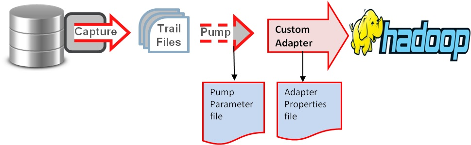

# 基于OGG的Oracle与Kafka准实时同步

## OGG的安装

### OGG for Oracle安装

下载OGG for Oracle，fbo_ggs_Linux_x64_shiphome.zip，将OGG for Oracle安装在oracle所在节点上。

解压缩至制定目录，这里制定/opt/

```shell
unzip fbo_ggs_Linux_x64_shiphome.zip
```

进入目录/opt/fbo_ggs_Linux_x64_shiphome/Disk1/response

```shell
cd /opt/fbo_ggs_Linux_x64_shiphome/Disk1/response
```

编辑oggcore.rsp，修改以下参数

```
INSTALL_OPTION=ORA11g
SOFTWARE_LOCATION=/opt/oracle/ogg/ogg_work
START_MANAGER=true
MANAGER_PORT=7809
DATABASE_LOCATION=/opt/oracle/app/oracle/product/11.2.0/dbhome_1
INVENTORY_LOCATION=
UNIX_GROUP_NAME=oracle
```

参数含义

| 参数                 | 含义                                       |
| ------------------ | ---------------------------------------- |
| INSTALL_OPTION     | 选择针对什么版本的oracle,如ORA12c对应Oracle Database 12c，ORA11g对应Oracle Database 11g |
| SOFTWARE_LOCATION  | OGG的安装目录，这里使用的目录是/opt/oracle/ogg/ogg_work |
| START_MANAGER      | true或者false，是否安装后启用mgr，如果填true，启用mgr，false时，在安装后先不启用 |
| MANAGER_PORT       | OGG的端口，这里填写7809                          |
| DATABASE_LOCATION  | oracle的目录，可选，如果开始启用mgr时填写，例子中填写的是/opt/oracle/app/oracle/product/11.2.0/dbhome_1 |
| INVENTORY_LOCATION | 可选参数，在window上安装时需要填写                     |
| UNIX_GROUP_NAME    | linux的用户组，这里填写的是oracle的用户组               |

参数设置后，可以开始静默安装ogg

在上一级目录下运行

```shell
./runInstaller -silent -nowait -responseFile /opt/fbo_ggs_Linux_x64_shiphome/Disk1/response/oggcore.rsp
```

安装后设置环境变量，在oracle的根目录下找到.profile，编辑增加下列配置

```
export ORACLE_BASE=/opt/oracle/app

export ORACLE_HOME=$ORACLE_BASE/oracle/product/11.2.0/dbhome_1

export ORACLE_SID=orcl

export OGG_HOME=/opt/oracle/ogg/ogg_work

export PATH=$PATH:$HOME/bin:$ORACLE_HOME/bin:$OGG_HOME

export LD_LIBRARY_PATH=$ORACLE_HOME/lib:/usr/lib:$OGG_HOME
```

> 其中LD_LIBRARY_PATH必须进行设置，否则ogg在后续的一些操作中可能出现一些错误

### Oracle GoldenGate for Big Data安装

下载oracle goldengate for bigdata，122011_ggs_Adapters_Linux_x64.zip，解压到相应目录。

这里解压到了/opt/oracle/ogg/ogg_work。

## Oracle 源端基础配置

1. **启动sqlplus**

   ```shell
   sqlplus /nolog
   ```


2. **打开归档模式**

   查看是否归档模式(Archive Mode)

   ```plsql
   conn as sysdba
   archive log list
   ```

   将输出

   ```
   Database log mode	       Archive Mode
   Automatic archival	       Enabled
   Archive destination	       /opt/oracle/app/oracle/product/11.2.0/dbhome_1/dbs/arch
   Oldest online log sequence     136
   Next log sequence to archive   138
   Current log sequence	       138
   ```

   如果Database log mode非Archive Mode，进行如下设置

   ```plsql
   shutdown immediate  -- 立即关闭数据库
   startup mount   -- 启动实例并加载数据库，但不打开
   alter database archivelog  -- 更改数据库为归档模式
   alter database open  -- 打开数据库
   alter system archive log start  -- 启用自动归档
   ```

3. **打开辅助日志**

   OGG基于辅助日志等进行实时传输，故需要打开相关日志确保可获取事务内容。通过一下命令查看当前状态：

   ```plsql
   select force_logging, supplemental_log_data_min from v$database;
   ```

   查看状态

   ```
   FOR SUPPLEME
   --- --------
   YES YES
   ```

   如果不是yes，继续修改

   ```plsql
   alter database force logging;
   alter database add supplemental log data;
   ```

4. **创建复制用户**

   ```plsql
   查看用户ggs的权限create tablespace ggs_tbs datafile '/opt/oracle/app/oradata/orcl/ggs_tbs01.dbf' size 50m;
   create user ggs identified by ggs default tablespace ggs_tbs;
   grant create session,alter session to ggs;
   grant execute on utl_file to ggs;
   grant select any dictionary,select any table to ggs;
   grant alter any table to ggs;
   grant flashback any table to ggs;
   grant select any transaction to ggs;
   grant sysdba to ggs;
   grant create table,insert any table,lock any table to ggs;
   grant execute on dbms_flashback to ggs;
   select * from dba_sys_privs where GRANTEE='GGS'; -- 查看用户ggs的权限
   ```

   输出

   ```
   GRANTEE 		       PRIVILEGE				ADM
   ------------------------------ ---------------------------------------- ---
   GGS			       DROP ANY DIRECTORY			NO
   GGS			       ALTER ANY TABLE				NO
   GGS			       ALTER SESSION				NO
   GGS			       SELECT ANY DICTIONARY			NO
   GGS			       CREATE ANY DIRECTORY			NO
   GGS			       LOCK ANY TABLE				NO
   GGS			       FLASHBACK ANY TABLE			NO
   GGS			       CREATE TABLE				NO
   GGS			       SELECT ANY TRANSACTION			NO
   GGS			       INSERT ANY TABLE 			NO
   GGS			       UNLIMITED TABLESPACE			NO

   GRANTEE 		       PRIVILEGE				ADM
   ------------------------------ ---------------------------------------- ---
   GGS			       CREATE SESSION				NO
   GGS			       SELECT ANY TABLE 			NO

   13 rows selected.
   ```

5. **OGG初始化**

   进入OGG的主目录执行`./ggsci`，进入OGG命令行

   ```
   ./ggsci 
   GGSCI (node3) 1> create subdirs

   Creating subdirectories under current directory /opt/oracle/ogg/ogg_work

   Parameter files                /opt/oracle/ogg/ogg_work/dirprm: already exists
   Report files                   /opt/oracle/ogg/ogg_work/dirrpt: already exists
   Checkpoint files               /opt/oracle/ogg/ogg_work/dirchk: already exists
   Process status files           /opt/oracle/ogg/ogg_work/dirpcs: already exists
   SQL script files               /opt/oracle/ogg/ogg_work/dirsql: already exists
   Database definitions files     /opt/oracle/ogg/ogg_work/dirdef: already exists
   Extract data files             /opt/oracle/ogg/ogg_work/dirdat: already exists
   Temporary files                /opt/oracle/ogg/ogg_work/dirtmp: already exists
   Credential store files         /opt/oracle/ogg/ogg_work/dircrd: already exists
   Masterkey wallet files         /opt/oracle/ogg/ogg_work/dirwlt: already exists
   Dump files                     /opt/oracle/ogg/ogg_work/dirdmp: already exists
   ```

## 目标端基础配置

​	同源端配置，进入都OGG的主目录执行`./ggsci`,进入OGG命令行：

```
GGSCI (master) 1> create subdirs

Creating subdirectories under current directory /opt/oracle/ogg/ogg_work

Parameter files                /opt/oracle/ogg/ogg_work/dirprm: already exists
Report files                   /opt/oracle/ogg/ogg_work/dirrpt: already exists
Checkpoint files               /opt/oracle/ogg/ogg_work/dirchk: already exists
Process status files           /opt/oracle/ogg/ogg_work/dirpcs: already exists
SQL script files               /opt/oracle/ogg/ogg_work/dirsql: already exists
Database definitions files     /opt/oracle/ogg/ogg_work/dirdef: already exists
Extract data files             /opt/oracle/ogg/ogg_work/dirdat: already exists
Temporary files                /opt/oracle/ogg/ogg_work/dirtmp: already exists
Credential store files         /opt/oracle/ogg/ogg_work/dircrd: already exists
Masterkey wallet files         /opt/oracle/ogg/ogg_work/dirwlt: already exists
Dump files                     /opt/oracle/ogg/ogg_work/dirdmp: already exists
```

## OGG配置

Oracle实时传输到Hadoop集群（HDFS，Hive，Kafka等）的基本原理如图：



根据如上原理，配置大概分为如下步骤：源端目标端配置ogg管理器（mgr）；源端配置extract进程进行Oracle日志抓取；源端配置pump进程传输抓取内容到目标端；目标端配置replicate进程复制日志到Hadoop集群或者复制到kafka中，最后由自定义解析器将最终结果落入到Hadoop集群。

### OGG源配置

#### 配置全局变量

在源端服务器OGG主目录下，执行`./ggsci`到OGG命令行下，执行如下命令：

```
GGSCI (node3) 2> dblogin userid ggs password ggs
Successfully logged into database.

GGSCI (node3 as ggs@orcl) 3> view params ./globals

ggschema ggs
```

其中`./globals`中变量是空的话可以用`edit params ./globals`命令来编辑添加即可（编辑器默认使用的vim），edit params后的操作同使用vi。

#### 配置管理器 mgr

```
GGSCI (node3 as ggs@orcl) 2> edit param mgr


PORT 7809

dynamicportlist 9901-9920,9930

autorestart extract *,retries 5,waitminutes 3
purgeoldextracts /opt/oracle/ogg/ogg_work/dirdat/*,usecheckpoints,minkeephours 3
```

> 说明：
>
> PORT即mgr的默认监听端口；DYNAMICPORTLIST动态端口列表，当指定的mgr端口不可用时，会在这个端口列表中选择一个，最大指定范围为256个；AUTORESTART重启参数设置表示重启所有EXTRACT进程，最多5次，每次间隔3分钟；PURGEOLDEXTRACTS即TRAIL文件的定期清理

在命令行下执行`start mgr`即可启动管理进程，通过`info mgr`可查看mgr状态。

#### 添加复制表

在OGG命令行下执行添加需要复制的表的操作，如下：

```
GGSCI (node3 as ggs@orcl) 7> add trandata ggs.test
Logging of supplemental redo data enabled for table GGS.TEST.
GGSCI (node3 as ggs@orcl) 8> info trandata ggs.test
Logging of supplemental redo log data is enabled for table GGS.TEST.
Columns supplementally logged for table GGS.TEST: ID, NAME.
Prepared CSN for table GGS.TEST: 1340751
```

#### 配置 extract 进程

配置extract进程OGG命令行下执行如下命令：

```
GGSCI (node3 as ggs@orcl) 6> edit params ext2kf

extract ext2kf
dynamicresolution
SETENV(ORACLE_SID="orcl")
userid ggs,password ggs
exttrail /opt/oracle/ogg/ogg_work/dirdat/tc
table ggs.test;
```

> 说明：
>
> 指定extract进程名称，**进程名不可过长**；dynamicresolution动态解析；SETENV设置环境变量，这里设置了Oracle数据库；userid ggs,password ggs即OGG连接Oracle数据库的帐号密码，这里使用之前特意创建的复制帐号ggs；exttrail定义trail文件的保存位置以及文件名，注意这里文件名只能是2个字母，其余部分OGG会补齐；table即复制表的表明，可不指定单表，**支持*通配**，必须以;结尾

接下来在OGG命令行执行如下命令添加extract进程：

```
GGSCI (VM_0_25_centos) 11> add extract ext2kf,tranlog,begin now
EXTRACT added.
```

最后添加trail文件的定义与extract进程绑定：

```
GGSCI (VM_0_25_centos) 12> add exttrail /opt/oracle/ogg/ogg_work/dirdat/tc,extract ext2kf
EXTTRAIL added
```

可在OGG命令行下通过info命令查看状态：

```
GGSCI (node3 as ggs@orcl) 7> info ext2kf

EXTRACT    EXT2KF    Last Started 2017-06-13 15:39   Status RUNNING
Checkpoint Lag       00:00:00 (updated 00:00:04 ago)
Log Read Checkpoint  Oracle Redo Logs
                     2017-06-20 14:03:47  Seqno 139, RBA 4069888
                     SCN 0.1753903 (1753903)
```

#### 配置 pump 进程

pump进程从本质上来说也是一个extract，只不过他的作用仅仅是把trail文件传递到目标端，配置过程和extract进程类似，只是逻辑上称之为pump进程
在OGG命令行下执行：

```
GGSCI (node3 as ggs@orcl) 8> edit params push2kf


extract push2kf
passthru
dynamicresolution
userid ggs,password ggs
rmthost 172.16.210.151 mgrport 7809
rmttrail /opt/oracle/ogg/ogg_work/dirdat/tc
table ggs.test;
```

> 说明：
>
> 指定extract进程名称；passthru即禁止OGG与Oracle交互，我们这里使用pump逻辑传输，故禁止即可；dynamicresolution动态解析；userid
>  ggs,password ggs即OGG连接Oracle数据库的帐号密码，这里使用之前特意创建的复制帐号ggs；rmthost和mgrhost即目标端OGG的mgr服务的地址以及监听端口；rmttrail即目标端trail文件存储位置以及名称，table即复制表的表明，可不指定单表，**支持*通配**，必须以;结尾

分别将本地trail文件和目标端的trail文件绑定到extract进程：

```
GGSCI (node3 as ggs@orcl) 17> add extract push2kf,exttrailsource /opt/oracle/ogg/ogg_work/dirdat/tc
EXTRACT added.
GGSCI (node3 as ggs@orcl) 18> add rmttrail /opt/oracle/ogg/ogg_work/dirdat/tc,extract push2kf
RMTTRAIL added.
```

> exttrailsource 本地trail文件
>
> rmttrail 目标端trail文件地址
>
> 注意二者的目录需要填写正确，否则无法使用pump逻辑传输到相应目录。

同样可以在OGG命令行下使用info查看进程状态：

```
GGSCI (node3 as ggs@orcl) 9> info push2kf

EXTRACT    PUSH2KF   Last Started 2017-06-13 15:39   Status RUNNING
Checkpoint Lag       00:00:00 (updated 00:00:01 ago)
Log Read Checkpoint  File /opt/oracle/ogg/ogg_work/dirdat/tc000000001
                     2017-06-13 16:33:25.000000  RBA 2000
```

#### 配置 define 文件

Oracle与MySQL，Hadoop集群（HDFS，Hive，kafka等）等之间数据传输可以定义为异构数据类型的传输，故需要定义表之间的关系映射，在OGG命令行执行：

```
GGSCI (node3 as ggs@orcl) 10> edit params test


defsfile /opt/oracle/ogg/ogg_work/dirdef/ggs.test
userid ggs,password ggs
table ggs.test;
```

在OGG主目录下执行：
`./defgen paramfile dirprm/test.prm`
完成之后会生成这样的文件/opt/oracle/ogg/ogg_work/dirdef/ggs.test，将这个文件拷贝到目标端的OGG主目录下的dirdef目录即可。

### 目标端OGG的配置

#### 配置管理器mgr

目标端的OGG管理器（mgr）和源端的配置类似，在OGG命令行下执行：

```
GGSCI (master) 1> edit params mgr


PORT 7809
DYNAMICPORTLIST 9901-9920,9930
AUTORESTART EXTRACT *,RETRIES 5,WAITMINUTES 3
PURGEOLDEXTRACTS ./dirdat/*,usecheckpoints,minkeepdays 3
```

#### 配置 checkpoint

checkpoint即复制可追溯的一个偏移量记录，在全局配置里添加checkpoint表即可

```
GGSCI (master) 2> edit  params  ./GLOBALS

CHECKPOINTTABLE ggs.checkpoint
```

#### 配置replicate

在OGG的命令行下执行：

```
GGSCI (master) 4> edit params rkafka


REPLICAT rkafka
-- Trail file for this example is located in "AdapterExamples/trail" directory
-- Command to add REPLICAT
-- add replicat rkafka, exttrail AdapterExamples/trail/tr
sourcedefs /opt/oracle/ogg/ogg_work/dirdef/ggs.test
TARGETDB LIBFILE libggjava.so SET property=dirprm/kafka.props
REPORTCOUNT EVERY 1 MINUTES, RATE
GROUPTRANSOPS 10000
MAP ggs.test, TARGET ggs.test;
```

> 说明：
>
> REPLICATE rkafka定义rep进程名称；sourcedefs即在源服务器上做的表映射文件；TARGETDB LIBFILE即定义一些适配性的库文件以及配置文件，配置文件位于OGG主目录下的`dirprm/kafka.props`；REPORTCOUNT即复制任务的报告生成频率；GROUPTRANSOPS为以事务传输时，事务合并的单位，减少IO操作；MAP即源端与目标端的映射关系

其中`property=dirprm/kafka.props`的配置中，最主要的几项配置及注释如下：

```shell
gg.handlerlist = kafkahandler #handler类型
gg.handler.kafkahandler.type = kafka
gg.handler.kafkahandler.KafkaProducerConfigFile=custom_kafka_producer.properties #kafka相关配置
gg.handler.kafkahandler.TopicName =oggtopic #kafka的topic名称，无需手动创建
gg.handler.kafkahandler.format =json #传输文件的格式，支持json，xml等
gg.handler.kafkahandler.mode =op  #OGG for Big Data中传输模式，即op为一次SQL传输一次，tx为一次事务传输一次
gg.classpath=dirprm/:/opt/cloudera/parcels/KAFKA/lib/kafka/libs/* #相关库文件的引用
```

`rkafka.props`引用的`custom_kafka_producer.properties`定义了Kafka的相关配置如下：

```shell
bootstrap.servers=master:9092,node1:9092,node2:9092 #kafkabroker的地址
acks=1
compression.type=gzip #压缩类型
reconnect.backoff.ms=1000 #重连延时

value.serializer=org.apache.kafka.common.serialization.ByteArraySerializer
key.serializer=org.apache.kafka.common.serialization.ByteArraySerializer
# 100KB per partition
batch.size=102400
linger.ms=10000
```

kafka相关配置可[参考](http://docs.oracle.com/goldengate/bd1221/gg-bd/GADBD/GUID-2561CA12-9BAC-454B-A2E3-2D36C5C60EE5.htm#GADBD457)

配置完成后，在OGG命令行下添加trail文件到replicate进程并启动导入到Kafka的replicate进程

```
GGSCI (master) 5> add replicat rkafka exttrail
/opt/oracle/ogg/ogg_work/dirdat/tc,checkpointtable ggs.checkpoint
REPLICAT added.
GGSCI (master) 6> start rkafka
Sending START request to MANAGER ...
REPLICAT R2KAFKA starting
GGSCI (master) 10> info rkafka

REPLICAT   RKAFKA    Last Started 2017-06-13 16:31   Status RUNNING
Checkpoint Lag       00:00:00 (updated 00:00:07 ago)
Process ID           39405
Log Read Checkpoint  File /opt/oracle/ogg/ogg_work/dirdat/tc000000002
                     2017-06-13 16:32:42.693147  RBA 2052
```

## 测试

### 启动进程

在源端和目标端的OGG命令行下使用start [进程名]的形式启动所有进程。

启动顺序按照源mgr——目标mgr——源extract——源pump——目标replicate来完成。

### 检查进程状态

以上启动完成之后，可在源端与目标端的OGG命令行下使用info [进程名]来查看所有进程状态，如下：
源端：

```
GGSCI (node3) 1> info mgr

Manager is running (IP port ???, Process ID ???).
GGSCI (node3) 1> info ext_kf

EXTRACT    EXT_KF    Last Started 2017-06-13 15:39   Status RUNNING
Checkpoint Lag       00:00:00 (updated 00:00:10 ago)
Log Read Checkpoint  Oracle Redo Logs
                     2017-06-20 17:03:48  Seqno 139, RBA 8244224
                     SCN 0.1759206 (1759206)
GGSCI (node3) 2> info push2kf

EXTRACT    PUSH2KF   Last Started 2017-06-13 15:39   Status RUNNING
Checkpoint Lag       00:00:00 (updated 00:00:02 ago)
Log Read Checkpoint  File /opt/oracle/ogg/ogg_work/dirdat/tc000000001
                     2017-06-13 16:33:25.000000  RBA 2000
```

目标端：

```
GGSCI (master) 2> info mgr

Manager is running (IP port master.7809, Process ID 39380).
GGSCI (master) 3> info rkafka

REPLICAT   RKAFKA    Last Started 2017-06-13 16:31   Status RUNNING
Checkpoint Lag       00:00:00 (updated 00:00:00 ago)
Process ID           39405
Log Read Checkpoint  File /opt/oracle/ogg/ogg_work/dirdat/tc000000002
                     2017-06-13 16:32:42.693147  RBA 2052

```

### 测试同步更新效果

测试方法比较简单，直接在源端的数据表中insert，update，delete操作即可。由于Oracle到Hadoop集群的同步是异构形式，目前尚不支持truncate操作。
源端进行insert操作

```plsql
SQL> conn ggs/ggs
Connected.
SQL> select * from test;

	ID NAME
---------- --------------------
	 1 test01
	 2 test2
	 3 test3
	 4 test4
	 5 test5
	 6 test6

6 rows selected.
SQL> desc test;
Name					   Null?    Type
 ----------------------------------------- -------- ----------------------------
 ID						    NUMBER(38)
 NAME						    VARCHAR2(20)
SQL> insert into test values(7,'test7');

1 row created.

SQL> commit;

Commit complete.
```

查看源端trail文件状态

```shell
oracle@node3:/root> ls -l /opt/oracle/ogg/ogg_work/dirdat/tc*
-rw-r----- 1 root root 2127 Jun 20 17:12 /opt/oracle/ogg/ogg_work/dirdat/tc000000001
```

查看目标端trail文件状态

```
master:/opt/oracle/ogg/ogg_work # ls -l dirdat/tc*
-rw-r----- 1 root root 2179 Jun 20 17:11 dirdat/tc000000002
```

目标端Kafka的同步情况：

```shell
master:/opt/cloudera/parcels/KAFKA/bin # ./kafka-console-consumer --zookeeper master:2181,node1:2181,node2:2181 --from-beginning --topic oggtopic
{"table":"GGS.TEST","op_type":"I","op_ts":"2017-06-20 17:11:23.403197","current_ts":"2017-06-20T17:11:29.374000","pos":"00000000020000002052","after":{"ID":"7","NAME":"test7"}}
```

显然，Oracle的数据已准实时同步到Kafka。从头开始消费这个topic发现之前的同步信息也存在。架构上可以直接接Storm，SparkStreaming等直接消费kafka消息进行业务逻辑的处理。

从Oracle实时同步到其他的Hadoop集群中，官方最新版本提供了HDFS，HBase，Flume和Kafka等，相关配置可参考官网给出的[文档](http://docs.oracle.com/goldengate/bd1221/gg-bd/GADBD/GUID-85A82B2E-CD51-463A-8674-3D686C3C0EC0.htm#GADBD376)配置即可。