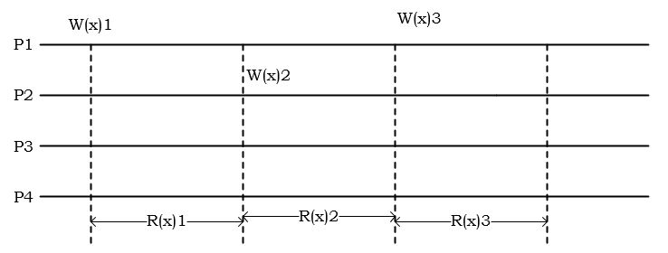
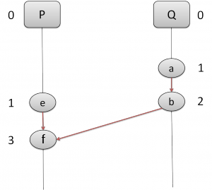
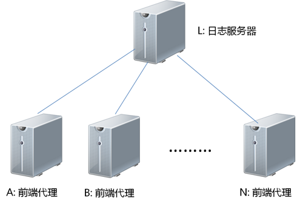
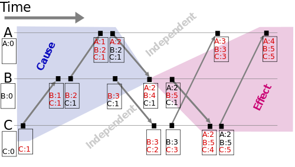
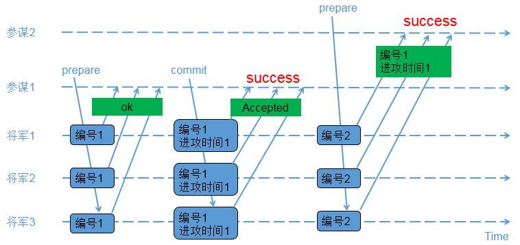

# 分布式SQL数据库

[TOC]

## 关系型数据库现状
数据库作为业务的核心，在整个基础软件中是非常重要的一环。很长时间以来，关系型数据库一直是大公司的专利，市场被 Oracle / DB2 等企业数据库牢牢把持。但是随着互联网的崛起、开源社区的发展，上世纪九十年代 MySQL 1.0 的发布，标志着关系型数据库的领域社区终于有可选择的方案：

### MySQL & MariaDB
MySQL是一个真正的多用户、多线程SQL数据库服务器。SQL（结构化查询语言）是世界上最流行的和标准化的数据库语言，它使得存储、更新和存取信息更加容易。基本上 MySQL 的成长史就是互联网的成长史。其中，MySQL 5.5 是经典版本，基本所有的互联网公司都在使用。

MariaDB是由MySQL创始人之一Monty分支的一个版本。在MySQL数据库被Oracle公司收购后，Monty担心MySQL数据库发展的未来，从而分支出一个版本。这个版本和其他分支有很大的不同，其默认使用崭新的Maria存储引擎，是原MyISAM存储引擎的升级版本。此外，其增加了对Hash Join的支持和对Semi Join的优化，使MariaDB在复杂的分析型SQL语句中较原版本的MySQL性能提高很多。另外，除了包含原有的一些存储引擎，如InnoDB、Memory，还整合了PBXT、FederatedX存储引擎。不得不承认，MariaDB数据库是目前MySQL分支版本中非常值得使用的一个版本，尤其是在OLAP的应用中，对Hash Join的支持和对Semi Join的优化可以大大提高MySQL数据库在这方面的查询性能。

### PostgreSQL
PostgreSQL 的历史也非常悠久，其前身是 UCB 的 Ingres，主持这个项目的 Michael Stronebraker 于 2015 年获得图灵奖。后来项目更名为 Post-Ingres，基于 BSD license 下开源。 1995 年几个 UCB 的学生为 Post-Ingres 开发了 SQL 的接口，正式发布了 PostgreSQL95，随后一步步在开源社区中成长起来。和 MySQL 一样，PostgreSQL 也是一个单机的关系型数据库，但是与 MySQL 方便用户过度扩展的 SQL 文法不一样的是，PostgreSQL 的 SQL 支持非常强大，不管是内置类型、JSON 支持、GIS 类型以及对于复杂查询的支持，PL/SQL 等都比 MySQL 强大得多，而且从代码质量上来看，PostgreSQL 的代码质量是优于 MySQL 的。相对于MySQL 5.7以前的版本，PostgreSQL 的 SQL 优化器比 MySQL 强大很多，几乎所有稍微复杂的查询PostgreSQL 的表现都优于 MySQL。

从近几年的趋势上来看，PostgreSQL 的势头也很强劲，我认为 PostgreSQL 的不足之处在于没有 MySQL 那样强大的社区和群众基础。MySQL 经过那么多年的发展，积累了很多的运维工具和最佳实践，但是 PostgreSQL 作为后起之秀，拥有更优秀的设计和更丰富的功能。PostgreSQL 9 以后的版本也足够稳定，也有很多新的数据库项目是基于 PostgreSQL 源码的基础上进行二次开发，比如 Greenplum 等。

随着时代的发展，各种终端的普及，应用和数据的规模越来越大，各种云服务的方案层出不穷。 在这个一切都可以水平扩展的时代，机器可扩展，服务可扩展，监控可扩展，缓存可扩展..... 然而，作为大多数应用最底层的数据存储 -- 关系型数据库， 难以找到一个优雅易用的水平扩展解决方案，一直以来不得不依赖主从复制，静态 Sharding 以及各种业务层的 Workarounds 勉强应对。

## NOSQL的兴起和优缺点
现代计算系统每天在网络上都会产生庞大的数据量。这些数据有很大一部分是由关系型数据库管理系统（RDBMSs）来处理，其严谨成熟的数学理论基础使得数据建模和应用程序编程更加简单。但随着信息化的浪潮和互联网的兴起，传统的RDBMS在一些业务上开始出现问题。首先，对数据库存储的容量要求越来越高，单机无法满足需求，很多时候需要用集群来解决问题，而RDBMS由于要支持join，union等操作，一般不支持分布式集群。其次，在大数据大行其道的今天，很多的数据都“频繁读和增加，不频繁修改”，而RDBMS对所有操作一视同仁，这就带来了优化的空间。另外，互联网时代业务的不确定性导致数据库的存储模式也需要频繁变更，不自由的存储模式增大了运维的复杂性和扩展的难度。

### 优点
* 易扩展
NoSQL数据库种类繁多，但是有一个共同的特点，都是去掉了关系型数据库的关系型特性。数据之间无关系，这样就非常容易扩展。也无形之间，在架构的层面上带来了可扩展的能力。
* 大数据量，高性能
NoSQL数据库都具有非常高的读写性能，尤其在大数据量下，同样表现优秀。这得益于它的无关系性，数据库的结构简单。一般MySQL使用Query Cache，每次表更新Cache就失效，是一种大粒度的Cache，针对web2.0的交互频繁的应用，Cache性能不高。而NoSQL的Cache是记录级的，是一种细粒度的Cache，所以NoSQL在这个层面上来说性能就要高很多了。
* 灵活的数据模型
NoSQL无需事先为要存储的数据建立字段，随时可以存储自定义的数据格式。而在关系型数据库里，增删字段是一件非常麻烦的事情。如果是非常大数据量的表，增加字段简直就是一个噩梦。这点在大数据量的web2.0时代尤其明显。
* 高可用
NoSQL在不太影响性能的情况下，就可以方便地实现高可用的架构。比如Cassandra、HBase模型，通过复制模型也能实现高可用。

### 缺点
* 没有标准
没有对NoSQL数据库定义的标准，所以没有两个NoSQL数据库是平等的。
* 没有存储过程
NoSQL数据库中大多没有存储过程。
* 不支持SQL
NoSQL大多不提供对SQL的支持：如果不支持SQL这样的工业标准，将会对用户产生一定的学习和应用迁移上的成本。
* 支持的特性不够丰富，产品不够成熟
现有产品所提供的功能都比较有限，不像MS SQL Server和Oracle那样能提供各种附加功能，比如BI和报表等。大多数产品都还处于初创期，和关系型数据库几十年的完善不可同日而语。

### NoSQL与SQL的对比

|      | RDBMS        | NoSQL     |
| ---- | ------------ | --------- |
| 模式   | 预定义的模式       | 没有预定义的模式  |
| 查询语言 | 结构化查询语言（SQL） | 没有声明性查询语言 |
| 一致性  | 严格的一致性       | 最终一致性     |
| 事务   | 支持           | 不支持       |
| 理论基础 | ACID         | CAP, BASE |
| 扩展   | 纵向扩展         | 横向扩展(分布式) |

## NoSQL数据库的分类

### 键值(Key-Value)存储数据库
这一类数据库主要会使用到哈希表，在这个表中有一个特定的键和一个指针指向特定的数据。Key/value模型对于IT系统来说优势在于简单、易部署。但是如果DBA只对部分值进行查询或更新的时候，Key/value就显得效率低下了。
E. g:
TokyoCabinet/Tyrant
Redis
Voldemort
OracleBDB
### 列存储数据库
这部分数据库通常是用来应对分布式存储的海量数据。键仍然存在，但是它们的特点是指向了多个列。这些列是由列家族来安排的。
E. g:
Cassandra
HBase
Riak
### 文档型数据库
文档型数据库的灵感来自于Lotus Notes办公软件，它同第一种键值存储相类似。该类型的数据模型是版本化的文档，半结构化的文档以特定的格式存储，比如JSON。文档型数据库可以看作是键值数据库的升级版，允许之间嵌套键值。而且文档型数据库比键值数据库的查询效率更高。
E. g:
CouchDB
MongoDB
SequoiaDB
### 图形(Graph)数据库
图形结构的数据库同其它行列以及刚性结构的SQL数据库不同，它是使用灵活的图形模型，并且能够扩展到多个服务器上。NoSQL数据库没有标准的查询语言(SQL)，因此进行数据库查询需要制定数据模型。许多NoSQL数据库都有REST式的数据接口或者查询API。
E. g:
Neo4J
InfoGrid
InfiniteGraph

## 新一代分布式SQL数据库（NewSQL）

[参考文档](http://www.infoq.com/cn/articles/situation-of-the-open-source-database)

### NewSQL的必备特点
* 无缝的水平扩展，应用层可以不用关心存储的容量和吞吐。
* SQL 支持，SQL 有着良好的易用性和生态系统。业务层如果已经在使用 SQL ，转变到 NoSQL 上是个极其痛苦的过程。
* 完整的 ACID 事务支持，应用层不需要关心跨行事务的实现，不需要写很多 hack 代码来确保数据的安全性。
* 更强的 MVCC（多版本并发控制），可以无锁的访问任意时间点的数据库快照。
* 在线的 Schema 变更，不需要每次更新Schema都要面临停止服务的窘境。
* 零迁移成本，兼容现有的协议或者查询语法，已有的代码不需要做改动或很少改动自动就能获得扩展的能力。

### [Spanner](http://www.csdn.net/article/2012-09-19/2810132-google-spanner-next-database-datacenter)

2012 年 Google 在 OSDI 上发表了 Spanner 的论文，2013 年在 SIGMOD 发表了 F1 的论文。这两篇论文让业界第一次看到了关系模型和 NoSQL 的扩展性在超庞大集群规模上融合的可能性。在此之前，大家普遍认为这个是不可能的，即使是 Google 也经历了 Megastore 这样的失败。

Spanner 的创新之处在于通过硬件（GPS时钟+原子钟）来解决时钟同步的问题。在分布式系统里，时钟是最让人头痛的问题，Cassandra 为什么不是一个强一致性的系统，正是因为时钟的问题。而 Spanner 的厉害之处在于即使两个数据中心隔得非常远，不需要有通信（因为通信的代价太大，最快也就是光速）就能保证 TrueTime API的时钟误差在一个很小的范围内（10ms）。另外 Spanner 沿用了很多 Bigtable 的设计，比如 Tablet / Directory 等，同时在 Replica 这层使用 Paxos 复制，并未完全依赖底层的分布式文件系统。但是 Spanner 的设计底层仍然沿用了 Colossus（Google的下一代GFS）。

Google 的内部的数据库存储业务，大多是 3～5 副本，重要一点的 7 副本，遍布全球各大洲的数据中心，由于普遍使用了 Paxos，延迟是可以缩短到一个可以接受的范围（Google 的风格一向是追求吞吐的水平扩展而不是低延迟，从悲观锁的选择也能看得出来，因为跨数据中心复制是必选的，延迟不可能低，对于低延迟的场景，业务层自己解决或者依赖缓存）。另外由 Paxos 带来的 Auto-Failover 能力，更是能让整个集群即使数据中心瘫痪，业务层都是透明无感知的。

另外 F1 构建在 Spanner 之上，对外提供了更丰富的 SQL 语法支持，F1 更像一个分布式 MPP SQL——F1 本身并不存储数据，而是将客户端的 SQL 翻译成类似 MapReduce 的任务，调用 Spanner 来完成请求。

其实 Spanner 和 F1 除了 TrueTime 整个系统并没有用什么全新的算法，其意义在于这是近些年来第一个 NewSQL 在生产环境中提供服务的分布式系统技术。

Spanner 和 F1 有以下几个重点：
* 完整的 SQL 支持，ACID 事务；
* 弹性伸缩能力；
* 自动的故障转移和故障恢复，多机房异地灾备。

在 Google 内部，大量的业务已经从原来的 Bigtable 切换到 Spanner 之上。我相信未来几年，整个业界的趋势也是如此，就像当年的 Hadoop 一样，Google 的基础软件的技术趋势是走在社区前面的。

### TiDB
TiDB开源的分布式数据库，参考 Google F1/Spanner 实现了水平伸缩，一致性的分布式事务，多副本同步复制等重要 NewSQL 特性。结合了 RDBMS 和 NoSQL 的优点，部署简单，在线扩容和表结构变更不影响业务，异地多活保障数据安全，同时完全兼容 MySQL / PostgreSQL 协议，使迁移使用成本降到极低。

TiDB 本质上是一个更加正统的 Spanner 和 F1 实现，并不像 CockroachDB 那样选择将 SQL 和 Key-Value 融合，而是像 Spanner 和 F1 一样选择分离，这样分层的思想也是贯穿整个 TiDB 项目始终的。对于测试、滚动升级以及各层的复杂度控制会比较有优势；另外 TiDB 选择了 MySQL 协议和语法的兼容，MySQL 社区的 ORM 框架和运维工具，直接可以应用在 TiDB 上。

和 F1 一样，TiDB 是一个无状态的 MPP SQL Layer，整个系统的底层是依赖 TiKV 来提供分布式存储和分布式事务的支持。TiKV 的分布式事务模型采用的是 Google Percolator 的模型，但是在此之上做了很多优化。Percolator 的优点是去中心化程度非常高，整个集群不需要一个独立的事务管理模块，事务提交状态这些信息其实是均匀分散在系统的各个 Key 的 meta 中，整个模型唯一依赖的是一个授时服务器。极限情况这个授时服务器每秒能分配 400w 以上个单调递增的时间戳，大多数情况基本够用了（毕竟有 Google 量级的场景并不多见）；同时在 TiKV 中，这个授时服务本身是高可用的，也不存在单点故障的问题。

TiKV 和 CockroachDB 一样也是选择了 Raft 作为整个数据库的基础；不一样的是，TiKV 整体采用 Rust 语言开发，作为一个没有 GC 和 Runtime 的语言，在性能上可以挖掘的潜力会更大。

[Apache HAWQ与TiDB比较](https://www.zhihu.com/question/54597742)

### CockroachDB
CockroachDB是一个基于事务和强一致性键值存储构建的分布式SQL数据库。 它支持水平缩放; 可以容忍磁盘
、机器、机架，甚至数据中心故障，并能在极短时间内无需人工干预的恢复服务; 支持强一致的ACID事务; 并提供了类SQL API来构造、操作和查询数据。

蟑螂是一个分布式的K/V数据仓库，支持ACID事务，多版本值存储是其首要特性。主要的设计目标是全球一致性和可靠性，从蟑螂的命名上是就能看出这点。蟑螂数据库能处理磁盘、物理机器、机架甚至数据中心失效情况下最小延迟的服务中断；整个失效过程无需人工干预。蟑螂的节点是均衡的，其设计目标是同质部署（只有一个二进制包）且最小配置。

蟑螂数据库实现了单一的、巨大的有序映射，键和值都是字节串形式（不是unicode），支持线性扩展，理论上支持4EB的逻辑数据）。映射有一个或者多个Range组成，每一个Range对应一个把数据存储在RocksDB（LevelDB的一个变种，Facebook贡献）上的K/V数据库，并且复制到三个或者更多蟑螂服务器上，Range定义为有开始和结束键值的区间。Range可以合并及分裂来维持总大小在一个全局配置的最大最小范围之间。Range的大小默认是64M，目的是便于快速分裂和合并，在一个热点键值区间快速分配负载。Range的复制确定为分离的数据中心来达到可靠性（比如如下分组：{ US-East, US-West, Japan }, { Ireland, US-East, US-West}, { Ireland, US-East, US-West, Japan, Australia }）

 Range有一种变化，通过分布式一致性算法实例来调节确保一致性，蟑螂所选择使用Raft一致性算法。所有的一致性状态存在于RocksDB中。

  一个逻辑上的变化可能会影响多个K/V对，逻辑变化是ACID事务性的。如果一个逻辑的变化引起的所有的键值都落在同一个Range里，Raft保证事务的原子性和一致性；不然的话，一个无锁的分布式提交协议用来协同受影响的Range。

 蟑螂提供快照隔离级别和可串行化快照隔离级别，允许外部一致性和无锁读写，这些都依赖于快照时间戳和当前时间。快照一致性提供无锁读写，但是依然允许写偏。SSI（可串行化快照隔离级别）消除写偏，但是引入了一个有争议系统的性能损失。SSI是默认的隔离级别；为了性能客户端必须自己处理交易的正确性。蟑螂实现了和Spannerde 目录相似，蟑螂允许任意数据zone的配置。允许选择复制因子、存储设备类型及数据中心位置等配置来优化性能或者可用性。不像Spaner，zone是一个整体，不允许对实体组水平的细粒度数据进行移动。

 CockroachDB 的技术选型比较激进，比如依赖了 HLC 来做事务的时间戳。但是在 Spanner 的事务模型的 Commit Wait 阶段等待时间的选择，CockroachDB 并没有办法做到 10ms 内的延迟；CockroachDB 的 Commit Wait 需要用户自己指定，但是 NTP 的时钟误差无法确定在多少毫秒内（在处理跨洲际机房时钟同步的问题上，基本只有硬件时钟一种办法，HLC 是没办法解决的）。Cockroach 采用了 gossip 来同步节点信息，当集群变得比较大的时候，gossip 心跳会是一个非常大的开销。
 
CockroachDB 的这些技术选择带来的优势就是非常好的易用性，所有逻辑都在一个 binary 中，开箱即用，这个是非常大的优点。

 [cockroachdb设计翻译](https://lihuanghe.github.io/2016/05/06/cockroachdb-design.html)

### OceanBase
OceanBase是阿里巴巴自主研发的一个支持海量数据的高性能分布式数据库系统。

OceanBase使用了分布式技术和无共享架构，来自业务的访问会自动分散到多台数据库主机上。

OceanBase引入了Paxos协议，每一笔事务，主库执行完成后，要同步到半数以上库(包括主库自身)，例如3个库中的2个库，或者5个库中的3个库，事务才成功。这样，少数库(例如3个库中的1个库，或者5个库中的2个库)异常后业务并不受影响。分布式事务一致性协议paxos主要用于保证一个数据在分布式系统里是可靠的。

OceanBase是“基线数据（硬盘）”+“修改增量（内存）”的架构。

即整个数据库以硬盘（通常是SSD）为载体，新近的增、删、改数据（“修改增量”）在内存，而基线数据在保存在硬盘上，因此OceanBase可以看成一个准内存数据库。这样的好处是：
* 写事务在内存（除事务日志必须落盘外），性能大大提升
* 没有随机写硬盘，硬盘随机读不受干扰，高峰期系统性能提升明显；对于传统数据库，业务高峰期通常也是大量随机写盘（刷脏页）的高峰期，大量随机写盘消耗了大量的IO，特别是考虑到SSD的写入放大，对于读写性能都有较大的影响
* 基线数据只读，缓存（cache）简单且效果提升
* 线上OceanBase的内存配置是支撑平常两天的修改增量（从OceanBase 1.0开始，每台OceanBase都可以写入，都承载着部分的修改增量），因此即使突发大流量为平日的10-20倍，也可支撑1~2个小时以上。

修改增量在内存，大概需要多大的内存？即使按双11全天的支付笔数10.5亿笔，假设每笔1KB，总共需要的内存大约是1TB，平均到10台服务器，100GB/台。

在类似双十一这种流量特别大的场景中，OceanBase内存能够支持峰值业务写入1~2个小时以上，之后OceanBase必须把内存中的增删改数据（“修改增量”）尽快整合到硬盘并释放内存，以便业务的持续写入。整合内存中的修改增量到硬盘，OceanBase称为每日合并，必然涉及到大量的硬盘读写（IO），因此可能对业务的吞吐量和事务响应时间（RT）产生影响。如何避免每日合并对业务的影响呢？OceanBase通过“轮转合并”解决了这个问题。

出于高可用的考虑，OceanBase是三机群（zone）部署。

根据配置和部署的不同，业务高峰时可以一个机群（zone）、两个机群（zone）或者三个机群（zone）提供读写服务。OceanBase的轮转合并就是对每个机群（zone）轮转地进行每日合并，在对一个机群（zone）进行每日合并之前，先把该机群（zone）上的业务读写流量切换到另外的一个或两个机群（zone），然后对该机群（zone）进行全速的每日合并。因此在每日合并期间，合并进行中的机群（zone）没有业务流量，仅仅接收事务日志并且参与Paxos投票，业务访问OceanBase的事务响应时间完全不受每日合并的影响，仅仅是OceanBase的总吞吐量有所下降：如果先前是三个机群（zone）都提供服务则总吞吐量下降1/3，如果先前只有一个或两个机群（zone）提供服务则总吞吐量没有变化。

轮转合并使得OceanBase对SSD十分友好，避免了大量随机写盘对SSD寿命的影响，因此OceanBase可以使用相对廉价的“读密集型”SSD来代替传统数据库使用的相对昂贵的“读写型”SSD，而不影响性能。此外由于轮转合并对服务器的CPU使用、硬盘IO使用以及耗时长短都不敏感（高峰期的传统数据库在刷脏页的同时还要优先保证业务访问的吞吐量和事务响应时间，刷脏页的CPU及IO资源都非常受限），因此OceanBase在每日合并时可以采用更加高效的压缩或者编码算法（比如压缩或编码速度略慢，但压缩率较高、解压缩很快的算法），从而进一步降低存储成本并提升性能。

### SequoiaDB

SequoiaDB（巨杉数据库）是一款企业级分布式NewSQL数据库，自主研发并拥有完全自主知识产权，没有基于任何其他外部的开源数据库源代码。SequoiaDB支持标准SQL、事务操作、高并发、分布式、可扩展、与双引擎存储等特性，并已经作为商业化的数据库产品开源。

SequoiaDB作为典型Share-Nothing的分布式数据库，同时具备高性能与高可用的特性。

** 网站主页中有与MongoDB对比。** 

* 标准SQL支持
SequoiaDB提供高性能的标准SQL语句访问，在100%支持和兼容原有JSON特性的基础上，提供了标准SQL2003的语法支持， 能够兼容传统应用，并最大程度满足传统应用开发人员对于数据库SQL访问方式的诉求。

* 分布式架构
SequoiaDB采用分布式架构，从存储引擎就使用分布式MPP架构。分布式的架构不仅实现了容量的水平动态扩展， 让存储随需求灵活调整；此外，分布式集群为系统带来了更高的性能。

* 对象存储
SequoiaDB的底层采用了JSON（BSON）的对象式存储，解决了传统存储结构僵化、设计复杂、性能低下的问题。 通过对象式存储，既可以存储表这样的结构化的数据，也可以存储日志记录、图片等非结构化、半结构化的数据。真正实现一套数据多种用途。

* JSON与块存储双引擎
除了JSON存储引擎以外，为了提高非结构化文件的读写性能，SequoiaDB核心引擎提供了分布式块存储模式，可以将非结构化大文件按照固定大小的数据块进行切分并存放于不同分区。当用户需要管理海量的小文件（例如照片、音视频、文档、图片等）时，SequoiaDB的双存储引擎特性能够帮助用户快速搭建一个高性能、高可用的内容管理与影像平台系统。

* 集成Spark内存计算框架

### BDRT
天云大数据BDRT（Beagledata Realtime Transaction）是一款大规模高并发支持灵活查询的实时查询引擎，具有高可用、可横向扩展、健壮性的特点，支持数据自动均匀分布、支持索引及事务控制、支持REST、SQL、SDK等接口，支持上千个用户并发的进行实时查询。

BDRT是在总结了多年大型银行大数据项目实施经验的基础上，针对海量数据实时模糊搜索查询场景抽象出的最佳实践工具。BDRT具有海量数据高效插入、读取和快速响应以及丰富的条件检索等特点，同时融入关系型数据库中事务的概念，形成的一套完整的支持分布式数据一致性的实时模糊搜索服务解决方案。

BDRT具有包括Java、Python、Scala SDK，RESTFul API，SQL等多种读写接口，可同时满足FTP、MQ、Sqoop、Flume、Kafka等多种数据接入方式，同时支持天云自有交换平台的数据接入。同时利用多种多样的接口可向各类业务应用推送需要的数据。支持全量导入、增量导入数据、读取数据支持分页等细节功能。
保持数据事务一致性,对ACID的有效支撑。事务控制层可以支持安全的使用并发的多线程。可以支持对一个数据对象或方法在读写上的提交与回滚。在事务完成时，无论成功或者回滚，数据在多个节点都会处于一致的状态。
为了更好的查询效率和对各种数据类型有更好的支持，BDRT索引包含了多种数据类型的索引，这些数据类型包括：Byte、Short、Integer、Long、Float、Double、Decimal、Precision、String、Date、Instant等，有了这些数据类型，索引就可以根据业务实际需要来进行选择，紧密的和业务结合在一起。
通过持久化接口将数据在BDRT中持久化。BDRT原生支持了多种数据类型，这些类型包括：String、Character、Boolean、Byte、Short、Integer、Long、Float、Double、Decimal（拥有三位小数的数字）、Precision（拥有6位小数的数字）、Date、UUID。

#### 产品特性
* 与hadoop生态圈紧密结合，可与其他hadoop组件进行无缝集成。
* 支持数据和用户的高扩展，水平扩展非常容易。支持高效稳定的海量数据存储，可有效支持上亿行、上百万列、上万个版本，支持对数据自动分片。
* 具有容错性的数据分发和备份，对索引分片，并对每个分片创建多个副本。每个副本都可以对外提供服务。一个副本的异常不会对整个集群提供索引服务造成影响。
* 支持高可用性和热备份。
* 支持对数据进行各种高级查询，包括交集、联集、排除、通配符、范围、分页、排序、Group等。
* 读写严格一致，支持ACID（ACID指数据库正确执行的四个基本要素，包括:原子性，一致性，隔离性，持久性）和最终一致性。支持事务的提交和回滚，有效保障了数据的完整性。
* 数据查询的秒级毫秒级响应，从而支持OLTP。

#### 产品优势
* 采用分布式架构解决数据的安全性、稳定性，相对于传统关系型数据库，大大提高了数据的存储容量。
* 支持数据和用户的高扩展，水平扩展非常容易。支持高效稳定的海量数据存储，可有效支持上亿行、上百万列、上万个版本，支持对数据自动分片。
* 具有容错性的数据分发和备份，对索引分片，并对每个分片创建多个副本。每个副本都可以对外提供服务。一个副本的异常不会对整个集群提供索引服务造成影响。
* 支持对数据进行各种高级查询，包括交集、联集、排除、通配符、范围、分页、排序、Group等。
* 读写严格一致，支持ACID。支持事务的提交和回滚，有效保障了数据的完整性。
* 数据查询的秒级毫秒级响应，从而支持OLTP。
* 可与其他组件可以做到轻松集成，既可以与业务系统结合，将读数据放到BDRT端，来做读写分离，为业务系统减负，也可通过大数据平台hadoop和spark进行ETL处理，从而支持OLAP。
* 良好的开发规范和完善的文档支持，降低了开发人员的使用门槛，无需关心BDRT的底层。

#### 适用场景
* 利用BDRT低延时、高性能、海量存储等特性，满足需要从海量的历史和实时数据中秒级获取有效信息的场景。
* 在分布式背景下，数据量不断的增长，需要高速的读写，并有复杂的ETL需要的场景。
* 用户使用频率非常高，重要程度仅次于核心应用，对数据的丢失以及服务的中断零容忍的场景。
* 对数据的一致性有要求的场景。

## 开源SQL引擎介绍

[6大主流开源SQL引擎总结](http://www.toutiao.com/a6392538584179720449/?tt_from=email&utm_campaign=client_share&app=news_article_social&utm_source=email&iid=9347877982&utm_medium=toutiao_ios)

Hive、Impala、Spark SQL、Drill、HAWQ 、Presto、Druid、Calcite、Kylin、Phoenix、Tajo 和Trafodion。2个商业化选择Oracle Big Data SQL 和IBM Big SQL（BigSQL 3.0 包含在 [BigInsights 3.0](https://www.ibm.com/analytics/us/en/technology/hadoop/) ），IBM 尚未将后者更名为“Watson SQL”。

不像关系型数据库，SQL 引擎独立于数据存储系统（相对而言，关系型数据库将查询引擎和存储绑定到一个单独的紧耦合系统中），提供了更大的灵活性，尽管存在潜在的性能损失。

下面的图中展示了主要的SQL 引擎的流行程度，数据由奥地利咨询公司Solid IT 维护的DB-Engines 提供。DB-Engines 每月为超过200个数据库系统计算流行得分。得分反应了搜索引擎的查询，在线讨论的提及，提供的工作，专业资历的提及，以及tweets。

https://db-engines.com/en/ranking

虽然Impala、Spark SQL、Drill、Hawq 和Presto 一直在运行性能、并发量和吞吐量上击败Hive，但是Hive 仍然是最流行的（至少根据DB-Engines 的标准）。原因有3个：

* Hive 是Hadoop 的默认SQL 选项，每个版本都支持。而其他的要求特定的供应商和合适的用户；
* Hive 已经在减少和其他引擎的性能差距。大多数Hive 的替代者在2012年推出，当Impala、Spark、Drill 等大步发展的时候，Hive只是慢慢改进。现在，虽然Hive 不是最快的选择，但是它比五年前要好得多；
* 虽然速度很重要，但是海量数据下查询的稳定性更重要。

对于开源项目来说，最佳的健康度量是它的活跃开发者社区的大小。如下图所示，Hive 和Presto 有最大的贡献者基础。（Spark SQL 的数据暂缺）
数据来源：[Open Hub](https://www.openhub.net/)

### Apache Hive

Apache Hive 是Hadoop 生态系统中的第一个SQL 框架。Facebook 的工程师在2007年介绍了Hive，并在2008年将代码捐献给Apache 软件基金会。2010年9月，Hive 毕业成为Apache 顶级项目。Hadoop 生态系统中的每个主要参与者都发布和支持Hive，包括Cloudera、MapR、Hortonworks 和IBM。Amazon Web Services 在Elastic MapReduce（EMR）中提供了Hive 的修改版作为云服务。

早期发布的Hive 使用MapReduce 运行查询。复杂查询需要多次传递数据，这会降低性能。所以Hive 不适合交互式分析。由Hortonworks 领导的Stinger 明显的提高了Hive 的性能，尤其是通过使用Apache Tez，一个精简MapReduce 代码的应用框架。Tez 和ORCfile，一种新的存储格式，对Hive 的查询产生了明显的提速。

Cloudera 实验室带领一个并行项目重新设计Hive 的后端，使其运行在Apache Spark 上。经过长期测试后，Cloudera 在2016年初发布了Hive-on-Spark 的正式版本。

在2016年，Hive 有100多人的贡献者。该团队在2月份发布了Hive 2.0，并在6月份发布了Hive 2.1。Hive 2.0 的改进包括了对Hive-on-Spark 的多个改进，以及性能、可用性、可支持性和稳定性增强。Hive 2.1 包括了Hive LLAP（”Live Long and Process“），它结合持久化的查询服务器和优化后的内存缓存，来实现高性能。该团队声称提高了25倍。

9月，Hivemall 项目进入了Apache 孵化器，Hivemall 最初由Treasure Data 开发并捐献给Apache 软件基金会，它是一个可扩展的机器学习库，通过一系列的Hive UDF 来实现，设计用于在Hive、Pig 和Spark SQL 上运行MapReduce。该团队计划在2017年第一季度发布了第一个版本。

### Apache Impala

2012年，Cloudera 推出了Impala，一个开源的MPP SQL 引擎，作为Hive 的高性能替代品。Impala 使用HDFS 和HBase，并利用了Hive 元数据。但是，它绕开了使用MapReduce 运行查询。

Cloudera 的首席战略官Mike Olson 在2013年底说到Hive 的架构是有根本缺陷的。在他看来，开发者只能用一种全新的方式来实现高性能SQL，例如Impala。2014年的1月、5月和9月，Cloudera 发布了一系列的基准测试。在这些测试中，Impala 展示了其在查询运行的逐步改进，并且显著优于基于Tez 的Hive、Spark SQL 和Presto。除了运行快速，Impala 在并发行、吞吐量和可扩展性上也表现优秀。2015年，Cloudera 将Impala 捐献给Apache 软件基金会，进入了Apache 孵化计划。Cloudera、MapR、Oracle 和Amazon Web Services 分发Impala，Cloudera、MapR 和Oracle 提供了商业构建和安装支持。

2016年，Impala 在Apache 孵化器中取得了稳步发展。该团队清理了代码，将其迁移到Apache 基础架构，并在10月份发布了第一个Apache 版本2.7.0。新版本包括了性能提升和可扩展性改进，以及一些其他小的增强。

### Spark SQL

Spark SQL 是Spark 用于结构化数据处理的组件。Apache Spark 团队 在2014年发布了Spark SQL，并吸收了一个叫Shark 的早期的Hive-on-Spark 项目。它迅速成为最广泛使用的Spark 模块。

Spark SQL 用户可以运行SQL 查询，从Hive 中读取数据，或者使用它来创建Spark Dataset和DataFrame（Dataset 是分布式的数据集合，DataFrame 是统一命名的Dataset 列）。Spark SQL 的接口向Spark 提供了数据结构和执行操作的信息，Spark 的Catalyst 优化器使用这些信息来构造一个高效的查询。

2015年，Spark 的机器学习开发人员引入了ML API，一个利用Spark DataFrame 代替低级别Spark RDD API 的包。这种方法被证明是有吸引力和富有成果的；2016年，随着2.0 的发布，Spark 团队将基于RDD 的API改为维护模式。DataFrame API现在是Spark 机器学习的主要接口。

此外，在2016年，该团队还在Spark 2.1.0的Alpha 版本中发布了结构化的流式处理。结构化的流式处理是构建在Spark SQL 上的一个流处理引擎。用户可以像对待静态源一样，用同样的方式查询流式数据源，并且可以在单个查询中组合流式和静态源。Spark SQL 持续运行查询，并且在流式数据到达的时候更新结果。结构化的流通过检查点和预写日志来提供一次性的容错保障。

### Apache Drill

2012年，由Hadoop 分销商的领导者之一MapR 领导的一个团队，提出构建一个Google Dremel 的开源版本，一个交互式的分布式热点分析系统。他们将其命名为Apache Drill。Drill 在Apache 孵化器中被冷落了两年多，最终在2014年底毕业。该团队在2015年发布了1.0。

MapR 分发和支持Apache Drill。2016年，超过50个人对Drill 做出了贡献。该团队在2016年发布了5个小版本，关键的增强功能包括：

Web 认证
支持Apache Kudu 列数据库
支持HBase 1.x
动态UDF 支持
2015年，两位关键的Drill 贡献者离开了MapR，并启动了Dremio，该项目尚未发布。

### Apache HAWQ

Pivotal 软件在2012年推出了一款商业许可的高性能SQL 引擎[HAWQ](http://hawq.incubator.apache.org)，并在尝试市场营销时取得了小小的成功。改变战略后，Pivotal 在2015年6月将项目捐献给了Apache，并于2015年9月进入了Apache 孵化器程序。

15个月之后，HAWQ 仍然待在孵化器中。2016年12月，该团队发布了HAWQ 2.0.0.0，加入了一些错误修复。他可能会在2017年毕业成为正式项目。

HAWQ 的一个特点是它支持Apache MADlib，一个同样在孵化器中的SQL 机器学习项目。HAWQ 和MADlib 的组合，应该是对购买了Greenplum 的人是一个很好的安慰。

HAWQ部署：


HAWQ组件：


### Presto

Facebook 工程师在2012年发起了Presto 项目，作为Hive 的一个快速交互的取代。在2013年推出时，成功的支持了超过1000个Facebook 用户和每天超过30000个PB级数据的查询。2013年Facebook 开源了Presto。

Presto 支持多种数据源的ANSI SQL 查询，包括Hive、Cassandra、关系型数据库和专有文件系统（例如Amazon Web Service 的S3）。Presto 的查询可以联合多个数据源。用户可以通过C、Java、Node.js、PHP、Python、R和Ruby 来提交查询。

Airpal 是Airbnb 开发的一个基于web 的查询工具，让用户可以通过浏览器来提交查询到Presto。Qubole 位Presto 提供了管理服务。AWS 在EMR 上提供Presto 服务。

2015年6月，Teradata 宣布计划开发和支持该项目。根据宣布的三阶段计划，Teredata 提出将Presto 集成导Hadoop 生态系统中，能够在YARN 中进行操作，并且通过ODBC 和JDBC 增强连接性。Teredata 提供了自己的Presto 发行版，附带一份数据表。2016年6月，Teradata 宣布了Information Builders、Looker、Qlik、Tableau 和ZoomData 的鉴定结果，以及正在进行中的MicroStrategy 和Microsoft Power BI。

Presto 是一个非常活跃的项目，有一个巨大的和充满活力的贡献者社区。该团队发布的速度非常快--2016年共发布了42个版本。

### Apache Calcite

Apache Calcite 是一个开源的数据库构建框架。它包括：

* SQL 解析器、验证器和JDBC 驱动
* 查询优化工具，包括关系代数API，基于规则的计划器和基于成本的查询优化器
* Apache Hive 使用Calcite 进行基于成本的查询优化，而Apache Drill 和Apache Kylin 使用SQL 解析器。

Calcite 团队在2016年推出了5个版本包括bug 修复和用于Cassandra、Druid 和Elasticsearch 的新适配器。

### Apache Kylin

[Apache Kylin](http://kylin.apache.org/cn/) 是一个具有SQL 接口的OLAP 引擎。由eBay 开发并捐献给Apache，Kylin于2014年10月在github开源，并在2014年11月加入Apache孵化器，Kylin 在2015年毕业成为顶级项目。

2016年3月，Apache Kylin核心开发成员创建成立的创业公司Kyligence 提供商业支持的数据仓库产品KAP （Kyligence Analytics Platform）。


### Apache Phoenix

Apache Phoenix 是一个运行在HBase 上的SQL 框架，绕过了MapReduce。Salesforce 开发了该软件并在2013年捐献给了Apache。2014年5月项目毕业成为顶级项目。Hortonworks 的Hortonworks 数据平台中包含该项目。自从领先的SQL 引擎都适配HBase 之后，Phoenix的重要性大大下降。

### Apache Tajo

Apache Tajo 是Gruter 在2011年推出的一个快速SQL 数据仓库框架，一个大数据基础设施公司，并在2013年捐献给Apache。2014年Tajo 毕业成为顶级项目。在作为Gruter 主要市场的韩国之外，该项目很少吸引到预期用户和贡献者的兴趣。

### Apache Trafodion

[Apache Trafodion](http://trafodion.incubator.apache.org/) 是另一个SQL-on-HBase 项目，由HP 实验室构思，它告诉你几乎所有你需要知道的。2014年6月HP 发布Trafodion，一个月之后，Apache Phoenix 毕业。6个月之后，HP 的高管们认为相对于另一款SQL-on-HBase 引擎，它的商业潜力有限，所以他们将项目捐献给了Apache，项目于2015年5月进入孵化器。

如果孵化结束，Trafodion 承诺成为一个事务数据库。


## 基础技术原理和名称术语

### CAP
CAP原则又称CAP定理，指的是在一个分布式系统中， Consistency（一致性）、 Availability（可用性）、Partition tolerance（分区容错性），三者不可得兼。

分布式系统的CAP理论：理论首先把分布式系统中的三个特性进行了如下归纳：
* 一致性（C）：在分布式系统中的所有数据备份，在同一时刻是否同样的值。（等同于所有节点访问同一份最新的数据副本）
* 可用性（A）：在集群中一部分节点故障后，集群整体是否还能响应客户端的读写请求。（对数据更新具备高可用性）
* 分区容错性（P）：以实际效果而言，分区相当于对通信的时限要求。系统如果不能在时限内达成数据一致性，就意味着发生了分区的情况，必须就当前操作在C和A之间做出选择。

2000年，Eric Brewer提出了一个猜想：

* C（一致性）：所有的节点上的数据时刻保持同步
* A（可用性）：每个请求都能接受到一个响应，无论响应成功或失败
* P（分区容错）：系统应该能持续提供服务，即使系统内部有消息丢失（分区）
  高可用、数据一致是很多系统设计的目标，但是分区又是不可避免的事情：
* CA without P：如果不要求P（不允许分区），则C（强一致性）和A（可用性）是可以保证的。但其实分区不是你想不想的问题，而是始终会存在，因此CA的系统更多的是允许分区后各子系统依然保持CA。
* CP without A：如果不要求A（可用），相当于每个请求都需要在Server之间强一致，而P（分区）会导致同步时间无限延长，如此CP也是可以保证的。很多传统的数据库分布式事务都属于这种模式。
* AP wihtout C：要高可用并允许分区，则需放弃一致性。一旦分区发生，节点之间可能会失去联系，为了高可用，每个节点只能用本地数据提供服务，而这样会导致全局数据的不一致性。现在众多的NoSQL都属于此类。

2002年，Lynch与其他人证明了Brewer猜想，CAP的定义进行了更明确的声明:

* C：一致性被称为原子对象，任何的读写都应该看起来是“原子“的，或串行的。**写后面的读一定能读到前面写的内容**。所有的读写请求都好像被全局排序。
* A：对任何非失败节点都应该在有限时间内给出请求的回应。（请求的可终止性）。
* P：允许节点之间丢失任意多的消息，当网络分区发生时，节点之间的消息可能会完全丢失。

Brewer和Lynch于2012年补充完善了CAP理论：
* 把CAP理论的证明局限在原子读写的场景，并申明不支持数据库事务之类的场景
* 一致性场景不会引入用户agent，只是发生在后台集群之内
* 把分区容错归结为一个对网络环境的陈述，而非之前一个独立条件。这实际上就是更加明确了概念
* 引入了活性(liveness)和安全属性(safety)，在一个更抽象的概念下研究分布式系统，并认为CAP是活性与安全属性之间权衡的一个特例。其中的一致性属于liveness，可用性属于safety
* 把CAP的研究推到一个更广阔的空间：网络存在同步、部分同步；一致性性的结果也从仅存在一个到存在N个（部分一致）；引入了通信周期round，并引用了其他论文，给出了为了保证N个一致性结果，至少需要通信的round数。

在分布式环境下面，P 是铁定存在的，也就是只要我们有多台机器，那么网络隔离分区就一定不可避免，所以在设计系统的时候我们就要选择到底是设计的是 AP 系统还是 CP 系统。实际环境中，主要表现在：

1. 网络分区出现的概率很低，所以我们没必要去刻意去忽略 C 或者 A。多数时候，应该是一个 CA 系统。
2. CAP 里面的 A 是 100% 的可用性，但实际上，我们只需要提供 high availability，也就是仅仅需要满足 99.99% 或者 99.999% 等几个 9 就可以了。

例如：

Spanner 是一个 CP + HA 系统，官方文档说的可用性是优于 5 个 9 ，稍微小于 6 个 9，也就是说，Spanner 在系统出现了大的故障的情况下面，大概 31s+ 的时间就能够恢复对外提供服务，这个时间是非常短暂的，远远比很多外部的系统更加稳定。然后鉴于 Google 强大的自建网络，P 很少发生，所以 Spanner 可以算是一个 CA 系统。

当然，当整个集群真的出现了灾难性的事故，导致大多数节点都出现了问题，整个系统就不可能服务了，但是这个概率是非常小的。而且我们可以通过增加更多的副本数来降低这个概率发生。据传在一些关键数据上面，Spanner 都有 7 个副本。


CAP并不适合再作为一个适应任何场景的定理，它的正确性更加适合基于原子读写的NoSQL场景。


### ACID
传统的SQL数据库的事务通常都是支持ACID的强事务机制。
#### 原子性
一个事务包含多个操作，这些操作要么全部执行，要么全都不执行。实现事务的原子性，要支持回滚操作，在某个操作失败后，回滚到事务执行之前的状态。
回滚实际上是一个比较高层抽象的概念，大多数DB在实现事务时，是在事务操作的数据快照上进行的（比如MVCC），并不修改实际的数据，如果有错并不会提交，所以很自然的支持回滚。
而在其他支持简单事务的系统中，不会在快照上更新，而直接操作实际数据。可以先预演一边所有要执行的操作，如果失败则这些操作不会被执行，通过这种方式很简单的实现了原子性。
#### 一致性（Consistency）
一致性是指事务使得系统从一个一致的状态转换到另一个一致状态。在事务开始和完成时，数据必须保持一致状态，相关的数据规则必须应用于事务的修改，以保证数据的完整性，事务结束时，所有的内部数据结构必须正确
事务的一致性决定了一个系统设计和实现的复杂度。事务可以不同程度的一致性：
     **强一致性：**读操作可以立即读到提交的更新操作。
     **弱一致性：**提交的更新操作，不一定立即会被读操作读到，此种情况会存在一个不一致窗口，指的是读操作可以读到最新值的一段时间。
     **最终一致性：**是弱一致性的特例。事务更新一份数据，最终一致性保证在没有其他事务更新同样的值的话，最终所有的事务都会读到之前事务更新的最新值。如果没有错误发生，不一致窗口的大小依赖于：通信延迟，系统负载等。
     其他一致性变体还有：
     **单调一致性：**如果一个进程已经读到一个值，那么后续不会读到更早的值。
     **会话一致性：**保证客户端和服务器交互的会话过程中，读操作可以读到更新操作后的最新值。
#### 隔离性（Isolation）
在数据库操作中，为了有效保证并发读取数据的正确性，提出的事务隔离级别。他表示并发事务之间互相影响的程度，比如一个事务会不会读取到另一个未提交的事务修改的数据。

在事务并发操作时，可能出现的问题有：
* 脏读：事务A修改了一个数据，但未提交，事务B读到了事务A未提交的更新结果，如果事务A提交失败，事务B读到的就是脏数据。
* 不可重复读：在同一个事务中，对于同一份数据读取到的结果不一致。比如，事务B在事务A提交前读到的结果，和提交后读到的结果可能不同。不可重复读出现的原因就是事务并发修改记录，要避免这种情况，最简单的方法就是对要修改的记录加锁，这回导致锁竞争加剧，影响性能。另一种方法是通过MVCC可以在无锁的情况下，避免不可重复读。
* 幻读：在同一个事务中，同一个查询多次返回的结果不一致。事务A新增了一条记录，事务B在事务A提交前后各执行了一次查询操作，发现后一次比前一次多了一条记录。幻读是由于并发事务增加记录导致的，这个不能像不可重复读通过记录加锁解决，因为对于新增的记录根本无法加锁。需要将事务串行化，才能避免幻读。

SQL-92标准中，数据库事务的隔离级别有4个，由低到高依次为Read uncommitted(未授权读取、读未提交)、Read committed（授权读取、读提交）、Repeatable read（可重复读取）、Serializable（序列化），这四个级别可以逐个解决脏读、不可重复读、幻读这几类问题。隔离级别越高,读操作的请求锁定就越严格,锁的持有时间久越长;所以隔离级别越高,一致性就越高,并发性就越低,同时性能也相对影响越大。

事务的隔离级别从低到高有：
* Read Uncommitted：最低的隔离级别，什么都不需要做，一个事务可以读到另一个事务未提交的结果。所有的并发事务问题都会发生。
* Read Committed：只有在事务提交后，其更新结果才会被其他事务看见。可以解决脏读问题。
* Repeated Read：在一个事务中，对于同一份数据的读取结果总是相同的，无论是否有其他事务对这份数据进行操作，以及这个事务是否提交。可以解决脏读、不可重复读。
* Serialization：事务串行化执行，隔离级别最高，牺牲了系统的并发性。可以解决并发事务的所有问题。
     通常，在工程实践中，为了性能的考虑会对隔离性进行折中。

自SQL Server 2005起，增加了SI和RCSI2个新的乐观隔离级别。

* SNAPSHOT ISOLATION(快照隔离)：快照隔离级别在逻辑上与SERIALIZABLE类似，提供重复读（Repeatable Reads）的乐观方式。

* READ COMMITTED SNAPSHOT ISOLATION(读提交快照隔离) ：RCSI提供基于快照语句级别的隔离。换句话说，总会返回你在语句开始前有效的版本。它是提交读隔离级别（Read Committed Isolation Level）的乐观实现，使用这个隔离级别会有不可重复读。启用RCSI可以克服锁和阻塞问题。

#### 持久性（Durability）
事务提交后，对系统的影响是永久的，即使系统出现故障也能够保持。

### 权衡一致性与可用性 - BASE理论
Base = Basically Available + Soft state + Eventuallyconsistent 基本可用性+软状态+最终一致性，由eBay架构师DanPritchett提出。Base是对CAP中一致性A和可用性C权衡的结果，源于提出者自己在大规模分布式系统上实践的总结。核心思想是无法做到强一致性，但每个应用都可以根据自身的特点，采用适当方式达到最终一致性。
#### BA - Basically Available - 基本可用
基本可用。这里是指分布式系统在出现故障的时候，允许损失部分可用性，即保证核心功能或者当前最重要功能可用。对于用户来说，他们当前最关注的功能或者最常用的功能的可用性将会获得保证，但是其他功能会被削弱。
#### S – Soft State - 软状态
允许系统数据存在中间状态，但不会影响到系统的整体可用性，即允许系统在不同节点的数据副本之间进行数据同步时存在延时。
#### E - Eventually Consistent - 最终一致性
要求系统数据副本最终能够一致，而不需要实时保证数据副本一致。最终一致性是弱一致性的一种特殊情况。最终一致性有5个变种：
* 因果一致性
* 读己之所写(因果一致性特例)
* 会话一致性
* 单调读一致性
* 单调写一致性

## 分布式存储算法和技术实现

### 分布式系统的定义

**Leslie Lamport在1983年的PODC大会上提到：**

> What is a distributed systeme. Distribution is in the eye of the beholder.To the user sitting at the keyboard, his IBM personal computer is a nondistributed system.To a flea crawling around on the circuit board, or to the engineer who designed it, it's very much a distributed system.

​从狭义上来说，分布式系统是建立在网络之上的软件系统。一个分布式系统由多个计算节点组成，每个节点承担一定的计算和存储，节点之间通过网络连接到一起，协同工作形成一个整体。因此，整个系统中发生的事件可能会同时发生。从广义上来说，就如上面Leslie Lamport所说的那样，是个非常相对的概念，对于用户来说，可以看成一个非分布式系统，对于设计分布式系统的工程师来说，则肯定是一个分布式系统。很多早期的分布式研究都是从更加微观的多路处理器的研究开始的, 发展到现在分布式更多的是指狭义上的分布式系统，即多个计算机节点通过网络组成的分布式集群之上的软件，例如分布式数据库。但无论是狭义还是广义的分布式系统, 并发一致性一直是分布式系统的核心问题。一致性不是简单的让两个节点最终对一个值的结果一致, 很多时候还需要对这个值的变化历史在不同节点上的观点也要一致。主要看设计的分布式系统的需要，就像前面BASE理论里说的那样，需要采用适当的方法来满足分布式系统的最终一致性。例如一个变量在一个节点中体现的状态可能是由1->2->3->4这个顺序变化最终变成状态4的，在另一个节点，体现的状态可能是1->2->4。根据应用场景，有可能没有问题，有可能会存在着严重的问题。而这种问题产生的原因可能是网络，也可能是其他的问题。以网络举例，计算机网络大多数都是异步的，异步网络的延时、顺序、可靠性都不可保证，如果发生网络问题，重连的网络也有可能不能保证接收到的消息是按真实的时间顺序接收的。因此，对于分布式系统来说，并发一致性一直是分布式系统的核心问题。

### 分布式系统中的一致性问题

#### 一致性问题简介

详细分布式一致性问题可参考[Solved Problems, Unsolved Problems and Problems in Concurrency](http://research.microsoft.com/en-us/um/people/lamport/pubs/solved-and-unsolved.pdf)

​在一个分布式系统中，如果其中一个节点发起一个变更，在一定时间内（不是无休止的确认）经过所有节点的确认，都认同这个结果，就可以说满足一致性。但是这只是理想情况下，实际上分布式系统可能面临着很多问题导致一致性很难满足。

一致性面临的问题包括：

- 消息传递

现实网络不是可靠的，存在消息丢失、消息延时、传递消息顺序错乱等问题。

两军问题(two-army problem)是一个典型的信道安全问题。即：白军驻扎在沟渠里，蓝军则分散在沟渠两边。白军比任何一支蓝军都更为强大，但是蓝军若能同时合力进攻则能够打败白军。他们不能够远程的沟通，只能派遣通信兵穿过沟渠去通知对方蓝军协商进攻时间。是否存在一个能使蓝军必胜的通信协议，这就是两军问题。

倘若1号蓝军（简称1）向2号蓝军（简称2）派出了通信兵，若1要知道2是否收到了自己的信息，1必须要求2给自己传输一个回执，说“你的信息我已经收到了，我同意你提议的明天早上10点9分准时进攻”。

然而，就算2已经送出了这条信息，2也不能确定1就一定会在这个时间进攻，因为2发出的回执1并不一定能够收到。所以，1必须再给2发出一个回执说“我收到了”，但是1也不会知道2是否收到了这样一个回执，所以1还会期待一个2的回执。

这个系统中永远需要存在一个回执，这对于两方来说都并不一定能够达成十足的确信。更要命的是，我们还没有考虑，通信兵的信息还有可能被篡改。由此可见，经典情形下两军问题是不可解的，并不存在一个能使蓝军一定胜利的通信协议。

两军问题的根本问题在于信道的不可靠，反过来说，如果传递消息的信道是可靠的，两军问题可解。然而，并不存在这样一种信道，所以两军问题在经典情境下是不可解的。

在现代通信系统中，TCP协议通过一种相对可靠的方式来解决大部分问题。TCP协议中，A先向B发出一个随机数x，B收到x了以后，发给A另一个随机数y以及x+1作为答复，这样A就知道B已经收到了，因为要破解随机数x可能性并不大；然后A再发回y+1给B，这样B就知道A已经收到了。这样，A和B之间就建立一个可靠的连接，彼此相信对方已经收到并确认了信息。

而事实上，A并不会知道B是否收到了y+1；并且，由于信道的不可靠性，x或者y都是可能被截获的，这些问题说明了即使是三次握手，也并不能够彻底解决两军问题，只是在现实成本可控的条件下，我们把TCP协议当作了两军问题的现实可解方法。

- 节点问题

节点宕机或者节点宕机后恢复，都可能导致一致性问题，这也是在分布式系统中最常见的问题，与消息传递类似，可能出现时延或者未有响应等多种情况。在节点宕机或宕机后恢复时都无法保证其他节点获取宕机节点的状态以及它给出的意见，也就无法保证所有节点都认同一个结果。

- 网络分化

网络链路有问题，将节点分割成几个部分。数个节点组成互不关联的几个组合，也有可能会产生分布式一致性中常见的一种错误，脑裂。

- 协议（共识）

拜占庭将军（Byzantine failure）问题，是由莱斯利·兰伯特提出的点对点通信中的基本问题。含义是在存在消息
丢失的不可靠信道上试图通过消息传递的方式达到一致性是不可能的。因此对一致性的研究一般假设信道是可靠的
，或不存在本问题。

拜占庭帝国军队的将军们必须全体一致的决定是否攻击某一支敌军。问题是这些将军在地理上是分隔开来的，并且将军中存在叛徒。叛徒可以任意行动以达到以下目标：欺骗某些将军采取进攻行动；促成一个不是所有将军都同意的决定，如当将军们不希望进攻时促成进攻行动；或者迷惑某些将军，使他们无法做出决定。如果叛徒达到了这些目的之一，则任何攻击行动的结果都是注定要失败的，只有完全达成一致的努力才能获得胜利。即错误节点可以做任意事情（不受协议限制），比如不响应、发送错误信息、对不同节点发送不同决定、不同错误节点联合起来发送错误决定影响投票等等。总之就是说，没有节点会出现比这更严重的错误。这种错误在实际环境中比较少见，但拜占庭错误可以衡量一致性算法的好坏。如果某个一致性算法能够保证在系统出现多个拜占庭错误时保持系统一致，那么这个算法也就能够保证在出现多个任意其他错误的时候也保持系统一致。

**参考** [The Byzantine Generals Problem](http://research.microsoft.com/en-us/um/people/lamport/pubs/byz.pdf)

#### 一致性基本概念

- FLP定理

FLP定理(FLP impossibility)已经证明在一个收窄的模型中(异步环境并只存在节点宕机)，不能同时满足强一致和可用性。强一致：它要求所有节点状态一致、共进退；可用：它要求分布式系统24*7无间断对外服务。工程实践上根据具体的业务场景，或保证强一致，或在节点宕机、网络分化的时候保证可用。总要在一致性和可用上做一定的取舍。

[Impossibility of Distributed Consensus with One Faulty Process](http://cs-www.cs.yale.edu/homes/arvind/cs425/doc/fischer.pdf)

- XA

XA 是指由 X/Open 组织提出的分布式交易处理的规范。XA规范主要 定义了(全局)事务管理器(Transaction Manager)和(局部)资源管理器(Resource Manager)之间的接口。X/Open XA接口是双向的系统接口，在事务管理器以及一个或多个资源管理器之间形成通信桥梁。XA之所以需要引入事务管理器是因为，在分布式系统中，从理论上讲（参考FLP impossibility定理），两台机器理论上无法达到一致的状态，需要引入一个单点进行协调。事务管理器控制着全局事务，管理事务生命周期，并协调资源。资源管理器负责控制和管理实际资源。通常情况下，通过XA 接口规范，使用两阶段提交来完成一个全局事务，XA规范的基础是两阶段提交协议。

下图说明了事务管理器、资源管理器，与应用程序之间的关系：


- 2PC

二阶段提交（2 Phase Commit）协议被认为是一种一致性协议，用来保证分布式系统数据的一致性。流程中需要两种角色来完成整个工作，一个是协调者，一个是参与者。

二段提交（2PC）将提交分成两个阶段，第一阶段是准备阶段，由一个节点提议并收集其他节点的反馈，第二阶段是提交阶段，根据反馈情况决定是提交还是回滚。这里提议节点被称作协调者(coordinator)，其他参与节点被称为参与者(participants)。


第一阶段：提交事务请求，这里相当于一个投票表决的环境，分为三步

1. 事务询问：协调者向所有的参与者发送事务执行请求，并等待参与者反馈事务执行结果。
2. 执行事务：事务参与者收到请求之后，执行事务，但不提交，并记录事务日志。
3. 询问响应参与者将自己事务执行情况反馈给协调者，同时阻塞等待协调者的后续指令。

第二阶段：执行事务提交或中断事务

在第一阶段协调者的轮询之后，各个参与者会回复自己事务的执行情况，这时候存在两种情况，协调者回复能够正常执行事务、一个或多个协调者回复事务失败或者协调者等待超时。

如果协调者收到所有的参与者反馈的消息都是Yes，那么正常执行事务提交：

  1. 发送提交请求：协调者向各个参与者发送commit通知，请求提交事务。
  2. 事务提交：参与者收到事务提交通知之后，执行commit操作，然后释放占有的资源。
  3. 反馈事务提交结果：参与者在完成事务提交之后，向协调者发送Ack消息。
  4. 完成事务：协调者接收到所有参与者反馈的Ack消息后，完成事务。

  如果任何一个参与者向协调者反馈了No响应，或者在等待超时之后，协调者尚无法接收到所有参与者的响应，那么就会回滚事务：

  1. 发送回滚请求：协调者向各个参与者发送事务rollback通知，请求回滚事务。
  2. 事务回滚：参与者收到事务回滚通知之后，执行rollback操作，然后释放占有的资源。
  3. 反馈事务回滚结果：参与者完成事务回滚之后，向协调者发送 Ack 消息。
  4. 中断事务：协调者接收到所有参与者反馈的 Ack 消息后，完成事务中断。

​从协调者接收到一次事务请求、发起提议到事务完成，经过2PC协议后增加了2次RTT(请求+提交)，带来的时延增加相对较少。

2PC解决的是分布式数据强一致性问题，其原理简单，易于实现，但是缺点是十分明显的，主要缺点是存在单点问题，协调者在整个两阶段提交过程中扮演着举足轻重的作用，一旦协调者所在服务器宕机，那么就会影响整个数据库集群的正常运行，比如在第二阶段中，如果协调者因为故障不能正常发送事务提交或回滚通知，那么参与者们将一直处于阻塞状态，整个数据库集群将无法提供服务。

通过改进的2PC可以解决这一问题。协调者如果在发起提议后宕机，那么参与者将进入阻塞状态、一直等待协调者回应以完成该次决议。这时需要另一角色把系统从不可结束的状态中带出来，可以在系统中新增一个角色协调者备份。协调者宕机一定时间后，协调者备份接替原协调者工作，通过轮询各参与者的状态，决定阶段2是提交还是中止。这也要求 协调者/参与者记录历史状态，以备协调者宕机后协调者备份对参与者查询、协调者宕机恢复后重新找回状态。

即使可以使用协调者备份（watchdog）解决单点问题，仍然可能存在问题。在两阶段提交中一个参与者的状态只有它自己和协调者知晓，假如协调者提议后自身宕机，在协调者备份启用前一个参与者又宕机，其他参与者就会进入既不能回滚、又不能强制commit的阻塞状态，直到参与者宕机恢复。由此可能造成分布式系统阻塞。

- 3PC

 3PC是为解决两阶段提交协议的缺点而设计的。与两阶段提交不同的是，三阶段提交是“非阻塞”协议。三阶段提交在两阶段提交的第一阶段与第二阶段之间插入了一个准备阶段，使得原先在两阶段提交中，参与者在投票之后，由于协调者发生崩溃或错误，而导致参与者处于无法知晓是否提交或者中止的“不确定状态”所产生的可能相当长的延时的问题得以解决（解决2PC中参与者宕机可能会出现的系统阻塞问题）。

  

  参与者如果在不同阶段宕机，3PC的处理逻辑：

阶段1: CanCommit

1. 事务询问
协调者向所有参与者发送一个包含事务内容的 canCommit 请求，询问是否可以执行事务提交操作，并开始等待各参与者的响应。
2. 响应询问
参与者在接收到来自协调者的 canCommit 请求后，正常情况下，如果其自身认为可以顺利执行事务，那么会反馈 Yes 响应， 并进入预备状态，否则发聩 No 响应。

阶段2: PreCommit

如果协调者收到所有的参与者反馈的消息都是Yes,那么执行事务预提交：

1. 发送预提交请求
协调者向所有参与者节点发出 preCommit 的请求，并进入 Prepared 阶段。
2. 事务预提交
参与者接收到 preCommit 请求后，会执行事务操作，并将Undo 和 Redo 信息记录到事务日志中。
3. 反馈事务提交结果
如果参与者成功执行了事务操作，那么就会反馈给协调者 Ack 响应，同时等待最终的指令：提交(commit)或终止(abort)。

如果任何一个参与者向协调者反馈了No响应，或者在等待超时之后，协调者尚无法接收到所有参与者的响应，那么就会中断事务：
1. 发送中断请求
协调者向所有参与者节点发出 Abort 请求。
2. 中断事务
无论是收到来自协调者的 abort 请求，或者是在等待协调者请求过程中出现超时，参与者都会中断事务。

阶段3: doCommit

如果协调者收到所有的参与者反馈的 Ack 消息,那么执行事务提交：

1. 发送提交请求
进入这一阶段，假设协调者处于正常工作状态，并且它接收到了来自所有参与者的 Ack 响应，那么它将从 “预提交” 状态转换到 “提交” 状态，并向所有参与者发送 doCommit 请求。
2. 事务提交
参与者接收到 doCommit 请求后，会正式执行事务提交操作，并在完成提交之后释放在整个事务执行期间占用的事务资源。
3. 反馈事务提交结果
参与者完成事务提交之后，向协调者发送 Ack 消息。
4. 完成事务
协调者接收到所有参与者反馈的 Ack 消息后，完成事务。

如果在阶段二，参与者反馈 Ack 出问题或者超时，那么执行事务回滚请求：
同2PC的事务回滚请求

* 优点：3PC主要解决的单点故障问题，并减少阻塞范围，因为一旦参与者无法及时收到来自协调者的信息之后，他会默认执行commit。而不会一直持有事务资源并处于阻塞状态。

* 缺点：引入新问题，如果出现网络分区，协调者发送的abort响应没有及时被参与者接收到，那么参与者在等待超时之后执行了commit操作。这样就和其他接到abort命令并执行回滚的参与者之间存在数据不一致的情况。

参考[维基百科中文](https://zh.wikipedia.org/wiki/%E4%B8%89%E9%98%B6%E6%AE%B5%E6%8F%90%E4%BA%A4)，[维基百科英文](https://en.wikipedia.org/wiki/Three-phase_commit_protocol)


#### 一致性模型

- Strict Consistency（理想的一致性模型）

所有的读操作都能读取到最新的修改，也就要求任何的写操作都可以立刻被同步到所有的节点中，在任一节点都可以读到写操作的内容，所以这里强调的是绝对的时钟上的即时同步，而实际的分布式系统中，任何信息的同步都需要有一定的延时，所以，strict consistency只能存在于理论，无法严格实现。

如果让整个系统只在单个节点的单个线程运行。或者，在系统粒度上，读写操作被读写锁保护起来，简单理解就是读操作在写操作之后，在未完成写时，进行读写锁定。是可以做到strict consistency，如下图，W代表写，R代表读，不管哪次读，都可以得到写操作的内容。但这势必会影响系统的性能。因为不管是读还是写都需要进行在所有的节点进行锁定。
  
  

- Sequential Consistency（顺序一致性）

  顺序一致性不要求绝对时钟，而是使用了逻辑时钟。任意一次执行的结果都像所有处理器的操作以某种顺序的次序执行所得到的一样，而且各处理器的操作都按照各自程序所指定的次序出现在这个顺序中。 

  ```
  node 1:     <-- A1 run --> <-- B1 run -->        <-- C1 run -->
  node 2:       <-- A2 run --> <-- B2 run -->
  Time --------------------------------------------------------------------->
  ```

  首先，每个节点内的读写操作按顺序；其次，每个节点的每个操作都被全局的一个FIFO队列定序。在这种实现方式下，同一个节点的几个操作在FIFO的顺序一定是绝对，不同节点的两个操作顺序是不确定的，可能违背两个操作的绝对时间序。也就是在绝对时钟上，B2可能在C1之前运行，也可能在C1之后，但只要在顺序上看C1在B2之后（也即时在FIFO队列中），就可以说这个分布式系统满足顺序一致性。

- Linearizability Consistency（线性一致性）

  线性一致性比顺序一致性要更严格。线性一致性在顺序一致性的约束基础上，额外增加了如下的约束：如果操作A开始时间晚于B结束时间，则在顺序一致性定序时，要求B在A前。直观上，线性一致性要求的是，操作生效时间是在操作发起到操作返回之间的某个时刻。线性一致性（也可以看做atomic consistency）可以当做是有实时性约束的顺序一致性。

  由于线性一致性中,如果存在两个存在交叉的事务，如果一个事务2的开始事件晚于事务1的结束时间，那么要求读取时，要么只读取到1的结果，要么读取到1和2的结果，不允许出现只读取到T2的结果。
  
  Cassandra就是利用Linearizability实现轻量级事务的。
  
  Google Spanner同样支持线性一致性。

- Causal Consistency（因果一致性）

  因果一致性是削弱了的线性一致性，它明确了只有存在因果关系的事件中需要保持线性一致性，允许因果关系的事件顺序可以对于整个分布式系统不一致。

  也即同一个节点内的事件A早于B ，A完成后发消息通知触发B，已知A<B，B<C，根据传递性质推到出来的A<C，这是保持一致性即可，对于其他的无关联的事件可以一致。

  **注** ：后续的一致性模型都以处理器和进程定义。

- Processor Consistency

  定义了在不同Processor可以是不同顺序，只需要所有其他Processor看来在同一Processor的写入操作必须是同一顺序的即可，所以这比因果一致性要弱。

  Stanford DASH是Processor Consistency模型的一个实现。

- PRAM Consistency (FIFO consistency)

  FIFO Consistency(Pipelined RAM) 意为管道式或流水线式存储器，因为一个进程的写能被管道化，故进程不需要等待每次写的完成就可启动下一个操作。要求同一个进程的程序顺序下的几个操作被其他所有进程看到的顺序是相同的。但是不同进程的几个操作被其他所有进程看到的顺序可能是不同的（即使有因果关系）。

  Processor Consistency和PRAM Consistency定义很接近，在学术上很多人认为他们实际是一样的，Processor Consistency的提出者利用了一个例子证明在处理器一致的存储器还有一个附加条件，即存储相关性。PRAM一致性，对于任意存储器地址x，对于写入x的顺序有个全局约定。写入不同地址（即使是同一进程写），对于不同进程来看，不需要相同顺序。因此，Processor Consistency比PRAM Consistency约束条件多，也就是比它的一致性稍强。

  事实上FIFO Consistency不保证不同进程看到的写操作顺序是一致的，除非是同一个源的一个或多个写操作，才必须按次序到达，就好像在管道中。换而言之，在这种模式中，由不同进程产生的写操作是并发的。这种模型可以通过如下方法实现：简单地使用（进程，序列号）作为每个操作的标签，并根据序列号执行每个进程的写操作。

- Cache Consistency

   Cache Consistency要求所有进程涉及到的同一个地址的几个操作，要被所有进程看到一致的顺序。

- Slow Consistency

  如果进程读取先前写入内存位置的值，则无法在以后读取该位置的任何较早值。进程执行的写入在该进程中将立即可见，在其他进程不一定。Slow Consistency要比PRAM Consistency、Cache Consistency一致性要弱。

  
  
  例如，第一个过程写1到内存位置X，然后它写1到内存位置Y。第二个过程从Y中读取1，然后从X位置读取到 0，即使X是写在Y之前。在此模型中将依赖于显式同步，需要编程使用原子锁。

- Release Consistency

  Release Consistency提供了这样两种操作：

  •获取（acquire）操作是用于通知数据存储进程进入临界区的操作。

  •释放（release）操作是表明进程刚退出临界区。

  新的acquire允许在旧的release之前发生。

- Entry Consistency

  此模型是Release Consistency的一个变种，需要编程人员或编译器在临界区的首尾分别使用acquire和release操作。Entry Consistency要求每个普通的共享数据都要与某种同步变量如锁（lock）或屏障（barrier）相关联。

  定义如下：

  a. 只有某一进程的保护共享变量全部被更新以后，该进程方允许执行同步变量的获取访问；

  b. 在一进程以互斥模式访问该进程的同步变量之前，不允许其他进程持有此同步变量，即使在非互斥模式下；

  c. 在结束互斥模式下对一个同步变量的访问后，任意其他进程必须与该变量的拥有者核查，才能试图以非互斥模式访问该同步变量。

  > 将每个共享数据变量与同步变量相联系，这要求额外的开销，且增加了复杂度。这样编程更为复杂且更易于出错。

- General Consistency

  一个系统支持一般一致性，当每个处理机所执行的所有写已被完成时，如果一个内存位置的所有副本最终地包含同样的数据。

- Local Consistency

  每个进程按照其定义的顺序执行自己的操作，对于其他的进程上的执行没有任何限制。这是最弱的一致性模型。

其他的一致性模型列举如下，不再一一解释，这些模型包括：
  >
  >- Causal+ Consistency
  >- Delta consistency
  >- Eventual consistency
  >- Fork consistency
  >- One-copy serializability
  >- Serializability
  >- Vector-field consistency
  >- Weak consistency
  >- Strong consistency


### 分布式系统的时间

#### 时间、时钟和时序

分布式系统下需要记录和比较不同节点间事件发生的顺序，但不同于现实生活中使用物理时钟记录时间，分布式系统使用逻辑时钟记录事件顺序关系。为什么不适用物理时钟呢，这是由于现实生活中物理时间有统一的标准，而分布式系统中每个节点记录的时间并不一样，即使设置了 NTP 时间同步节点间也存在毫秒级别的偏差。并且存在网络的原因，一旦延时，可能会使事件乱序。

因此，分布式系统需要有另外的方法记录事件顺序关系，这就是逻辑时钟。

#### Logic Clock （Lamport Clock）
  
Leslie Lamport 在1978年提出逻辑时钟的概念，并描述了一种逻辑时钟的表示方法，这个方法被称为[Lamport时间戳](https://www.microsoft.com/en-us/research/publication/time-clocks-ordering-events-distributed-system/?from=http%3A%2F%2Fresearch.microsoft.com%2Fen-us%2Fum%2Fpeople%2Flamport%2Fpubs%2Ftime-clocks.pdf)
    
 (Lamport timestamps或Lamport Clock)。

分布式系统中按是否存在节点交互事件可分为三类事件，节点内部，发送事件，接收事件。

Lamport Clock包含下列规则：

1. 每个事件对应一个Lamport时间戳，初始值为0
2. 在节点内发生的事件，时间戳加1。
3. 如果事件属于发送事件，时间戳加1并在消息中带上该时间戳
4. 如果事件属于接收事件，时间戳由本地时间戳与消息中带的时间戳中取最大值加1。

Happend-before（->）的定义：

Lamport在文章中首先定义了一种关系，叫做Happend-before，用->表示。两个事件a，b满足下面任一条件，则记作a->b：

1. 如果a b是在同一进程内的两个事件，并且a发生在b之前，那么a->b
2. 如果a代表了某个进程的消息发送事件，b代表另一进程中针对这同一个消息的接收事件，那么a->b

Happend-before目的是在不依赖于物理时钟确定在离散系统中各个events的发生次序。

如下图所示：


P和Q是两个独立的进程，也可以理解为分布式系统中的两台服务器；时间从上往下递增，圆圈表示事件。图中红色的箭头就是上述的Happend-before关系。a,b和e,f分别是同一进程中的先后两个事件，满足条件1，b和f分别是消息的发送事件和接受事件，满足条件2。那么事件a和e，b和e，分别是什么关系呢？其实他们之间没有因果关系，可以认为他们是并发的。正因为他们没有因果关系，所以从系统的角度来看，他们谁发生在前谁发生在后不重要，只要能辨别清楚有因果关系的事件，使得因果关系不会倒转，那么整个分布式系统就可认为是正确的，至少从逻辑上不会很出错。至于那些没有因果关系的并发事件，不用关注他们的先后顺序。

Logical Clock解决的问题是找到一种方法，给分布式系统中所有时间定一个序，这个序能够正确地排列出具有因果关系的事件（**注意，是不能保证并发事件的真实顺序的**），使得分布式系统在逻辑上不会发生因果倒置的错误。

全序关系（=>）的定义

给系统中所有的事件打上一个时间戳（个递增的序号）。每个进程维护一个自己的时间戳，时间戳的增加遵循下面两点规则：

* 如果两个事件发生在同一个进程上，并且不是接受消息的事件，那么后面事件的时间戳为前面的+1
* 如果一个事件是接受消息，那么他的时间戳为本进程前续事件的时间戳与接受到的消息的时间戳中较大者+1



上图展示了打完时间戳后的样子，可见这个时间戳确保了在因果条件的事件中是递增的。但是并发的事件（如a和e），他们的时间戳是没有可比性的，谁大谁小说明不了问题。记C(a)为事件a的时间戳，那么：

若a->b，即a与b有因果关系，那么C(a)>C(b)
若a与b没有因果关系，那么C(a)与C(b)可能是任意关系（大于 小于 等于）

也就是说，根据这个时间戳，是没法反过来推断事件发生的真实顺序的，因为对于并发事件来说，虽然C(a)>C(b)，但也许a与b的真实顺序是t(a) < t(b)。
那么C(a)>C(b)就没有意义了？换个角度想想，既然上面说过，并发事件的顺序不重要，不会影响系统的正确性，那么我们随意定一个顺序不就完了吗？就当作时间戳大的事件肯定是发生在后面，时间戳小的事件肯定是发生在前面，这样一来不就统一了因果事件和并发事件的排序了吗？但是还有一个问题，两个并发事件的时间戳一样怎么办？那就再加一层假定，给分布式系统中的服务器编号，当两个时间戳一样时，编号小的服务器就当他发生在先。

总结一下上面说的，我们可以定义这样一个全序关系”=>”：假设a是进程Pi中事件，b是进程Pj中的事件，那么当且仅当满足如下条件之一时:(1)Ci(a)<Cj(b);(2)Ci(a)=Cj(b)且Pi<Pj，那么我们就认为“a=>b”。

但是至少这个方法给出了一个定义分布式系统中事件顺序的方法，他确保的是所有因果关系的事件不会发生逻辑错误，但他并不保证系统的公平性（比如两台服务器同时并发地请求一个资源，物理时间上先发出请求的进程不一定会先得到这个资源。但这顶多会造成不公平，不会造成错误）。

复杂的例子：


由下图可以看到各事件的时间戳，但也可以看到其中c、d和e、g具有相同的时间戳，这时候，需要将节点A、B、C进行编号，相同时间戳取按节点编号顺序排列，所以c=>d,e=>g，由此可以得到事件的全序关系：a->b->c=>d->e=>g->f->h。


可以看到Lamport timestamps是存在一些问题的，它确保了所有因果关系不会出现逻辑错误，但是不能保证系统的公平性。

在Logic Clock之后，人们又引入了Vector Clock，但vector clock也有logic clock同样的问题，不能依据真实的时间来查询。

Logical Clock应用：

怎么利用Logical Clock保证日志的顺序正确呢？

Lamport在论文的后半部分提出了一个算法，可以解决这个问题。但是这个算法基于一个前提：对于任意的两个进程Pi和Pj，它们之间传递的消息是按照发送顺序被接收到的。这个假设并不过分，TCP就可以满足要求。

首先，每个进程会维护各自在本地维护一个请求队列。算法是由如下5个规则定义的：（方便起见，每条规则定义的行为会被做为一个独立事件）

1. 为请求该项资源（在这个问题中，资源就是日志服务器），进程Pi发送一个(Tm,Pi)资源请求消息给其他所有进程，并将该消息放入自己的请求队列，在这里Tm代表了消息的时间戳；

2. 当进程Pj收到(Tm,Pi)资源请求消息后，将它放到自己的请求队列中，并发送一个带时间戳的确认消息给Pi。(注：如果Pj已经发送了一个时间戳大于Tm的消息，那就可以不发送)；

3. 释放该项资源时，进程Pi从自己的消息队列中删除(Tm,Pi)资源请求，同时给其他所有进程发送一个带有时间戳的Pi资源释放消息；

4. 当进程Pj收到Pi资源释放消息后，它就从自己的消息队列中删除(Tm,Pi)资源请求

5. 当同时满足如下两个条件时，就将资源分配给进程Pi：
* 按照“=>”关系排序后，(Tm,Pi)资源请求排在它的请求队列的最前面
* Pi已经从所有其他进程都收到了时间戳>Tm的消息

为什么这个算法可以保证日志服务器能被按照正确的顺序分配呢？参看第5条规则中的两个条件，只有当一个进程收到所有其他进程>Tm的消息后才会对自己的队列进行排序。那么如果其他进程在他之前请求了这个资源，但是由于网络慢还没收到，怎么办？因为前面已经提出假设，对于任意的两个进程Pi和Pj，它们之间传递的消息是按照发送顺序被接收到的。所以既然收到>Tm消息，那么说明其他所有进程在Tm之前的消息也都已经被收到了，所以这个时候自己的队列中肯定已经收到了所有的对资源的请求，这个时候只需要按照“=>”关系排序，排在最前面的就是最先发出请求的。

可见利用Logical Clock确实可以解决这种问题。那么我们再来看另一种问题。假设一个购票系统后台架构如下图所示：



有多台前端代理服务器，用户请求会随机地分配到各个代理服务器上。如果小明在物理时间7点50下单买了一本书，大明在7点51分下单，正好书只有一本。小明的请求被分配到了服务器A，大明的被分配到了服务器B。如果在这之前，A的Logical Clock走到了200，而B的Logical Clock走到150。那么在这个情况下，如果运用上述算法，B会先获得资源，下单买到票。所以从道理上说，这个算法是不公平的，但是换个角度想想，这样充其量也只是不公平，不会导致系统发生因果错误。因为小明和大明的请求在系统看来是并发事件，没有因果关系，所以系统无法判定并发事件的真实顺序。

#### Vector Clock

Lamport timestamps存在并发公平性问题，所以演进出另一种逻辑时钟方法，即[Vector clock](http://www.vs.inf.ethz.ch/publ/papers/VirtTimeGlobStates.pdf)。

Vector clock可以解决并发公平性问题，它通过vector结构不但记录本节点的Lamport时间戳，同时也记录了其他节点的Lamport时间戳。Vector clock的原理与Lamport时间戳类似，如图：



假设有事件a、b分别在节点P、Q上发生，Vector clock分别为Ta、Tb，如果 Tb[Q] > Ta[Q] 并且 Tb[P] >= Ta[P]，则a发生于b之前，记作 a -> b。那Vector clock怎么判别同时发生关系呢？

如果 Tb[Q] > Ta[Q] 并且 Tb[P] < Ta[P]，则认为a、b同时发生，记作 a <-> b。例如图2中节点B上的第4个事件 (A:2，B:4，C:1) 与节点C上的第2个事件 (B:3，C:2) 没有因果关系、属于同时发生事件。

Vector clocks允许为事件的部分因果排序。有图可知，基于Vector clock我们可以获得任意两个事件的顺序关系，结果或为先后顺序或为同时发生，识别事件顺序在工程实践中有很重要的引申应用，

下面以一个[简单的例子](http://basho.com/posts/technical/why-vector-clocks-are-easy/)说明：

Alice, Ben, Cathy, 和 Dave计划下周要一起吃聚餐，首先四个人通过邮件商量聚餐的时间：
1. Alice首先建议他们在周三见面。
2. 稍后， Dave 与Cathy经过讨论，他们决定在星期四。
3. Dave同时与Ben在邮件中确认在星期二见面。
4. 当Alice收集所有人的反馈，看是否还是在周三见面时，她得到了混合消息：
  - Cathy反馈说她和Dave决定在星期四；
  - Ben反馈他和Dave决定在星期二；
  - Dave没有反馈，而且不知道Catby和Ben分别与Deve确定时间的先后顺序。

最终 ，没人能确认这些讨论何时发生的，并且也都不能确认到底应该在周二还是周四晚餐。

与这个例子类似，结果都是相同的，当你去询问两个人信息时，如果他们给你的是不同的反馈，没有人能确认哪条才是最新的反馈。

利用vector clocks解决这个问题，从Alice开始初始化整个事件：

```
date = Wednesday
vclock = Alice:1
```

Alice将此作为第一个版本的信息，并发送信息通知给每个人。
此时 Dave 与Cathy开始讨论，Cathy建议：

```
date = Thursday
vclock = Alice:1, Cathy:1
```

Dave 没管Alice的建议，但是将其作为第一个版本信息记录下来了，并接收到Cathy的建议：

```
date = Thursday
vclock = Alice:1, Cathy:1, Dave:1
```

并将信息反馈给了Cathy，Cathy记录下这些信息，由于此时Ben没有收到Dave和Cathy的反馈，只接收到了Alice的建议，这时Ben开始反馈他的建议给Dave：
```
date = Tuesday 
clock = Alice:1, Ben:1
```
Dave将发现冲突：
```
date = Thursday
vclock = Alice:1, Cathy:1, Dave:1

date = Tuesday 
vclock = Alice:1, Ben:1
```
Dave通过比对两份消息的vclock可以发现冲突，两个结果无法确认哪个是最新的版本。这是因为上边两个版本的vclock都不是对方的“祖先”。其中vector clock对祖先的定义是这样的：当我们说vclock A是vclock B的祖先时，当且仅当A中的每一个标记ID都存在于B中，同时A中对应的标记版本号要小于等于B。对于标记ID不存在的情况，可以认为标记版本号为0。

Dave通过对比vclock的方式发现了版本冲突，于是尝试解决冲突。两个版本中只能选择一个，于是他选择了时间为周四的，那么这条消息可以表示为：

```
date = Thursday
vclock = Alice:1, Cathy:1, Ben:1, Dave:2
```

Dave在vclock中加上了两个消息中的全部标记ID（Alice，Ben，Catby，Dave），同时将自己对应的版本号加1。然后将这条消息发送给Ben。

最后当Alice从Catby和Ben收集反馈消息的时候（此时Dave联系不上），收到如下消息：

来自Catby的：
```
date = Thursday
vclock = Alice:1, Cathy:1, Dave:1
```
来自Ben的：
```
date = Thursday
vclock = Alice:1, Cathy:1, Ben:1, Dave:2
```

 这时Dave的信息版本已经变为了2，即使Dave没有反馈，Alice也会知道Ben反馈的是最新信息，而Cathy的是以前的信息。
 ​
 ####  Version vectors
 
 Version vectors是Vector clock的一个变种，实现上与Vector clock类似，目的用于发现数据冲突。
 
 分布式系统中数据一般存在多个副本，多个副本可能被同时更新，这会引起副本间数据不一致。每一个副本节点对于一个文件保存一个版本向量 version vectors，Version vectors用来记录不同节点对于该文件的修改。向量含有N个元素，N为拥有该文件的节点数。向量中每一个元素，比如(Si : vi )表示，节点Si上对文件f进行了共vi次修改。通过比较不同节点保存的version vectors向量可以发现节点间的更新冲突。
 
 Vector clock只用于发现数据冲突，不能解决数据冲突。如何解决数据冲突因场景而异，具体方法有以最后更新为准，或将冲突的数据交给client由client端决定如何处理，或通过选举决议事先避免数据冲突的情况发生。 因Vector Clock算法需维护一个副本节点数长度的版本向量，造成对节点的动态加入不灵活，以及当副本节点不断增长时，进行副本管理的数据量也会不断增长。

 > amazon的分布式存储引擎Dynamo早期就是通过Version vectors来构建同一对象多个事件的部分有序的时序集合。现在的amazon dynamo早已摒弃了version vectors，而采用了synchronous replication（类似paxos的protocol））。

  #### True Time

NTP是有误差的，而且NTP还可能出现时间回退的情况，所以我们不能直接依赖NTP来确定一个事件发生的时间。在Google Spanner里面，通过引入True Time来解决了分布式时间问题。

Google Spanner的关键技术是TrueTime API（具有原子时钟和GPS）。TrueTime API直观的揭示了时钟的不可靠性，它运行提供的边界更决定了时间标记。

Spanner通过使用GPS + Atomic Clock来对集群的机器进行校时，精度误差范围能控制在ms级别，通过提供一套TrueTime API给外面使用。

虽然spanner引入了TrueTime可以得到全球范围的时序一致性，但相关事务在提交的时候会有一个wait时间ε（ε表示一个无限接近于0的一个无限小的正数），只是这个时间很短，而且spanner后续都准备将其优化到 ε < 1ms，也就是对于关联事务，仅仅在上一个事务commit之后等待2ms之后就能执行。

spanner有一个最大的问题，TrueTime是基于硬件的，而现在对于很多企业来说，是没有办法实现这套部署的。

在分布式系统中，我们需要有一套机制来保证相关事务之间的先后顺序，如果事务 T1 在事务 T2 开始之前已经提交，那么 T2 一定能看到 T1 提交的数据。也就是事务需要有一个递增序列号，后开始的事务一定比前面开始的事务序列号要大。那么用一个全局序列号生成器是不是就能够实现呢，为什么还要这么麻烦的搞一个 TrueTime 出来？这有几个原因：

1. 全局序列号生成器是一个典型的单点，即使会做一些 failover 的处理，但它仍然是整个系统的一个瓶颈。同时也避免不了网络开销。但全局序列号的实现非常简单，Google 之前的 Percolator 以及现在 TiDB 都是采用这种方式。

2. 时间是一个非常直观的度量方式，所以用它来判断两个事件的先后顺序。另外，如果用时间跟事件关联，那么我们就能知道某一个时间点整个系统的 snapshot。例如，一个非常典型的用法就是在游戏里面确认用户是否谎报因为回档丢失了数据，假设用户说在某个时间点得到某个装备，但后来又没有了，我们就可以直接在那个特定的时间点查询这个用户的数据，从而知道是否真的有问题。

3. 我们不光可以用时间来确定以前的 snapshot，同样也可以用时间来约定集群会在未来达到某个状态。这个典型的应用就是 shema change。虽然我们不清楚 Spanner schema change 的实现，但 Google F1 有一篇[Online, Asynchronous Schema Change in F1](https://static.googleusercontent.com/media/research.google.com/en//pubs/archive/41376.pdf)论文提到了相关的方法，而 TiDB 也是采用的这种实现方式。简单来说，对于一个 schema change，通常都会分几个阶段来完成，如果集群某个节点在未来一个约定的时间没达到这个状态，这个节点就需要下线，防止因为数据不一致损坏数据。

使用 TrueTime，Spanner 非常方便，但 TureTime 也并不是万能的：
1. TureTime 需要依赖 atomic clock 和 GPS，这属于硬件方案，而 Google 并没有论文说明如何构造 TrueTime，对于其他用户的实际并没有太多参考意义。
2. TureTime 也会有误差范围，虽然非常的小，在毫秒级别以下，所以我们需要等待一个最大的误差时间，才能确保事务的相关顺序。


#### Hybrid Logic Clock

CockroachDB使用了一个叫[HLC](http://www.cse.buffalo.edu/tech-reports/2014-04.pdf)（hybird logic clocks）算法来解决分布式时间的问题，在保持逻辑时钟的特点的同时又逼近真实事件。

HLC是基于NTP的，但它只会读取当前系统时间，而不会去修改，同时HLC又能保证在NTP出现同步问题的时候仍能够很好的进行容错处理。对于一个HLC的时间t来时，它总是大于等于当前的系统时间，并且与其在一个很小的误差范围里面，也就是 |l - pt| < ε。

HLC由两部分组成，physical clock + logic clock，l.j维护的是节点j当前已知的最大的物理时间，c.j则是当前的逻辑时间。那么判断两个事件的先后顺序就很容易了，先判断物理时间pt，在判断逻辑时间ct。

HLC虽然方便，它毕竟是基于NTP的，所以如果NTP出现了问题，可能导致HLC与当前系统pt的时间误差过大，其实已经不怎么精确了，HLC论文提到对于一些out of bounds的message可以直接忽略，然后加个log让人工后续处理，而cockroachdb是直接打印了一个warning log。

#### TSO

无论上面的Ture Time还是Hybrid Logic Time，都是为了在分布式情况下获取全局唯一时间，如果整个系统不复杂，而且没有spanner那种跨全球的需求，有时候一台中心授时服务就可以了。

在Google Percolator系统中，就提到使用了一个timestamp oracle（TSO）的服务来提供统一的授时服务。

Percolator 是 Google 的上一代分布式事务解决方案，构建在 BigTable 之上，在 Google 内部用于网页索引更新的业务。原理比较简单，总体来说就是一个经过优化的 2PC 的实现，依赖一个单点的授时服务 TSO 来实现单调递增的事务编号生成，提供 SI 的隔离级别。

传统的分布式事务模型中，一般都会有一个中央节点作为事务管理器，Percolator 的模型通过对于锁的优化，去掉了单点的事务管理器的概念，将整个事务模型中的单点局限于授时服务器上，在生产环境中，单点授时是可以接受的，因为 TSO 的逻辑极其简单，只需要保证对于每一个请求返回单调递增的 id 即可，通过一些简单的优化手段（比如 pipeline）性能可以达到每秒生成百万 id 以上，同时 TSO 本身的高可用方案也非常好做，所以整个 Percolator 模型的分布式程度很高。

### 分布式一致性协议与算法

一致性协议与算法目前有多种，包括Paxos、Raft、Zab、VR等，都是当前分布式系统实现时的可选方案。这些协议或算法包含了很多共同的内容或基本概念，如选举、多数派、状态机等，Paxos、Raft、Zab和VR都是解决一致性问题的协议，Paxos协议原文倾向于理论，最初的描述是针对非常理论的一致性问题，真正能应用于工程实现的mulit-paxos，Lamport也是很粗略的描述，以后有人尝试对multi-paxos做出更为完整详细的描述，但是每个人描述的都不大一样。Raft、Zab、VR倾向于实践，一致性保证程度等的不同也导致这些协议间存在差异。相比Raft、Zab、VR，Paxos更纯粹、更接近一致性问题本源，尽管Paxos倾向理论，但不代表Paxos不能应用于工程。基于Paxos的工程实践，须考虑具体需求场景(如一致性要达到什么程度)，再在Paxos原始语意上进行包装。也可以将其他的一致性协议或者算法看做是Paxos的一个变种。Raft、Zab、VR，multi-paxos，这些都可以被称之为基于leader的一致性协议。不同的是，multi-paxos是作为对经典paxos的优化而提出，通过选择一个proposer作为leader降低多个proposer引起冲突的频率，合并阶段将一次决议的平均消息代价缩小到最优的两次，实际上就算有多个leader存在，算法还是安全的，只是退化为了经典的paxos算法。而经典的paxos，从一个proposal被提出到被接受分为两个阶段，第一个阶段去询问值，第二阶段根据询问的结果提出值。这两个阶段是无法分割的，相互关联，共同保障了协议的一致性。而VR,ZAB,Raft这些强调合法leader的唯一性协议，它们是从leader的角度描述协议的流程，也从leader的角度出发论证正确性。但是实际上它们使用了和Paxos完全一样的原理来保证协议的安全性，当同时存在多个节点同时尝试成为leader或者不止一个节点认为自己时leader时，本质上它们和经典Paxos中多个proposer并存的情形没什么不同。实现分布式系统时，先从具体需求和场景考虑，Raft、Zab、VR、Paxos等协议没有绝对地好与不好，只是适不适合。

Google的Chubby、Megastore（发表的论文里有关于mulit-paxos的公开细节）使用了Paxos，zookeeper使用了Zab，Raft是工程上应用最多的算法，很多知名组件都使用了raft协议，在github上有各种语言实现raft的算法包，请参考：https://raft.github.io/

####  选举、多数派、租约

选举、多数派、租约都是分布式系统中最常见的问题，也是分布式系统实现的基础，很多分布式系统组件中都存在这三个概念，例如zookeeper的实现，甚至现代分布式协议或算法都需要或依赖于选举、多数派及租约。

选举（election）通过打破节点间的对等关系，选得的leader(或叫master、coordinator)也即2PC/3PC中的协调者，有助于实现事务原子性、提升决议效率。

多数派(quorum)帮助我们在网络分化的情况下达成决议一致性，在leader选举的场景下帮助我们选出唯一leader。

租约(lease)在一定期限内给予节点特定权利，也可以用于实现leader选举。

#####  选举

在分布式系统出现故障后，通常需要重新组织活动的节点使它们继续执行有用的任务。在这个重新组织和配置的过程中，第一步就是要选出一个协调者来管理这些操作。故障的检测通常是基于超时机制的。如果一个进程超过一定的时间没有收到协调者的响应，它就怀疑协调者出了故障并启动选举过程。选举在集群服务器、负载均衡、重复数据更新、应急恢复、连接组和互斥等领域都有广泛应用。一般来说，选举过程包括两步：一、选择一个具有最高优先级的leader，二、通知其他进程谁是leader。

选举算法的分类：

1. 基于环形拓扑的（环算法），其中每个进程不知道其它进程的优先级。
2. 基于全连接拓扑的，其中每个进程知道其它进程的优先级。
3. 基于非比较的，其中消息被“编码”在以轮表示的时间中，这种类型的算法只能工作在同步系统中。 

其中最常用的算法是1982年由Hector Garcia-Molina提出的[Bully算法](http://homepage.divms.uiowa.edu/~ghosh/Bully.pdf)，其要求每个节点对应一个序号，序号最高的节点为leader。leader宕机后次高序号的节点被重选为leader。

当任何一个节点发现协调者不响应请求时，他发起一次选举，选举过程如下：

1. 发现协调者不响应的节点向所有编号比他大的节点发送一个选举消息
2. 如果无人响应，则该节点获胜，成为协调者
3. 如果编号比他大的节点响应，则由响应者接管选举工作，该节点的工作完成。在由响应者循环1-3步直到最大编号节点胜出。

任何一个时刻，一个节点只能从编号比他小的节点接受选举消息，当消息到达时，接受者发送一个OK消息给发送者，表明它在运行，接管工作。最终除了编号最大的一个节点外，其他节点都放弃，那个节点就是新的协调者。他将获胜消息发送给其他所有节点，通知他们自己为新的协调者。当一个以前宕机的节点恢复过来了后，它将主持一场选举。如果该节点恰好是当前运行节点中编号最大的进程，它将获胜。因此，此算法称为Bully算法。

#####  多数派

  当分布式环境下出现网络分化时，由于出现了网络隔离，隔离之后会有多个节点都认为自己具有最大编号，将会产生多个协调者，所以引入了[多数派](https://ecommons.cornell.edu/bitstream/handle/1813/6323/82-483.pdf?sequence=1)这个概念。多数派确保了在网络隔离情况下的leader的唯一性。假如节点总数为2X+1，则一项选举得到多于 X 节点赞成才能获得通过。leader选举中，网络分化场景下只有具备多数派节点的部分才可能选出leader，这避免了多leader的产生。因此，一般要保证分布式一致性，参与选举的节点数在集群中都要指定为单数个。

#####  租约

在一个分布式系统中何时发起重新选举呢？最先可能想到会通过心跳(heart beat)判别leader状态是否正常，但在网络拥堵或瞬断的情况下，leader状态可能不正常，但堵塞或瞬断结束后又正常，而这时，已经完成了选举，这容易导致出现双leader的情况。因此，引入了租约的概念。

租约的中心思想是每个租约时长内只有一个节点获得租约、到期后必须重新颁发租约。假设我们有一个租约颁发节点，节点在租约颁发节点上注册自己，租约颁发节点按选举颁发租约给节点，使节点成为leader，在租约期内，即使leader节点宕机，也不进行重新选举，到期后重新选举，颁发租约并确定leader。

在实际应用中，zookeeper、ectd均存在租约颁发。

#### Paxos 一致性算法

Paxos 算法解决的问题是一个分布式系统如何就某个值（决议）达成一致。一个典型的场景是，在一个分布式数据库系统中，如果各节点的初始状态一致，每个节点执行相同的操作序列，那么他们最后能得到一个一致的状态。为保证每个节点执行相同的命令序列，需要在每一条指令上执行一个“一致性算法”以保证每个节点看到的指令一致。一个通用的一致性算法可以应用在许多场景中，是分布式计算中的重要问题。因此从20世纪80年代起对于一致性算法的研究就没有停止过。节点通信存在两种模型：共享内存（Shared memory）和消息传递（Messages passing）。Paxos 算法就是一种基于消息传递模型的一致性算法。

不仅仅是在分布式系统中，凡是多个过程需要达成某种一致的场合都可以使用Paxos 算法。一致性算法可以通过共享内存（需要锁）或者消息传递实现，Paxos 算法采用的是后者。Paxos 算法适用的几种情况：一台机器中多个进程/线程达成数据一致；分布式文件系统或者分布式数据库中多客户端并发读写数据；分布式存储中多个副本响应读写请求的一致性。

因此一些著名的系统如Google的Chubby和Yahoo的Apache ZooKeeper都使用了paxos算法。

在paxos算法中，分为4种角色：

  1. Proposer ：提议者

  2. Acceptor：决策者

  3. Client：产生议题者

  4. Learner：最终决策学习者

面4种角色中，提议者和决策者是很重要的，Proposer就像Client的使者，由Proposer使者拿着Client的议题去向Acceptor提议，让Acceptor来决策。多数派个Acceptor最终接受了某提议即为最终决策。

paxos算法中所有的行为：

1. Proposer提出议题
2. Acceptor初步接受 或者 Acceptor初步不接受
3. 如果上一步Acceptor初步接受则Proposer再次向Acceptor确认是否最终接受
4. Acceptor 最终接受 或者Acceptor 最终不接受

上面Learner最终学习的目标是Acceptor们最终接受了什么议题？注意，这里是向所有Acceptor学习，如果有多数派个Acceptor最终接受了某提议，那就得到了最终的结果，算法的目的就达到了。

paxos协议的流程分为了两个阶段：

1. prepare阶段：
proposer选择一个新的提案编号n，然后向某个acceptors集合的所有成员发送请求，要求这些acceptor做出如下回应：
* 保证不再通过任何编号小于n的提案
* 返回当前它已经通过的编号小于n的最大编号的提案
2. accept阶段：
* 如果proposer收到了来自半数以上的acceptor的响应结果，那么它就可以产生编号为n，value值为v的提案（这里v是所有响应中编号最大的提案的value值）；如果响应中不包含任何的提案那么这个值就可以由proposer任意选择。
* 在不违背自己向其他proposer的承诺的前提下，acceptor收到accept请求后即接受这个请求。

因为要形成多数派，因此Acceptor必须是最少大于等于3个，并且必须是奇数个。

Proposer的个数是1~n 都可以的；如果是1个proposer，没有竞争压力，很顺利的完成2阶段提交，Acceptor们最终批准即可。如果是多个proposer的情况就比较复杂了。

##### 示例场景一

假设有2个Client(老板，老板之间是竞争关系，但并不是要你死我活)、2个Proposer（秘书，秘书只是在努力做一份工作）和3个Acceptor(政府官员，政府官员之间是要避免风险并达成共识)。

在实际的分布式系统中，如果遇到冲突，涉及的各方也不是要针锋相对争个你死我活，想要的只是能发现冲突，只有一方成功、或者全部失败都无所谓，只要能保证数据一致就行。

在第一阶段（prepare阶段）：

1. 现在需要对一项议题来进行paxos过程，议题是“某项目我要中标！”，这里的“我”指每个带着各自秘书（Proposer）的老板（Client）。

2. Proposer（秘书）听从Client（老板）吩咐，带着议题和现金去贿赂Acceptor（政府官员）。

3. 作为政府官员，假设谁给的钱多就把项目给谁。

4. Proposer-1带着现金同时找到了Acceptor-1~Acceptor-3官员，1与2号官员分别收取了10万，找到第3号官员时，没想到遭到了3号官员的鄙视，3号官员告诉他，Proposer-2给了11万。不过没关系，Proposer-1已经得到了1,2两个官员的认可，形成了多数派。如果没有形成多数派，Proposer-1会去银行提款（即PAXOS协议中的更新编号）在来找官员们给每人20万，这个过程一直重复每次+10万，直到多数派的形成；Proposer-1满意的找老板复命去了。但是此时Proposer-2找到了1,2号官员，分别给了他们11万，1,2号官员的态度立刻转变，都说Proposer-2的老板好，这下子Proposer-2放心了，搞定了3个官员，找自己的老板复命去了。

这个过程是第一阶段提交，只是官员们初步接受贿赂而已。

故事中的钱代表编号，议题是value。

这个过程保证了在某一时刻，某一个proposer的议题会形成一个多数派进行初步支持；

现在进入第二阶段（批准阶段）：

5. 现在proposer-1使用分身术(多线程并发)分了3个自己分别去找3位官员，最先找到了1号官员签合同，遭到了1号官员的拒绝，1号官员告诉他proposer-2给了他11万，因为上一条规则的性质proposer-1知道proposer-2第一阶段在她之后又形成了多数派(至少有2位官员的赃款被更新了);

6. 此时她赶紧去提款准备重新贿赂这3个官员(重新进入第一阶段)，每人20万。刚给1号官员20万， 1号官员很高兴初步接受了议题，还没来得及见到2,3号官员的时候这时proposer-2也使用分身术分别找3位官员(**这里是proposer-2的第二阶段**)，被第1号官员拒绝了告诉他收到了20万，第2,3号官员顺利签了合同，这时2，3号官员记录client-2老板用了11万中标，因为形成了多数派，所以最终接受了Client2老板中标这个议题，对于proposer-2来说，他已经出色的完成了工作；

7. 这时proposer-1找到了2号官员，官员告诉她合同已经签了，将合同给她看，proposer-1是一个没有什么职业操守的聪明人，觉得跟Client1老板混没什么前途，所以将自己的议题修改为“Client2老板中标”，并且给了2号官员20万，这样形成了一个多数派。顺利的再次进入第二阶段。由于此时没有人竞争了，顺利的找3位官员签合同，3位官员看到议题与上一次的合同是一致的，所以最终接受了，形成了多数派，proposer-1跳槽到Client2老板的公司去了。

如果在第6步的时候，client2只找其中一位官员签约，那就无法形成多数派，这时，client1已经进入第一阶段更新了2位Acceptor的贿赂，client2在第二阶段会碰壁的，碰壁之后他重新回到第一阶段，在用30万给Acceptor们。这个整体过程一直重复一直到第二阶段有多数派形成，谁先形成算谁的。

Paxos过程结束了，这样，一致性得到了保证，算法运行到最后所有的proposer都投“client2中标”，所有的acceptor都接受这个议题。也就是说在最初的第二阶段，议题是先入为主的，谁先占了先机，后面的proposer在第一阶段就会学习到这个议题而修改自己本身的议题，因为这样没职业操守，才能让一致性得到保证，该算法就是为了追求结果的一致性。

##### 示例场景二
* 假设：
1. 1支红军在山谷里扎营，在周围的山坡上驻扎着3支蓝军；
2. 红军比任意1支蓝军都要强大；如果1支蓝军单独作战，红军胜；如果2支或以上蓝军同时进攻，蓝军胜；
3. 三支蓝军需要同步他们的进攻时间；但他们惟一的通信媒介是派通信兵步行进入山谷，在那里他们可能被俘虏，从而将信息丢失；或者为了避免被俘虏，可能在山谷停留很长时间；
4. 每支军队有1个参谋负责提议进攻时间；每支军队也有1个将军批准参谋提出的进攻时间；很明显，1个参谋提出的进攻时间需要获得至少2个将军的批准才有意义；
* 基本规则
1. 参谋以两阶段提交（prepare/commit）的方式来发起提议，在prepare阶段需要给出一个编号；
2. 在prepare阶段产生冲突，将军以编号大小来裁决，编号大的参谋胜出；
3. 参谋在prepare阶段如果收到了将军返回的已接受进攻时间，在commit阶段必须使用这个返回的进攻时间；

* 问题：
是否存在一个协议，能够使得蓝军同步他们的进攻时间？
 
 ###### 两个参谋先后提议的场景

 

1. 参谋1发起提议，派通信兵带信给3个将军，内容为（编号1）；
2. 3个将军收到参谋1的提议，由于之前还没有保存任何编号，因此把（编号1）保存下来，避免遗忘；同时让通信兵带信回去，内容为（ok）；
3. 参谋1收到至少2个将军的回复，再次派通信兵带信给3个将军，内容为（编号1，进攻时间1）；
4. 3个将军收到参谋1的时间，把（编号1，进攻时间1）保存下来，避免遗忘；同时让通信兵带信回去，内容为（Accepted）；
5. 参谋1收到至少2个将军的（Accepted）内容，确认进攻时间已经被大家接收；
 
6. 参谋2发起提议，派通信兵带信给3个将军，内容为（编号2）；
7. 3个将军收到参谋2的提议，由于（编号2）比（编号1）大，因此把（编号2）保存下来，避免遗忘；又由于之前已经接受参谋1的提议，因此让通信兵带信回去，内容为（编号1，进攻时间1）；
8. 参谋2收到至少2个将军的回复，由于回复中带来了已接受的参谋1的提议内容，参谋2因此不再提出新的进攻时间，接受参谋1提出的时间；

###### 两个参谋交叉提议的场景

 

1. 参谋1发起提议，派通信兵带信给3个将军，内容为（编号1）；
2. 3个将军的情况如下
- 将军1和将军2收到参谋1的提议，将军1和将军2把（编号1）记录下来，如果有其他参谋提出更小的编号，将被拒绝；同时让通信兵带信回去，内容为（ok）；
- 负责通知将军3的通信兵被抓，因此将军3没收到参谋1的提议；
 
3. 参谋2在同一时间也发起了提议，派通信兵带信给3个将军，内容为（编号2）；
4. 3个将军的情况如下
- 将军2和将军3收到参谋2的提议，将军2和将军3把（编号2）记录下来，如果有其他参谋提出更小的编号，将被拒绝；同时让通信兵带信回去，内容为（ok）；
- 负责通知将军1的通信兵被抓，因此将军1没收到参谋2的提议；
 
5. 参谋1收到至少2个将军的回复，再次派通信兵带信给有答复的2个将军，内容为（编号1，进攻时间1）；
6. 2个将军的情况如下
- 将军1收到了（编号1，进攻时间1），和自己保存的编号相同，因此把（编号1，进攻时间1）保存下来；同时让通信兵带信回去，内容为（Accepted）；
- 将军2收到了（编号1，进攻时间1），由于（编号1）小于已经保存的（编号2），因此让通信兵带信回去，内容为（Rejected，编号2）；
 
7. 参谋2收到至少2个将军的回复，再次派通信兵带信给有答复的2个将军，内容为（编号2，进攻时间2）；
8. 将军2和将军3收到了（编号2，进攻时间2），和自己保存的编号相同，因此把（编号2，进攻时间2）保存下来，同时让通信兵带信回去，内容为（Accepted）；
9. 参谋2收到至少2个将军的（Accepted）内容，确认进攻时间已经被多数派接受；
 
10. 参谋1只收到了1个将军的（Accepted）内容，同时收到一个（Rejected，编号2）；参谋1重新发起提议，派通信兵带信给3个将军，内容为（编号3）；
11. 3个将军的情况如下
- 将军1收到参谋1的提议，由于（编号3）大于之前保存的（编号1），因此把（编号3）保存下来；由于将军1已经接受参谋1前一次的提议，因此让通信兵带信回去，内容为（编号1，进攻时间1）；
- 将军2收到参谋1的提议，由于（编号3）大于之前保存的（编号2），因此把（编号3）保存下来；由于将军2已经接受参谋2的提议，因此让通信兵带信回去，内容为（编号2，进攻时间2）；
- 负责通知将军3的通信兵被抓，因此将军3没收到参谋1的提议；
12. 参谋1收到了至少2个将军的回复，比较两个回复的编号大小，选择大编号对应的进攻时间作为最新的提议；参谋1再次派通信兵带信给有答复的2个将军，内容为（编号3，进攻时间2）；
13. 将军1和将军2收到了（编号3，进攻时间2），和自己保存的编号相同，因此保存（编号3，进攻时间2），同时让通信兵带信回去，内容为（Accepted）；
14. 参谋1收到了至少2个将军的（accepted）内容，确认进攻时间已经被多数派接受；

paxos最终仍然无法解决两军问题。在上面的场景中，按paxos算法的定义，最后是达成了一个共同的进攻时间，3军中的任何一方都可以通过paxos算法读取出这个进攻时间。但3军怎么知道在什么时候去读取、其他人是否已经读取，这是一个和两军问题同样的问题；同时由于通信兵可能无限延迟，可能部分蓝军在进攻时间之前读取到了，部分蓝军可能在进攻时间之后才读取到，所以两军最终还是无解的。


[如何浅显易懂地解说 Paxos 的算法](https://www.zhihu.com/question/19787937)

[以两军问题为背景来演绎Basic Paxos](http://iunknown.iteye.com/blog/2246484?from=message&isappinstalled=0)

[paxos slide](http://drmingdrmer.github.io/pdf/paxos-slide/paxos.html)

#### 分布式协调和配置服务

etcd是一个高可用的键值存储系统，主要用于共享配置和服务发现。它使用Go语言编写，并通过Raft一致性算法处理日志复制以保证强一致性。Raft是一个来自Stanford的新的一致性算法，适用于分布式系统的日志复制，Raft通过选举的方式来实现一致性，在Raft中，任何一个节点都可能成为Leader。etcd 集群的工作原理基于 raft 共识算法 (The Raft Consensus Algorithm)。raft 共识算法的优点在于可以在高效的解决分布式系统中各个节点日志内容一致性问题的同时，也使得集群具备一定的容错能力。即使集群中出现部分节点故障、网络故障等问题，仍可保证其余大多数节点正确的步进。甚至当更多的节点（一般来说超过集群节点总数的一半）出现故障而导致集群不可用时，依然可以保证节点中的数据不会出现错误的结果。
Raft算法可以通过这个[动画](http://thesecretlivesofdata.com/raft/)来学习。

Zookeeper是一个用户维护配置信息、命名、分布式同步以及分组服务的集中式服务框架，它使用Java语言编写，通过Zab协议来保证节点的一致性，zookeeper是基于paxos的简化版zab。因为Zookeeper是一个CP型系统，所以当网络分区问题发生时，系统就不能注册或查找服务。

当提供K/V存储的时候，读取是强一致性的，并且在面对网络分区的时候，为了保持一致性，读取的可用性是可以牺牲的。

etcd和zk二者大多数情况下可以互相替代，都是通用的分布式一致性kv存储。二者之间选择，比如一种是按语言选择，go语言的项目用etcd，java的用zk，出问题要看源码也容易些。如果是新项目，纠结于二者，那可以分装一层lib，类似于docker/libkv，同时支持两种，有需要可以切换。

当前 Etcd 的raft实现保证了多个节点数据之间的同步，但明显的一个问题就是扩充节点不能解决容量问题。要想解决容量问题，只能进行分片，但分片后如何使用raft同步数据？只能实现一个 multiple group raft，每个分片的多个副本组成一个虚拟的raft group，通过raft实现数据同步。当前实现了multiple group raft的有 TiKV 和 Cockroachdb，但尚未一个独立通用的。理论上来说，如果有了这套 multiple group raft，后面挂个持久化的kv就是一个分布式kv存储，挂个内存kv就是分布式缓存，挂个lucene就是分布式搜索引擎。

etcd和zk二者的定位都是通用的一致性kv存储，而eureka和consul的定位则是专做服务注册和发现。前二者的优势是通用性，应用广泛，部署运维的时候容易和已有的服务一起共用，而同时缺点也是太通用了，每个应用的服务注册都有自己的一套元数据格式，互相整合起来就比较麻烦了，比如想做个通用的api gateway就会遇到元数据格式兼容问题。这也成为后二者的优势。同时因为后二者的目标比较具体，所以可以做一些更高级的功能，比如consul的DNS支持，consul-template工具，eureka的事件订阅过滤机制。Eureka本身的实现是一个AP系统，也就是说牺牲了一致性，它认为在服务发现和配置中心这个场景下，可用性和分区容错比一致性更重要。 

#### Zookeeper

zookeeper常常用来做分布式事务锁。Zookeeper所使用的zab协议也是类似paxos协议的。所有分布式自协商一致性算法都是paxos算法的简化或者变种。

Client是使用zookeeper服务的机器，Zookeeper自身包含了Acceptor, Proposer, Learner。Zookeeper领导选举就是paxos过程，还有Client对Zookeeper写Znode时，也是要进行Paxos过程的，因为不同Client可能连接不同的Zookeeper服务器来写Znode，到底哪个Client才能写成功？需要依靠Zookeeper的paxos保证一致性，写成功Znode的Client自然就是被最终接受了，Znode包含了写入Client的IP与端口，其他的Client也可以读取到这个Znode来进行Learner。也就是说在Zookeeper自身包含了Learner(因为Zookeeper为了保证自身的一致性而会进行领导选举，所以需要有Learner的内部机制，多个Zookeeper服务器之间需要知道现在谁是领导)，Client端也可以Learner，Learner是广义的。

ZooKeeper可以保证如下分布式一致性特性。
1. 顺序一致性：
从同一个客户端发起的事务请求，最终将严格按照其发起顺序被应用到ZooKeeper中。
2. 原子性：
更新操作要么成功要么失败，没有中间状态。
3. 单一视图（Single system image）：
    不管客户端连接哪一个服务器，客户端看到服务端的数据模型都是一致的（the same view of service）。
4. 可靠性（Reliability）：
   一旦一个更新成功，那么那就会被持久化，直到客户端用新的更新覆盖这个更新。
5. 实时性（Timeliness）：
Zookeeper仅保证在一定时间内，客户端最终一定能够从服务端读到最新的数据状态。

[ZAB协议](http://blog.csdn.net/bohu83/article/details/51356773)

ZooKeeper为高可用的一致性协调框架，并没有完全采用paxos算法，而是使用了ZAB（ZooKeeper Atomic Broadcast ）原子消息广播协议作为数据一致性的核心算法，ZAB协议是专为zookeeper设计的支持崩溃恢复原子消息广播算法。

基于ZAB协议，zookeeper实现了一种基于主备模式的系统架构来保证集群中各副本之间的数据一致性。具体的：ZooKeeper使用单一主进程Leader用于处理客户端所有事务请求，采用ZAB协议将服务器数状态以事务形式广播到所有Follower上，因此能很好的处理客户端的大量并发请求（这里我理解就是ZK通过使用TCP协议及一个事务ID来实现事务的全序特性，leader模式就是先到先执行解决因果顺序）；另一方面,由于事务间可能存在着依赖关系，ZAB协议保证Leader广播的变更序列被顺序的处理，一个状态被处理那么它所依赖的状态也已经提前被处理；最后，考虑到住进程leader在任何时候可能崩溃或者异常退出，因此ZAB协议还要Leader进程崩溃的时候可以重新选出Leader并且保证数据的完整性；

协议核心如下：

所有的事务请求必须一个全局唯一的服务器（leader）来协调处理，集群其余的服务器称为follower服务器。leader服务器负责将一个客户端请求转化为事务提议（Proposal），并将该proposal分发给集群所有的follower服务器。之后leader服务器需要等待所有的follower服务器的反馈，一旦超过了半数的follower服务器进行了正确反馈后，那么leader服务器就会再次向所有的follower服务器分发commit消息，要求其将前一个proposal进行提交。

ZAB协议中存在着三种状态，每个节点都属于以下三种中的一种：
1. Looking：系统刚启动时或者Leader崩溃后正处于选举状态
2. Following：Follower节点所处的状态，Follower与Leader处于数据同步阶段；
3. Leading：Leader所处状态，当前集群中有一个Leader为主进程；

ZAB是一种paxos算法的简化:

ZAB协议可以细分为三个阶段：发现（discovery）、同步（sync）、广播(Broadcast)。

ZooKeeper启动时所有节点初始状态为Looking，这时集群会尝试选举出一个Leader节点，选举出的Leader节点切换为Leading状态；当节点发现集群中已经选举出Leader则该节点会切换到Following状态，然后和Leader节点保持同步；当Follower节点与Leader失去联系时Follower节点则会切换到Looking状态，开始新一轮选举；在ZooKeeper的整个生命周期中每个节点都会在Looking、Following、Leading状态间不断转换；

选举出Leader节点后ZAB进入原子广播阶段，这时Leader为和自己同步的每个节点Follower创建一个操作序列，一个时期一个Follower只能和一个Leader保持同步，Leader节点与Follower节点使用心跳检测来感知对方的存在；当Leader节点在超时时间内收到来自Follower的心跳检测那Follower节点会一直与该节点保持连接；若超时时间内Leader没有接收到来自过半Follower节点的心跳检测或TCP连接断开，那Leader会结束当前周期的领导，切换到Looking状态，所有Follower节点也会放弃该Leader节点切换到Looking状态，然后开始新一轮选举；


#### Etcd 架构与实现

Etcd 主要提供以下能力:

1. 提供存储以及获取数据的接口，它通过协议保证 Etcd 集群中的多个节点数据的强一致性。用于存储元信息以及共享配置。
2. 提供监听机制，客户端可以监听某个key或者某些key的变更（v2和v3的机制不同，参看后面文章）。用于监听和推送变更。
3. 提供key的过期以及续约机制，客户端通过定时刷新来实现续约（v2和v3的实现机制也不一样）。用于集群监控以及服务注册发现。
4. 提供原子的CAS（Compare-and-Swap）和 CAD（Compare-and-Delete）支持（v2通过接口参数实现，v3通过批量事务实现）。用于分布式锁以及leader选举。

Etcd 如何实现一致性:

1. raft通过对不同的场景（选主，日志复制）设计不同的机制，虽然降低了通用性（相对paxos），但同时也降低了复杂度，便于理解和实现。
2. raft内置的选主协议是给自己用的，用于选出主节点，理解raft的选主机制的关键在于理解raft的时钟周期以及超时机制。
3. 理解 Etcd 的数据同步的关键在于理解raft的日志同步机制。

wal日志是二进制的，解析出来后是以上数据结构LogEntry。其中第一个字段type，只有两种，一种是0表示Normal，1表示ConfChange（ConfChange表示 Etcd 本身的配置变更同步，比如有新的节点加入等）。第二个字段是term，每个term代表一个主节点的任期，每次主节点变更term就会变化。第三个字段是index，这个序号是严格有序递增的，代表变更序号。第四个字段是二进制的data，将raft request对象的pb结构整个保存下。Etcd 源码下有个tools/etcd-dump-logs，可以将wal日志dump成文本查看，可以协助分析raft协议。

raft协议本身不关心应用数据，也就是data中的部分，一致性都通过同步wal日志来实现，每个节点将从主节点收到的data apply到本地的存储，raft只关心日志的同步状态，如果本地存储实现的有bug，比如没有正确的将data apply到本地，也可能会导致数据不一致。

Etcd v2 和 v3 本质上是共享同一套 raft 协议代码的两个独立的应用，接口不一样，存储不一样，数据互相隔离。也就是说如果从 Etcd v2 升级到 Etcd v3，原来v2 的数据还是只能用 v2 的接口访问，v3 的接口创建的数据也只能访问通过 v3 的接口访问。


Etcd v2 是个纯内存的实现，并未实时将数据写入到磁盘，持久化机制很简单，就是将store整合序列化成json写入文件。数据在内存中是一个简单的树结构。比如以下数据存储到 Etcd 中的结构就如图所示。

```
/nodes/1/name  node1  
/nodes/1/ip    192.168.1.1 
```

store中有一个全局的currentIndex，每次变更，index会加1.然后每个event都会关联到currentIndex.

当客户端调用watch接口（参数中增加 wait参数）时，如果请求参数中有waitIndex，并且waitIndex 小于 currentIndex，则从 EventHistroy 表中查询index小于等于waitIndex，并且和watch key 匹配的 event，如果有数据，则直接返回。如果历史表中没有或者请求没有带 waitIndex，则放入WatchHub中，每个key会关联一个watcher列表。 当有变更操作时，变更生成的event会放入EventHistroy表中，同时通知和该key相关的watcher。

这里有几个影响使用的细节问题：

EventHistroy 是有长度限制的，最长1000。也就是说，如果你的客户端停了许久，然后重新watch的时候，可能和该waitIndex相关的event已经被淘汰了，这种情况下会丢失变更。
如果通知watch的时候，出现了阻塞（每个watch的channel有100个缓冲空间），Etcd 会直接把watcher删除，也就是会导致wait请求的连接中断，客户端需要重新连接。
Etcd store的每个node中都保存了过期时间，通过定时机制进行清理。
从而可以看出，Etcd v2 的一些限制：

过期时间只能设置到每个key上，如果多个key要保证生命周期一致则比较困难。
watch只能watch某一个key以及其子节点（通过参数 recursive),不能进行多个watch。
很难通过watch机制来实现完整的数据同步（有丢失变更的风险），所以当前的大多数使用方式是通过watch得知变更，然后通过get重新获取数据，并不完全依赖于watch的变更event。


Etcd v3 将watch和store拆开实现，我们先分析下store的实现。

Etcd v3 store 分为两部分，一部分是内存中的索引，kvindex，是基于google开源的一个golang的btree实现的，另外一部分是后端存储。按照它的设计，backend可以对接多种存储，当前使用的boltdb。boltdb是一个单机的支持事务的kv存储，Etcd 的事务是基于boltdb的事务实现的。Etcd 在boltdb中存储的key是reversion，value是 Etcd 自己的key-value组合，也就是说 Etcd 会在boltdb中把每个版本都保存下，从而实现了多版本机制。

举个例子： 用etcdctl通过批量接口写入两条记录：

```
etcdctl txn <<<' 
put key1 "v1" 
put key2 "v2" 

' 
```

再通过批量接口更新这两条记录：

```
etcdctl txn <<<' 
put key1 "v12" 
put key2 "v22" 

' 
```
boltdb中其实有了4条数据：

```
rev={3 0}, key=key1, value="v1" 
rev={3 1}, key=key2, value="v2" 
rev={4 0}, key=key1, value="v12" 
rev={4 1}, key=key2, value="v22" 
```

reversion主要由两部分组成，第一部分main rev，每次事务进行加一，第二部分sub rev，同一个事务中的每次操作加一。如上示例，第一次操作的main rev是3，第二次是4。当然这种机制大家想到的第一个问题就是空间问题，所以 Etcd 提供了命令和设置选项来控制compact，同时支持put操作的参数来精确控制某个key的历史版本数。

了解了 Etcd 的磁盘存储，可以看出如果要从boltdb中查询数据，必须通过reversion，但客户端都是通过key来查询value，所以 Etcd 的内存kvindex保存的就是key和reversion之前的映射关系，用来加速查询。

然后我们再分析下watch机制的实现。Etcd v3 的watch机制支持watch某个固定的key，也支持watch一个范围（可以用于模拟目录的结构的watch），所以 watchGroup 包含两种watcher，一种是 key watchers，数据结构是每个key对应一组watcher，另外一种是 range watchers, 数据结构是一个 IntervalTree（不熟悉的参看文文末链接），方便通过区间查找到对应的watcher。

同时，每个 WatchableStore 包含两种 watcherGroup，一种是synced，一种是unsynced，前者表示该group的watcher数据都已经同步完毕，在等待新的变更，后者表示该group的watcher数据同步落后于当前最新变更，还在追赶。

当 Etcd 收到客户端的watch请求，如果请求携带了revision参数，则比较请求的revision和store当前的revision，如果大于当前revision，则放入synced组中，否则放入unsynced组。同时 Etcd 会启动一个后台的goroutine持续同步unsynced的watcher，然后将其迁移到synced组。也就是这种机制下，Etcd v3 支持从任意版本开始watch，没有v2的1000条历史event表限制的问题（当然这是指没有compact的情况下）。

另外我们前面提到的，Etcd v2在通知客户端时，如果网络不好或者客户端读取比较慢，发生了阻塞，则会直接关闭当前连接，客户端需要重新发起请求。Etcd v3为了解决这个问题，专门维护了一个推送时阻塞的watcher队列，在另外的goroutine里进行重试。

Etcd v3 对过期机制也做了改进，过期时间设置在lease上，然后key和lease关联。这样可以实现多个key关联同一个lease id，方便设置统一的过期时间，以及实现批量续约。

相比Etcd v2, Etcd v3的一些主要变化：

接口通过grpc提供rpc接口，放弃了v2的http接口。优势是长连接效率提升明显，缺点是使用不如以前方便，尤其对不方便维护长连接的场景。
废弃了原来的目录结构，变成了纯粹的kv，用户可以通过前缀匹配模式模拟目录。
内存中不再保存value，同样的内存可以支持存储更多的key。
watch机制更稳定，基本上可以通过watch机制实现数据的完全同步。
提供了批量操作以及事务机制，用户可以通过批量事务请求来实现Etcd v2的CAS机制（批量事务支持if条件判断）。

### 分区（Partitioning）

原来所有的数据都是在一个数据库上的，网络IO及文件IO都集中在一个数据库上的，因此CPU、内存、文件IO、网络IO都可能会成为系统瓶颈。而分区的方案就是把某一个表或某几个相关的表的数据放在一个独立的数据库上，这样就可以把CPU、内存、文件IO、网络IO分解到多个机器中，从而提升系统处理能力。

### 分片（Replication）

分区有两种模式，一种是主从模式，用于做读写分离；另外一种模式是分片模式，也就是说把一个表中的数据分解到多个表中。一个分区只能是其中的一种模式。

### 一致性哈希（Consistent Hashing）

一致性哈希算法是分布式系统中常用的算法。比如，一个分布式的存储系统，要将数据存储到具体的节点上，如果采用普通的hash方法，将数据映射到具体的节点上，如key%N，key是数据的key，N是机器节点数，如果有一个机器加入或退出这个集群，则所有的数据映射都无效了，如果是持久化存储则要做数据迁移，如果是分布式缓存，则其他缓存就失效了。

一致性哈希基本解决了在P2P环境中最为关键的问题——如何在动态的网络拓扑中分布存储和路由。每个节点仅需维护少量相邻节点的信息，并且在节点加入/退出系统时，仅有相关的少量节点参与到拓扑的维护中。所有这一切使得一致性哈希成为第一个实用的DHT算法。

## Spanner & TiDB中的事务

Spanner 默认将数据使用 range 的方式切分成不同的 splits，就跟 TiKV 里面 region 的概念比较类似。每一个 Split 都会有多个副本，分布在不同的 node 上面，各个副本之间使用 Paxos 协议保证数据的一致性。

Spanner 对外提供了 read-only transaction 和 read-write transaction 两种事物，这里简单的介绍一下，主要参考 [Spanner](https://cloud.google.com/spanner/docs/whitepapers/LifeCloudSpannerReadWrite.pdf) 的白皮书。

### Single Split Write
假设 client 要插入一行数据 Row 1，这种情况我们知道，这一行数据铁定属于一个 split，spanner 在这里使用了一个优化的 1PC 算法，流程如下：

1. API Layer 首先找到 Row 1 属于哪一个 split，譬如 Split 1。
2. API Layer 将写入请求发送给 Split 1 的 leader。
3. Leader 开始一个事务。
4. Leader 首先尝试对于 Row 1 获取一个 write lock，如果这时候有另外的 read-write transaction 已经对于这行数据上了一个 read lock，那么就会等待直到能获取到 write lock。

* 这里需要注意的是，假设事务 1 先 lock a，然后 lock b，而事务 2 是先 lock b，在 lock a，这样就会出现 dead lock 的情况。这里 Spanner 采用的是 wound-wait 的解决方式，新的事务会等待老的事务的 lock，而老的事务可能会直接 abort 掉新的事务已经占用的 lock。
5. 当 lock 被成功获取到之后，Leader 就使用 TrueTime 给当前事务绑定一个 timestamp。因为用 TrueTime，我们能够保证这个 timestamp 一定大于之前已经提交的事务 timestamp，也就是我们一定能够读取到之前已经更新的数据。
6. Leader 将这次事务和对应的 timestamp 复制给 Split 1 其他的副本，当大多数副本成功的将这个相关 Log 保存之后，我们就可以认为该事务已经提交（注意，这里还并没有将这次改动 apply）。
7. Leader 等待一段时间确保事务的 timestamp 有效（TrueTime 的误差限制），然后告诉 client 事务的结果。这个 commit wait 机制能够确保后面的 client 读请求一定能读到这次事务的改动。另外，因为 commit wait 在等待的时候，Leader 同时也在处理上面的步骤 6，等待副本的回应，这两个操作是并行的，所以 commit wait 开销很小。
8. Leader 告诉 client 事务已经被提交，同时也可以顺便返回这次事务的 timestamp。
9. 在 Leader 返回结果给 client 的时候，这次事务的改动也在并行的被 apply 到状态机里面。
* Leader 将事务的改动 apply 到状态机，并且释放 lock。
* Leader 同时通知其他的副本也 apply 事务的改动。
* 后续其他的事务需要等到这次事务的改动被 apply 之后，才能读取到数据。对于 read-write 事务，因为要拿 read lock，所以必须等到之前的 write lock 释放。而对于 read-only 事务，则需要比较 read-only 的 timestamp 是不是大于最后已经被成功 apply 的数据的 timestamp。

TiDB 现在并没有使用 1PC 的方式，但不排除未来也针对单个 region 的 read-write 事务，提供 1PC 的支持。

### Multi Split Write
如果一个 read-write 事务要操作多个 Split 了，那么我们就只能使用 2PC 了。

假设一个事务需要在 Split 1 读取数据 Row 1，同时将改动 Row 2，Row 3 分别写到 Split 2，Split 3，流程如下：
1. client 开始一个 read-write 事务。
2. client 需要读取 Row 1，告诉 API Layer 相关请求。
3. API Layer 发现 Row 1 在 Split 1。
4. API Layer 给 Split 1 的 Leader 发送一个 read request。
5. Split1 的 Leader 尝试将 Row 1 获取一个 read lock。如果这行数据之前有 write lock，则会持续等待。如果之前已经有另一个事务上了一个 read lock，则不会等待。至于 deadlock，仍然采用上面的  wound-wait 处理方式。
6. Leader 获取到 Row 1 的数据并且返回。
7. Clients 开始发起一个 commit request，包括 Row 2，Row 3 的改动。所有的跟这个事务关联的 Split 都变成参与者 participants。
8. 一个 participant 成为协调者 coordinator，譬如这个 case 里面 Row 2 成为 coordinator。Coordinator 的作用是确保事务在所有 participants 上面要不提交成功，要不失败。这些都是在 participants 和 coordinator 各自的 Split Leader 上面完成的。
9. Participants 开始获取 lock
* Split 2 对 Row 2 获取 write lock。
* Split 3 对 Row 3 获取 write lock。
* Split 1 确定仍然持有 Row 1 的 read lock。
* 每个 participant 的 Split Leader 将 lock 复制到其他 Split 副本，这样就能保证即使节点挂了，lock 也仍然能被持有。
* 如果所有的 participants 告诉 coordinator lock 已经被持有，那么就可以提交事务了。coordinator 会使用这个时候的时间点作为这次事务的提交时间点。
* 如果某一个 participant 告诉 lock 不能被获取，事务就被取消
10. 如果所有 participants 和 coordinator 成功的获取了 lock，Coordinator 决定提交这次事务，并使用 TrueTime 获取一个 timestamp。这个 commit 决定，以及 Split 2 自己的 Row 2 的数据，都会复制到 Split 2 的大多数节点上面，复制成功之后，就可以认为这个事务已经被提交。
11. Coordinator 将结果告诉其他的 participants，各个 participant 的 Leader 自己将改动复制到其他副本上面。
12. 如果事务已经提交，coordinator 和所有的 participants 就 apply 实际的改动。
13. Coordinator Leader 返回给 client 说事务已经提交成功，并且返回事务的 timestamp。当然为了保证数据的一致性，需要有 commit-wait。

TiDB 也使用的是一个 2PC 方案，采用的是优化的类 Google Percolator 事务模型，没有中心的 coordinator，全部是靠 client 自己去协调调度的。另外，TiDB 也没有实现 wound-wait，而是对一个事务需要操作的 key 顺序排序，然后依次上 lock，来避免 deadlock。

### Strong Read
上面介绍在一个或者多个 Split 上面 read-write 事务的处理流程，对于 read-only 的事务处理，相比 read-write，read-only 要简单一点，这里以多个 Split 的 Strong read 为例。

假设我们要在 Split 1，Split 2 和 Split 3 上面读取 Row 1，Row 2 和 Row 3。
1. API Layer 发现 Row 1，Row 2，和 Row 3 在 Split1，Split 2 和 Split 3 上面。
2. API Layer 通过 TrueTime 获取一个 read timestamp（如果我们能够接受 Stale Read 也可以直接选择一个以前的 timestamp 去读）。
3. API Layer 将读的请求发给 Split 1，Split 2 和 Split 3 的一些副本上面，这里有几种情况：
* 多数情况下面，各个副本能通过内部状态和 TureTime 知道自己有最新的数据，直接能提供 read。
* 如果一个副本不确定是否有最新的数据，就像 Leader 问一下最新提交的事务 timestamp 是啥，然后等到这个事务被 apply 了，就可以提供 read。
* 如果副本本来就是 Leader，因为 Leader 一定有最新的数据，所以直接提供 read。
4. 各个副本的结果汇总然会返回给 client。

当然，Spanner 对于 Read 还有一些优化，如果我们要进行 stale read，并且这个 stale 的时间在 10s 之前，那么就可以直接在任何副本上面读取，因为 Leader 会每隔 10s 将最新的 timestamp 更新到其他副本上面。

现在 TiDB 只能支持从 Leader 读取数据，还没有支持 follower read，这个功能已经实现，但还有一些优化需要进行，现阶段并没有发布。

TiDB 在 Leader 上面的读大部分走的是 lease read，也就是只要 Leader 能够确定自己仍然在 lease 有效范围里面，就可以直接读，如果不能确认，我们就会走 Raft 的 ReadIndex 机制，让 Leader 跟其他节点进行 heartbeat 交互，确认自己仍然是 Leader 之后在进行读操作。


## 分布式数据库 Schema 设计

[关于 TiDB 的正确使用姿势](https://zhuanlan.zhihu.com/p/25574778)

分布式数据库在表结构设计的时候需要考虑的事情和传统的单机数据库不太一样，需要开发者能够带着「这个表的数据会分散在不同的机器上」这个前提，才能做更好的设计。

Spanner  中的一张表的行（Rows）是按照主键的字节序排序的（整数类型的主键会使用特定的编码使其字节序和按大小排序一致），即使在 CREATE TABLE 语句中不显式的创建主键，也会分配一个隐式的。有四点需要记住：

1. 按照字节序的顺序扫描的效率是比较高的；
2. 连续的行大概率会存储在同一台机器的邻近位置，每次批量的读取和写入的效率会高；
3. 索引是有序的（主键也是一种索引），一行的每一列的索引都会占用一个 KV Pair，比如，某个表除了主键有 3 个索引，那么在这个表中插入一行，对应在底层存储就是 4 个 KV Pairs 的写入：数据行以及 3 个索引行。
4. 一行的数据都是存在一个 KV Pair 中，不会被切分，这点和类 BigTable 的列式存储很不一样。

表的数据在内部会被底层 KV 存储切分成很多 64M 的 Region（ Spanner 的 Splits 的概念），每个 Region 里面存储的都是连续的行，Region 是进行数据调度的单位，随着一个 Region 的数据量越来越大和时间的推移，Region 会分裂/合并，或者移动到集群中不同的物理机上，使得整个集群能够水平扩展。

1. 尽可能批量写入，但是一次写入总大小不要超过 Region 的分裂阈值（64M），另外对单个事务有大小的限制。
2. 存储超宽表是比较不合适的，特别是一行的列非常多，同时不是太稀疏，一个经验是最好单行的总数据大小不要超过 64K，越小越好。大的数据最好拆到多张表中。
3. 对于高并发且访问频繁的数据，尽可能一次访问只命中一个 Region，这个也很好理解，比如一个模糊查询或者一个没有索引的表扫描操作，可能会发生在多个物理节点上，一来会有更大的网络开销，二来访问的 Region 越多，遇到 stale region 然后重试的概率也越大（可以理解为会经常做 Region 的移动，客户端的路由信息可能更新不那么及时），这些可能会影响延迟；另一方面，小事务（在一个 Region 的范围内）的写入的延迟会更低，针对同一个 Region 内的跨行事务是有优化的。另外对通过主键精准的点查询（结果集只有一条）效率更高。

### 索引

#### TiDB的索引
除了使用主键查询外，TiDB 允许用户创建二级索引以加速访问，就像上面提到过的，在 TiKV 的层面，TiDB 这边的表里面的行数据和索引的数据看起来都是 TiKV 中的 KV Pair，所以很多适用于表数据的原则也适用于索引。和 Spanner 有点不一样的是，TiDB 只支持全局索引，也就是 Spanner 中默认的 Non-interleaved indexes。全局索引的好处是对使用者没有限制，可以 scale 到任意大小，不过这意味着，索引信息不一定和实际的数据在一个 Region 内。

建议：对于大海捞针式的查询来说 (海量数据中精准定位某条或者某几条)，务必通过索引。当然也不要盲目的创建索引，创建太多索引会影响写入的性能。

### Spanner 的白皮书建议避免的情况

1. 过度依赖单调递增的主键，AUTO INCREMENT ID
在传统的关系型数据库中，开发者经常会依赖自增 ID 来作为 PRIMARY KEY，但是其实大多数场景大家想要的只是一个不重复的 ID 而已，至于是不是自增其实无所谓，但是这个对于分布式数据库来说是不推荐的，随着插入的压力增大，会在这张表的尾部 Region 形成热点，而且这个热点并没有办法分散到多台机器。TiDB 在 GA 的版本中会对非自增 ID 主键进行优化，让 insert workload 尽可能分散。

建议：如果业务没有必要使用单调递增 ID 作为主键，就别用，使用真正有意义的列作为主键（一般来说，例如：邮箱、用户名等）
使用随机的 UUID 或者对单调递增的 ID 进行 bit-reverse （位反转）

2. 单调递增的索引 (比如时间戳)
很多日志类型的业务，因为经常需要按照时间的维度查询，所以很自然需要对 timestamp 创建索引，但是这类索引的问题本质上和单调递增主键是一样的，因为在 TiDB 的内部实现里，索引也是一堆连续的 KV Pairs，不断的插入单调递增的时间戳会造成索引尾部的 Region 形成热点，导致写入的吞吐受到影响。

建议：因为不可避免的，很多用户在使用 TiDB 存储日志，毕竟 TiDB 的弹性伸缩能力和 MySQL 兼容的查询特性是很适合这类业务的。另一方面，如果发现写入的压力实在扛不住，但是又非常想用 TiDB 来存储这种类型的数据，可以像 Spanner 建议的那样做 Application 层面的 Sharding，以存储日志为例，原来的可能在 TiDB 上创建一个 log 表，更好的模式是可以创建多个 log 表，如：log_1, log_2 … log_N，然后业务层插入的时候根据时间戳进行 hash ，随机分配到 1..N 这几个分片表中的一个。
相应的，查询的时候需要将查询请求分发到各个分片上，最后在业务层汇总结果。

### 查询优化

#### TiDB的查询优化

TiDB 的优化分为基于规则的优化（Rule Based Optimization）和基于代价的优化（Cost Based Optimization）, 本质上 TiDB 的 SQL 引擎更像是一个分布式计算框架，对于大表的数据因为本身 TiDB 会将数据分散到多个存储节点上，能将查询逻辑下推，会大大的提升查询的效率。

TiDB 基于规则的优化有：

* 谓词下推

谓词下推会将 where/on/having 条件推到离数据表尽可能近的地方，比如：
`select * from t join s on t.id = s.id where t.c1 < 10`

可以被 TiDB 自动改写成

`select * from (select * from t where t.c1 < 10) as t join s on t.id = s.id`

* 关联子查询消除

关联子查询可能被 TiDB 改写成 Join，例如：

`select * from t where t.id in (select id from s where s.c1 < 10 and s.name = t.name)`

可以被改写成：

`select * from t semi join s on t.id = s.id and s.name = t.name and s.c1 < 10`

* 聚合下推
聚合函数可以被推过 Join，所以类似带等值连接的 Join 的效率会比较高，例如：

`select count(s.id) from t join s on t.id = s.t_id`

可以被改写成：

`select sum(agg0) from t join (select count(id) as agg0, t_id from s group by t_id) as s on t.id = s.t_id`

基于规则的优化有时可以组合以产生意想不到的效果，例如：

`select s.c2 from s where 0 = (select count(id) from t where t.s_id = s.id)`

在TiDB中，这个语句会先通过关联子查询消除的优化，变成：

`select s.c2 from s left outer join t on t.s_id = s.id group by s.id where 0 = count(t.id)`

然后这个语句会通过聚合下推的优化，变成：

`select s.c2 from s left outer join (select count(t.id) as agg0 from t group by t.s_id) t on t.s_id = s.id group by s.id where 0 = sum(agg0)`

再经过聚合消除的判断，语句可以优化成：

`select s.c2 from s left outer join (select count(t.id) as agg0 from t group by t.s_id) t on t.s_id = s.id where 0 = agg0`

基于代价的优化有：

读取表时，如果有多条索引可以选择，我们可以通过统计信息选择最优的索引。例如:

`select * from t where age = 30 and name in ( ‘小明’, ‘小强’)`

对于包含 Join 的操作，我们可以区分大小表，TiDB 的对于一个大表和一个小表的 Join 会有特殊的优化。
例如 

`select * from t join s on s.id = t.id`

优化器会通过对表大小的估计来选择 Join 的算法：即选择把较小的表装入内存中。
对于多种方案，利用动态规划算法选择最优者，例如:

`(select * from t where c1 < 10) union all (select * from s where c2 < 10) order by c3 limit 10`

t 和 s 可以根据索引的数据分布来确定选择索引 c3 还是 c2。

总之正确使用 TiDB 的姿势，或者说 TiDB 的典型的应用场景是：

大数据量下，MySQL 复杂查询很慢；

大数据量下，数据增长很快，接近单机处理的极限，不想分库分表或者使用数据库中间件等对业务侵入性较大，架构反过来约束业务的 Sharding 方案；

大数据量下，有高并发实时写入、实时查询、实时统计分析的需求；

有分布式事务、多数据中心的数据 100% 强一致性、auto-failover 的高可用的需求。

## 分布式数据库开发
### TiDB和CockroachDB为什么使用GO语言实现
编程语言的选择很重要。 速度，稳定性，可维护性，底层语言的这些属性都可以影响BDRT的发展速度以及它的工作原理， 并不是所有的语言都是一样的。 Go是一种开源编程语言，主要在Google开发，作为C ++和Java的可行替代品。
* 建立分布式系统的良好环境
* 编译本机性能
* 垃圾收集和类型安全提供稳定性
* 良好的代码可读行

### BDRT为什么使用JAVA语言实现

## 分布式数据库性能测试
[Performance since PostgreSQL 7.4 / TPC-DS](http://blog.pgaddict.com/posts/performance-since-postgresql-7-4-to-9-4-tpc-ds)

[对Imapla&Spark2.0.0SQL进行TPC-DS性能测试](http://www.2cto.com/database/201606/517610.html)

[Spark SQL Performance Tests](https://github.com/databricks/spark-sql-perf)

[SQL on Hadoop TPCDS性能测试](http://www.itweet.cn/2016/04/09/SQL-on-Hadoop-tpc-testing/)

[OceanBase1.0的最新性能测试结果](https://zhuanlan.zhihu.com/p/26328407)

