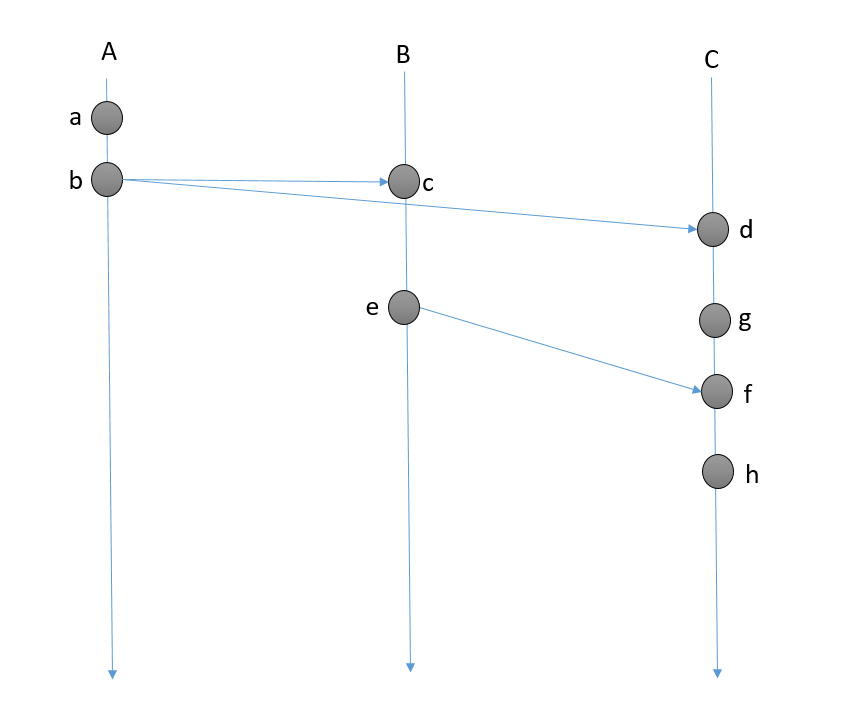
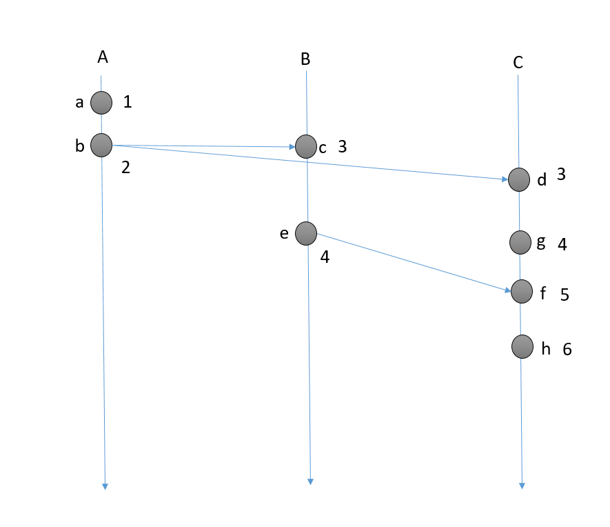

# 分布式SQL数据库
## 关系型数据库现状
随着时代的发展，各种终端的普及，应用和数据的规模越来越大，各种云服务的方案层出不穷。 在这个一切都可以水平扩展的时代，机器可扩展，服务可扩展，监控可扩展，缓存可扩展..... 然而，作为大多数应用最底层的数据存储 -- 关系型数据库， 难以找到一个优雅易用的水平扩展解决方案，一直以来不得不依赖主从复制，静态 Sharding 以及各种业务层的 Workarounds 勉强应对。

## NOSQL的兴起和优缺点
现代计算系统每天在网络上都会产生庞大的数据量。这些数据有很大一部分是由关系型数据库管理系统（RDBMSs）来处理，其严谨成熟的数学理论基础使得数据建模和应用程序编程更加简单。但随着信息化的浪潮和互联网的兴起，传统的RDBMS在一些业务上开始出现问题。首先，对数据库存储的容量要求越来越高，单机无法满足需求，很多时候需要用集群来解决问题，而RDBMS由于要支持join，union等操作，一般不支持分布式集群。其次，在大数据大行其道的今天，很多的数据都“频繁读和增加，不频繁修改”，而RDBMS对所有操作一视同仁，这就带来了优化的空间。另外，互联网时代业务的不确定性导致数据库的存储模式也需要频繁变更，不自由的存储模式增大了运维的复杂性和扩展的难度。
### 优点
易扩展
NoSQL数据库种类繁多，但是有一个共同的特点，都是去掉了关系型数据库的关系型特性。数据之间无关系，这样就非常容易扩展。也无形之间，在架构的层面上带来了可扩展的能力。
大数据量，高性能
NoSQL数据库都具有非常高的读写性能，尤其在大数据量下，同样表现优秀。这得益于它的无关系性，数据库的结构简单。一般MySQL使用Query Cache，每次表更新Cache就失效，是一种大粒度的Cache，针对web2.0的交互频繁的应用，Cache性能不高。而NoSQL的Cache是记录级的，是一种细粒度的Cache，所以NoSQL在这个层面上来说性能就要高很多了。
灵活的数据模型
NoSQL无需事先为要存储的数据建立字段，随时可以存储自定义的数据格式。而在关系型数据库里，增删字段是一件非常麻烦的事情。如果是非常大数据量的表，增加字段简直就是一个噩梦。这点在大数据量的web2.0时代尤其明显。
高可用
NoSQL在不太影响性能的情况下，就可以方便地实现高可用的架构。比如Cassandra、HBase模型，通过复制模型也能实现高可用。
### 缺点
没有标准
没有对NoSQL数据库定义的标准，所以没有两个NoSQL数据库是平等的。
没有存储过程
NoSQL数据库中大多没有存储过程。
不支持SQL
NoSQL大多不提供对SQL的支持：如果不支持SQL这样的工业标准，将会对用户产生一定的学习和应用迁移上的成本。
支持的特性不够丰富，产品不够成熟
现有产品所提供的功能都比较有限，不像MS SQL Server和Oracle那样能提供各种附加功能，比如BI和报表等。大多数产品都还处于初创期，和关系型数据库几十年的完善不可同日而语。

### NoSQL与SQL的对比

|      | RDBMS        | NoSQL     |
| ---- | ------------ | --------- |
| 模式   | 预定义的模式       | 没有预定义的模式  |
| 查询语言 | 结构化查询语言（SQL） | 没有声明性查询语言 |
| 一致性  | 严格的一致性       | 最终一致性     |
| 事务   | 支持           | 不支持       |
| 理论基础 | ACID         | CAP, BASE |
| 扩展   | 纵向扩展         | 横向扩展(分布式) |

## NoSQL数据库的分类

### 键值(Key-Value)存储数据库
这一类数据库主要会使用到哈希表，在这个表中有一个特定的键和一个指针指向特定的数据。Key/value模型对于IT系统来说优势在于简单、易部署。但是如果DBA只对部分值进行查询或更新的时候，Key/value就显得效率低下了。
E. g:
TokyoCabinet/Tyrant
Redis
Voldemort
OracleBDB
### 列存储数据库
这部分数据库通常是用来应对分布式存储的海量数据。键仍然存在，但是它们的特点是指向了多个列。这些列是由列家族来安排的。
E. g:
Cassandra
HBase
Riak
### 文档型数据库
文档型数据库的灵感来自于Lotus Notes办公软件，它同第一种键值存储相类似。该类型的数据模型是版本化的文档，半结构化的文档以特定的格式存储，比如JSON。文档型数据库可以看作是键值数据库的升级版，允许之间嵌套键值。而且文档型数据库比键值数据库的查询效率更高。
E. g:
CouchDB
MongoDB
SequoiaDB
### 图形(Graph)数据库
图形结构的数据库同其它行列以及刚性结构的SQL数据库不同，它是使用灵活的图形模型，并且能够扩展到多个服务器上。NoSQL数据库没有标准的查询语言(SQL)，因此进行数据库查询需要制定数据模型。许多NoSQL数据库都有REST式的数据接口或者查询API。
E. g:
Neo4J
InfoGrid
InfiniteGraph

## 新一代分布式SQL数据库的必备特点

* 无缝的水平扩展，应用层可以不用关心存储的容量和吞吐。
* SQL 支持，SQL 有着良好的易用性和生态系统。业务层如果已经在使用 SQL ，转变到 NoSQL 上是个极其痛苦的过程。
* 完整的 ACID 事务支持，应用层不需要关心跨行事务的实现，不需要写很多 hack 代码来确保数据的安全性。
* 更强的 MVCC，可以无锁的访问任意时间点的数据库快照。
* 在线的 Schema 变更，不需要每次更新Schema都要面临停止服务的窘境。
* 零迁移成本，兼容现有的协议或者查询语法，已有的代码不需要做改动或很少改动自动就能获得扩展的能力。

## TiDB
TiDB开源的分布式数据库，参考 Google F1/Spanner 实现了水平伸缩，一致性的分布式事务，多副本同步复制等重要 NewSQL 特性。结合了 RDBMS 和 NoSQL 的优点，部署简单，在线扩容和表结构变更不影响业务，异地多活保障数据安全，同时完全兼容 MySQL / PostgreSQL 协议，使迁移使用成本降到极低。

[关于 TiDB 的正确使用姿势](https://zhuanlan.zhihu.com/p/25574778)
[Apache HAWQ与TiDB比较](https://www.zhihu.com/question/54597742)

## CockroachDB
CockroachDB是一个基于事务和强一致性键值存储构建的分布式SQL数据库。 它支持水平缩放; 可以容忍磁盘
、机器、机架，甚至数据中心故障，并能在极短时间内无需人工干预的恢复服务; 支持强一致的ACID事务; 并提供了类SQL API来构造、操作和查询数据。

蟑螂是一个分布式的K/V数据仓库，支持ACID事务，多版本值存储是其首要特性。主要的设计目标是全球一致性和可靠性，从蟑螂的命名上是就能看出这点。蟑螂数据库能处理磁盘、物理机器、机架甚至数据中心失效情况下最小延迟的服务中断；整个失效过程无需人工干预。蟑螂的节点是均衡的，其设计目标是同质部署（只有一个二进制包）且最小配置。

蟑螂数据库实现了单一的、巨大的有序映射，键和值都是字节串形式（不是unicode），支持线性扩展，理论上支持4EB的逻辑数据）。映射有一个或者多个Range组成，每一个Range对应一个把数据存储在RocksDB（LevelDB的一个变种，Facebook贡献）上的K/V数据库，并且复制到三个或者更多蟑螂服务器上，Range定义为有开始和结束键值的区间。Range可以合并及分裂来维持总大小在一个全局配置的最大最小范围之间。Range的大小默认是64M，目的是便于快速分裂和合并，在一个热点键值区间快速分配负载。Range的复制确定为分离的数据中心来达到可靠性（比如如下分组：{ US-East, US-West, Japan }, { Ireland, US-East, US-West}, { Ireland, US-East, US-West, Japan, Australia }）

 Range有一种变化，通过分布式一致性算法实例来调节确保一致性，蟑螂所选择使用Raft一致性算法。所有的一致性状态存在于RocksDB中。

  一个逻辑上的变化可能会影响多个K/V对，逻辑变化是ACID事务性的。如果一个逻辑的变化引起的所有的键值都落在同一个Range里，Raft保证事务的原子性和一致性；不然的话，一个无锁的分布式提交协议用来协同受影响的Range。

 蟑螂提供快照隔离级别和可串行化快照隔离级别，允许外部一致性和无锁读写，这些都依赖于快照时间戳和当前时间。快照一致性提供无锁读写，但是依然允许写偏。SSI（可串行化快照隔离级别）消除写偏，但是引入了一个有争议系统的性能损失。SSI是默认的隔离级别；为了性能客户端必须自己处理交易的正确性。蟑螂实现了和Spannerde 目录相似，蟑螂允许任意数据zone的配置。允许选择复制因子、存储设备类型及数据中心位置等配置来优化性能或者可用性。不像Spaner，zone是一个整体，不允许对实体组水平的细粒度数据进行移动。

 提供一个类Megastore的消息队列机制来：可以容许异步执行的高效地sideline更新，以及，提供一个集成消息队列系统来用于分布式系统的组件之间的异步通信。

 [cockroachdb设计翻译](https://lihuanghe.github.io/2016/05/06/cockroachdb-design.html)

## BDRT
天云大数据BDRT（Beagledata Realtime Transaction）是一款大规模高并发支持灵活查询的实时查询引擎，具有高可用、可横向扩展、健壮性的特点，支持数据自动均匀分布、支持索引及事务控制、支持REST、SQL、SDK等接口，支持上千个用户并发的进行实时查询。

BDRT是在总结了多年大型银行大数据项目实施经验的基础上，针对海量数据实时模糊搜索查询场景抽象出的最佳实践工具。BDRT具有海量数据高效插入、读取和快速响应以及丰富的条件检索等特点，同时融入关系型数据库中事务的概念，形成的一套完整的支持分布式数据一致性的实时模糊搜索服务解决方案。

BDRT具有包括Java、Python、Scala SDK，RESTFul API，SQL等多种读写接口，可同时满足FTP、MQ、Sqoop、Flume、Kafka等多种数据接入方式，同时支持天云自有交换平台的数据接入。同时利用多种多样的接口可向各类业务应用推送需要的数据。支持全量导入、增量导入数据、读取数据支持分页等细节功能。
保持数据事务一致性,对ACID的有效支撑。事务控制层可以支持安全的使用并发的多线程。可以支持对一个数据对象或方法在读写上的提交与回滚。在事务完成时，无论成功或者回滚，数据在多个节点都会处于一致的状态。
为了更好的查询效率和对各种数据类型有更好的支持，BDRT索引包含了多种数据类型的索引，这些数据类型包括：Byte、Short、Integer、Long、Float、Double、Decimal、Precision、String、Date、Instant等，有了这些数据类型，索引就可以根据业务实际需要来进行选择，紧密的和业务结合在一起。
通过持久化接口将数据在BDRT中持久化。BDRT原生支持了多种数据类型，这些类型包括：String、Character、Boolean、Byte、Short、Integer、Long、Float、Double、Decimal（拥有三位小数的数字）、Precision（拥有6位小数的数字）、Date、UUID。

### BDRT查询引擎具有下列特性：
* 与hadoop生态圈紧密结合，可与其他hadoop组件进行无缝集成。
* 支持数据和用户的高扩展，水平扩展非常容易。支持高效稳定的海量数据存储，可有效支持上亿行、上百万列、上万个版本，支持对数据自动分片。
* 具有容错性的数据分发和备份，对索引分片，并对每个分片创建多个副本。每个副本都可以对外提供服务。一个副本的异常不会对整个集群提供索引服务造成影响。
* 支持高可用性和热备份。
* 支持对数据进行各种高级查询，包括交集、联集、排除、通配符、范围、分页、排序、Group等。
* 读写严格一致，支持ACID（ACID指数据库正确执行的四个基本要素，包括:原子性，一致性，隔离性，持久性）和最终一致性。支持事务的提交和回滚，有效保障了数据的完整性。
* 数据查询的秒级毫秒级响应，从而支持OLTP。

### 产品优势：
* 采用分布式架构解决数据的安全性、稳定性，相对于传统关系型数据库，大大提高了数据的存储容量。
* 支持数据和用户的高扩展，水平扩展非常容易。支持高效稳定的海量数据存储，可有效支持上亿行、上百万列、上万个版本，支持对数据自动分片。
* 具有容错性的数据分发和备份，对索引分片，并对每个分片创建多个副本。每个副本都可以对外提供服务。一个副本的异常不会对整个集群提供索引服务造成影响。
* 支持对数据进行各种高级查询，包括交集、联集、排除、通配符、范围、分页、排序、Group等。
* 读写严格一致，支持ACID。支持事务的提交和回滚，有效保障了数据的完整性。
* 数据查询的秒级毫秒级响应，从而支持OLTP。
* 可与其他组件可以做到轻松集成，既可以与业务系统结合，将读数据放到BDRT端，来做读写分离，为业务系统减负，也可通过大数据平台hadoop和spark进行ETL处理，从而支持OLAP。
* 良好的开发规范和完善的文档支持，降低了开发人员的使用门槛，无需关心BDRT的底层。

### 适用场景：
* 利用BDRT低延时、高性能、海量存储等特性，满足需要从海量的历史和实时数据中秒级获取有效信息的场景。
* 在分布式背景下，数据量不断的增长，需要高速的读写，并有复杂的ETL需要的场景。
* 用户使用频率非常高，重要程度仅次于核心应用，对数据的丢失以及服务的中断零容忍的场景。
* 对数据的一致性有要求的场景。

## 基础技术原理和名称术语

### CAP
CAP原则又称CAP定理，指的是在一个分布式系统中， Consistency（一致性）、 Availability（可用性）、Partition tolerance（分区容错性），三者不可得兼。

分布式系统的CAP理论：理论首先把分布式系统中的三个特性进行了如下归纳：
* 一致性（C）：在分布式系统中的所有数据备份，在同一时刻是否同样的值。（等同于所有节点访问同一份最新的数据副本）
* 可用性（A）：在集群中一部分节点故障后，集群整体是否还能响应客户端的读写请求。（对数据更新具备高可用性）
* 分区容错性（P）：以实际效果而言，分区相当于对通信的时限要求。系统如果不能在时限内达成数据一致性，就意味着发生了分区的情况，必须就当前操作在C和A之间做出选择。

2000年，Eric Brewer提出了一个猜想：

* C（一致性）：所有的节点上的数据时刻保持同步
* A（可用性）：每个请求都能接受到一个响应，无论响应成功或失败
* P（分区容错）：系统应该能持续提供服务，即使系统内部有消息丢失（分区）
  高可用、数据一致是很多系统设计的目标，但是分区又是不可避免的事情：
* CA without P：如果不要求P（不允许分区），则C（强一致性）和A（可用性）是可以保证的。但其实分区不是你想不想的问题，而是始终会存在，因此CA的系统更多的是允许分区后各子系统依然保持CA。
* CP without A：如果不要求A（可用），相当于每个请求都需要在Server之间强一致，而P（分区）会导致同步时间无限延长，如此CP也是可以保证的。很多传统的数据库分布式事务都属于这种模式。
* AP wihtout C：要高可用并允许分区，则需放弃一致性。一旦分区发生，节点之间可能会失去联系，为了高可用，每个节点只能用本地数据提供服务，而这样会导致全局数据的不一致性。现在众多的NoSQL都属于此类。

2002年，Lynch与其他人证明了Brewer猜想，CAP的定义进行了更明确的声明:

* C：一致性被称为原子对象，任何的读写都应该看起来是“原子“的，或串行的。**写后面的读一定能读到前面写的内容**。所有的读写请求都好像被全局排序。
* A：对任何非失败节点都应该在有限时间内给出请求的回应。（请求的可终止性）。
* P：允许节点之间丢失任意多的消息，当网络分区发生时，节点之间的消息可能会完全丢失。

Brewer和Lynch于2012年补充完善了CAP理论：
* 把CAP理论的证明局限在原子读写的场景，并申明不支持数据库事务之类的场景
* 一致性场景不会引入用户agent，只是发生在后台集群之内
* 把分区容错归结为一个对网络环境的陈述，而非之前一个独立条件。这实际上就是更加明确了概念
* 引入了活性(liveness)和安全属性(safety)，在一个更抽象的概念下研究分布式系统，并认为CAP是活性与安全属性之间权衡的一个特例。其中的一致性属于liveness，可用性属于safety
* 把CAP的研究推到一个更广阔的空间：网络存在同步、部分同步；一致性性的结果也从仅存在一个到存在N个（部分一致）；引入了通信周期round，并引用了其他论文，给出了为了保证N个一致性结果，至少需要通信的round数。

CAP并不适合再作为一个适应任何场景的定理，它的正确性更加适合基于原子读写的NoSQL场景。

### ACID
传统的SQL数据库的事务通常都是支持ACID的强事务机制。
#### 原子性
一个事务包含多个操作，这些操作要么全部执行，要么全都不执行。实现事务的原子性，要支持回滚操作，在某个操作失败后，回滚到事务执行之前的状态。
     回滚实际上是一个比较高层抽象的概念，大多数DB在实现事务时，是在事务操作的数据快照上进行的（比如MVCC），并不修改实际的数据，如果有错并不会提交，所以很自然的支持回滚。
     而在其他支持简单事务的系统中，不会在快照上更新，而直接操作实际数据。可以先预演一边所有要执行的操作，如果失败则这些操作不会被执行，通过这种方式很简单的实现了原子性。
#### 一致性（Consistency）
一致性是指事务使得系统从一个一致的状态转换到另一个一致状态。在事务开始和完成时，数据必须保持一致状态，相关的数据规则必须应用于事务的修改，以保证数据的完整性，事务结束时，所有的内部数据结构必须正确
事务的一致性决定了一个系统设计和实现的复杂度。事务可以不同程度的一致性：
     **强一致性：**读操作可以立即读到提交的更新操作。
     **弱一致性：**提交的更新操作，不一定立即会被读操作读到，此种情况会存在一个不一致窗口，指的是读操作可以读到最新值的一段时间。
     **最终一致性：**是弱一致性的特例。事务更新一份数据，最终一致性保证在没有其他事务更新同样的值的话，最终所有的事务都会读到之前事务更新的最新值。如果没有错误发生，不一致窗口的大小依赖于：通信延迟，系统负载等。
     其他一致性变体还有：
     **单调一致性：**如果一个进程已经读到一个值，那么后续不会读到更早的值。
     **会话一致性：**保证客户端和服务器交互的会话过程中，读操作可以读到更新操作后的最新值。
#### 隔离性（Isolation）
并发事务之间互相影响的程度，比如一个事务会不会读取到另一个未提交的事务修改的数据。
在事务并发操作时，可能出现的问题有：
     **脏读：**事务A修改了一个数据，但未提交，事务B读到了事务A未提交的更新结果，如果事务A提交失败，事务B读到的就是脏数据。
     **不可重复读：**在同一个事务中，对于同一份数据读取到的结果不一致。比如，事务B在事务A提交前读到的结果，和提交后读到的结果可能不同。不可重复读出现的原因就是事务并发修改记录，要避免这种情况，最简单的方法就是对要修改的记录加锁，这回导致锁竞争加剧，影响性能。另一种方法是通过MVCC可以在无锁的情况下，避免不可重复读。
     **幻读：**在同一个事务中，同一个查询多次返回的结果不一致。事务A新增了一条记录，事务B在事务A提交前后各执行了一次查询操作，发现后一次比前一次多了一条记录。幻读是由于并发事务增加记录导致的，这个不能像不可重复读通过记录加锁解决，因为对于新增的记录根本无法加锁。需要将事务串行化，才能避免幻读。
     事务的隔离级别从低到高有：
     **Read Uncommitted：**最低的隔离级别，什么都不需要做，一个事务可以读到另一个事务未提交的结果。所有的并发事务问题都会发生。
     **Read Committed：**只有在事务提交后，其更新结果才会被其他事务看见。可以解决脏读问题。
     **Repeated Read：**在一个事务中，对于同一份数据的读取结果总是相同的，无论是否有其他事务对这份数据进行操作，以及这个事务是否提交。可以解决脏读、不可重复读。
     **Serialization：**事务串行化执行，隔离级别最高，牺牲了系统的并发性。可以解决并发事务的所有问题。
     通常，在工程实践中，为了性能的考虑会对隔离性进行折中。
#### 持久性（Durability）
事务提交后，对系统的影响是永久的，即使系统出现故障也能够保持。

### 权衡一致性与可用性 - BASE理论
Base = Basically Available + Soft state + Eventuallyconsistent 基本可用性+软状态+最终一致性，由eBay架构师DanPritchett提出。Base是对CAP中一致性A和可用性C权衡的结果，源于提出者自己在大规模分布式系统上实践的总结。核心思想是无法做到强一致性，但每个应用都可以根据自身的特点，采用适当方式达到最终一致性。
#### BA - Basically Available - 基本可用
基本可用。这里是指分布式系统在出现故障的时候，允许损失部分可用性，即保证核心功能或者当前最重要功能可用。对于用户来说，他们当前最关注的功能或者最常用的功能的可用性将会获得保证，但是其他功能会被削弱。
#### S – Soft State - 软状态
允许系统数据存在中间状态，但不会影响到系统的整体可用性，即允许系统在不同节点的数据副本之间进行数据同步时存在延时。
#### E - Eventually Consistent - 最终一致性
要求系统数据副本最终能够一致，而不需要实时保证数据副本一致。最终一致性是弱一致性的一种特殊情况。最终一致性有5个变种：
* 因果一致性
* 读己之所写(因果一致性特例)
* 会话一致性
* 单调读一致性
* 单调写一致性

## 分布式存储算法和技术实现（Atomic）

### 从分布式系统说起

**Leslie Lamport在1983年的PODC大会上提到：**

> What is a distributed systeme. Distribution is in the eye of the beholder.To the user sitting at the keyboard, his IBM personal computer is a nondistributed system.To a flea crawling around on the circuit board, or to the engineer who designed it, it's very much a distributed system.

​	从狭义上来说，分布式系统是建立在网络之上的软件系统。一个分布式系统由多个计算节点组成，每个节点承担一定的计算和存储，节点之间通过网络连接到一起，协同工作形成一个整体。因此，整个系统中发生的事件可能会同时发生。从广义上来说，就如上面Leslie Lamport所说的那样，是个非常相对的概念，对于用户来说，可以看成一个非分布式系统，对于设计分布式系统的工程师来说，则肯定是一个分布式系统。很多早期的分布式研究都是从更加微观的多路处理器的研究开始的, 发展到现在分布式更多的是指狭义上的分布式系统，即多个计算机节点通过网络组成的分布式集群之上的软件，例如分布式数据库。但无论是狭义还是广义的分布式系统, 并发一致性一直是分布式系统的核心问题。一致性不是简单的让两个节点最终对一个值的结果一致, 很多时候还需要对这个值的变化历史在不同节点上的观点也要一致。主要看设计的分布式系统的需要，就像前面BASE理论里说的那样，需要采用适当的方法来满足分布式系统的最终一致性。例如一个变量在一个节点中体现的状态可能是由1->2->3->4这个顺序变化最终变成状态4的，在另一个节点，体现的状态可能是1->2->4。根据应用场景，有可能没有问题，有可能会存在着严重的问题。而这种问题产生的原因可能是网络，也可能是其他的问题。以网络举例，计算机网络大多数都是异步的，异步网络的延时、顺序、可靠性都不可保证，如果发生网络问题，重连的网络也有可能不能保证接收到的消息是按真实的时间顺序接收的。因此，对于分布式系统来说，并发一致性一直是分布式系统的核心问题。

### 一致性定义

**一致性条件**

详细分布式一致性问题可参考[Solved Problems, Unsolved Problems and Problems in Concurrency](http://research.microsoft.com/en-us/um/people/lamport/pubs/solved-and-unsolved.pdf)

​	在一个分布式系统中，如果其中一个节点发起一个变更，在一定时间内（不是无休止的确认）经过所有节点的确认，都认同这个结果，就可以说满足一致性。但是这只是理想情况下，实际上分布式系统可能面临着很多问题导致一致性很难满足。

一致性面临的问题包括：

- 消息传递

  现实网络不是可靠的，存在消息丢失、消息延时、传递消息顺序错乱等问题。

  举个例子来说，比如A通过短信邀请B在某处吃饭，时间约在了晚上8点，但B在8点后才收到短信或A未在8点前接收到回复，A、B都不能保证可以在8点到达某处参与吃饭这一活动。这就是消息延时导致的一致性问题。

- 节点问题

  节点宕机或者节点宕机后恢复，都可能导致一致性问题，这也是在分布式系统中最常见的问题，与消息传递类似，可能出现时延或者未有响应等多种情况。在节点宕机或宕机后恢复时都无法保证其他节点获取宕机节点的状态以及它给出的意见，也就无法保证所有节点都认同一个结果。

- 网络分化

  网络链路有问题，将节点分割成几个部分。数个节点组成互不关联的几个组合，也有可能会产生分布式一致性中常见的一种错误，脑裂。

- 拜占庭将军（Byzantine failure）

  拜占庭将军问题是一个协议问题，拜占庭帝国军队的将军们必须全体一致的决定是否攻击某一支敌军。问题是这些将军在地理上是分隔开来的，并且将军中存在叛徒。叛徒可以任意行动以达到以下目标：欺骗某些将军采取进攻行动；促成一个不是所有将军都同意的决定，如当将军们不希望进攻时促成进攻行动；或者迷惑某些将军，使他们无法做出决定。如果叛徒达到了这些目的之一，则任何攻击行动的结果都是注定要失败的，只有完全达成一致的努力才能获得胜利。即错误节点可以做任意事情（不受协议限制），比如不响应、发送错误信息、对不同节点发送不同决定、不同错误节点联合起来发送错误决定影响投票等等。总之就是说，没有节点会出现比这更严重的错误。这种错误在实际环境中比较少见，但拜占庭错误可以衡量一致性算法的好坏。如果某个一致性算法能够保证在系统出现多个拜占庭错误时保持系统一致，那么这个算法也就能够保证在出现多个任意其他错误的时候也保持系统一致。

  **参考** [The Byzantine Generals Problem](http://research.microsoft.com/en-us/um/people/lamport/pubs/byz.pdf)

**FLP定理**

FLP定理(FLP impossibility)已经证明在一个收窄的模型中(异步环境并只存在节点宕机)，不能同时满足强一致和 可用。强一致：它要求所有节点状态一致、共进退；可用：它要求分布式系统24*7无间断对外服务。工程实践上根据具体的业务场景，或保证强一致，或在节点宕机、网络分化的时候保证可用。总要在一致性和可用上做一定的取舍。

[Impossibility of Distributed Consensus with One Faulty Process](http://cs-www.cs.yale.edu/homes/arvind/cs425/doc/fischer.pdf)

**一致性基本概念**

- XA

   XA 是指由 X/Open 组织提出的分布式交易处理的规范。XA 规范主要定义了事务管理器和局部资源管理器之间的接口。X/Open XA接口是双向的系统接口，在事务管理器以及一个或多个资源管理器之间形成通信桥梁。XA之所以需要引入事务管理器是因为，在分布式系统中，从理论上讲（参考FLP impossibility定理），两台机器理论上无法达到一致的状态，需要引入一个单点进行协调。事务管理器控制着全局事务，管理事务生命周期，并协调资源。资源管理器负责控制和管理实际资源。通常情况下，通过XA 接口规范，使用两阶段提交来完成一个全局事务，XA规范的基础是两阶段提交协议。

- 二段提交

  二段提交（2PC）将提交分成两个阶段，第一阶段是准备阶段，由一个节点提议并收集其他节点的反馈，第二阶段是提交阶段，根据反馈情况决定是提交还是回滚。这里提议节点被称作协调者(coordinator)，其他参与节点被称为参与者(participants)。

  第一阶段：

  ```
  graph LR
  	协调者==准备==>参与者1..N
  	参与者1..N==就绪==>协调者	
  ```
  1. 协调者向所有的参与者发送事务执行请求，并等待参与者反馈事务执行结果。
  2. 事务参与者收到请求之后，执行事务，但不提交，并记录事务日志。
  3. 参与者将自己事务执行情况反馈给协调者，同时阻塞等待协调者的后续指令。

  ​

  第二阶段：

  ```
  graph LR
  	协调者==commit/rollback==>参与者1..N
  	参与者1..N==commit/rollback结果信息==>协调者
  ```

  在第一阶段协调者的轮询之后，各个参与者会回复自己事务的执行情况，这时候存在两种情况，协调者回复能够正常执行事务、一个或多个协调者回复事务失败或者协调者等待超时。

  正常执行任务：

  1. 协调者向各个参与者发送commit通知，请求提交事务。
  2. 参与者收到事务提交通知之后，执行commit操作，然后释放占有的资源。
  3. 参与者向协调者返回事务commit结果信息。

  事务回滚任务：

  1. 协调者向各个参与者发送事务rollback通知，请求回滚事务。
  2. 参与者收到事务回滚通知之后，执行rollback操作，然后释放占有的资源。
  3. 参与者向协调者返回事务rollback结果信息。

  ​	从协调者接收到一次事务请求、发起提议到事务完成，经过2PC协议后增加了2次RTT(请求+提交)，带来的时延增加相对较少。

  2PC解决的是分布式数据强一致性问题，其原理简单，易于实现，但是缺点是十分明显的，主要缺点是存在单点问题，协调者在整个两阶段提交过程中扮演着举足轻重的作用，一旦协调者所在服务器宕机，那么就会影响整个数据库集群的正常运行，比如在第二阶段中，如果协调者因为故障不能正常发送事务提交或回滚通知，那么参与者们将一直处于阻塞状态，整个数据库集群将无法提供服务。

  > ​	通过改进的2PC可以解决这一问题。协调者如果在发起提议后宕机，那么参与者将进入阻塞状态、一直等待协调者回应以完成该次决议。这时需要另一角色把系统从不可结束的状态中带出来，可以在系统中新增一个角色协调者备份。协调者宕机一定时间后，协调者备份接替原协调者工作，通过轮询各参与者的状态，决定阶段2是提交还是中止。这也要求 协调者/参与者记录历史状态，以备协调者宕机后协调者备份对参与者查询、协调者宕机恢复后重新找回状态。
  >
  > ​	即使可以使用协调者备份（watchdog）解决单点问题，仍然可能存在问题。在两阶段提交中一个参与者的状态只有它自己和协调者知晓，假如协调者提议后自身宕机，在协调者备份启用前一个参与者又宕机，其他参与者就会进入既不能回滚、又不能强制commit的阻塞状态，直到参与者宕机恢复。由此可能造成分布式系统阻塞。

- 三段提交

  三阶段提交是为解决两阶段提交协议的缺点而设计的。与两阶段提交不同的是，三阶段提交是“非阻塞”协议。三阶段提交在两阶段提交的第一阶段与第二阶段之间插入了一个准备阶段，使得原先在两阶段提交中，参与者在投票之后，由于协调者发生崩溃或错误，而导致参与者处于无法知晓是否提交或者中止的“不确定状态”所产生的可能相当长的延时的问题得以解决（解决2PC中参与者宕机可能会出现的系统阻塞问题）。

  

  参与者如果在不同阶段宕机，3PC的处理逻辑：

  - **阶段1**: 协调者或协调者备份未收到宕机参与者的反馈，直接中止事务；宕机的参与者恢复后，读取日志发现未发出就绪反馈，自行中止该次事务
  - **阶段2**: 协调者未收到宕机参与者的precommit ACK，但因为之前已经收到了宕机参与者的就绪反馈，协调者进行commit；协调者备份可以通过问询其他参与者获得这些信息，过程同理；宕机的参与者恢复后发现收到precommit或已经发出ACK，则自行commit该次事务
  - **阶段3**: 即便协调者或协调者备份未收到宕机参与者的haveCommitted，也结束该次事务；宕机的参与者恢复后发现收到commit或者precommit，也将自行commit该次事务

  参考[维基百科中文](https://zh.wikipedia.org/wiki/%E4%B8%89%E9%98%B6%E6%AE%B5%E6%8F%90%E4%BA%A4)，[维基百科英文](https://en.wikipedia.org/wiki/Three-phase_commit_protocol)

- 选举、多数派、租约

  选举、多数派、租约都是分布式系统中最常见的问题，也是分布式系统实现的基础，很多分布式系统组件中都存在这三个概念，例如zookeeper的实现，甚至现代分布式协议或算法都需要或依赖于选举、多数派及租约。

  选举（election）通过打破节点间的对等关系，选得的leader(或叫master、coordinator)也即2PC/3PC中的协调者，有助于实现事务原子性、提升决议效率。

  多数派(quorum)帮助我们在网络分化的情况下达成决议一致性，在leader选举的场景下帮助我们选出唯一leader。

  租约(lease)在一定期限内给予节点特定权利，也可以用于实现leader选举。

  **选举**

  ​	在分布式系统出现故障后，通常需要重新组织活动的节点使它们继续执行有用的任务。在这个重新组织和配置的过程中，第一步就是要选出一个协调者来管理这些操作。故障的检测通常是基于超时机制的。如果一个进程超过一定的时间没有收到协调者的响应，它就怀疑协调者出了故障并启动选举过程。选举在集群服务器、负载均衡、重复数据更新、应急恢复、连接组和互斥等领域都有广泛应用。一般来说，选举过程包括两步：一、选择一个具有最高优先级的leader，二、通知其他进程谁是leader。

  ​	选举算法的分类：

  1. 基于环形拓扑的（环算法），其中每个进程不知道其它进程的优先级。
  2. 基于全连接拓扑的，其中每个进程知道其它进程的优先级。
  3. 基于非比较的，其中消息被“编码”在以轮表示的时间中，这种类型的算法只能工作在同步系统中。 

  ​       其中最常用的算法是1982年由Hector Garcia-Molina提出的[Bully算法](http://homepage.divms.uiowa.edu/~ghosh/Bully.pdf)，其要求每个节点对应一个序号，序号最高的节点为leader。leader宕机后次高序号的节点被重选为leader。

  ​	当任何一个节点发现协调者不响应请求时，他发起一次选举，选举过程如下：

  1. 发现协调者不响应的节点向所有编号比他大的节点发送一个选举消息
  2. 如果无人响应，则该节点获胜，成为协调者
  3.  如果编号比他大的节点响应，则由响应者接管选举工作，该节点的工作完成。在由响应者循环1-3步直到最大编号节点胜出。

  > 任何一个时刻，一个节点只能从编号比他小的节点接受选举消息，当消息到达时，接受者发送一个OK消息给发送者，表明它在运行，接管工作。最终除了编号最大的一个节点外，其他节点都放弃，那个节点就是新的协调者。他将获胜消息发送给其他所有节点，通知他们自己为新的协调者。当一个以前宕机的节点恢复过来了后，它将主持一场选举。如果该节点恰好是当前运行节点中编号最大的进程，它将获胜。因此，此算法称为Bully算法。

  ---

  **多数派**

  ​	当分布式环境下出现网络分化时，由于出现了网络隔离，隔离之后会有多个节点都认为自己具有最大编号，将会产生多个协调者，所以引入了[多数派](https://ecommons.cornell.edu/bitstream/handle/1813/6323/82-483.pdf?sequence=1)这个概念。多数派确保了在网络隔离情况下的leader的唯一性。假如节点总数为2X+1，则一项选举得到多于 X 节点赞成才能获得通过。leader选举中，网络分化场景下只有具备多数派节点的部分才可能选出leader，这避免了多leader的产生。因此，一般要保证分布式一致性，参与选举的节点数在集群中都要指定为单数个。

  ---

  **租约**

  ​	在一个分布式系统中何时发起重新选举呢？最先可能想到会通过心跳(heart beat)判别leader状态是否正常，但在网络拥堵或瞬断的情况下，leader状态可能不正常，但堵塞或瞬断结束后又正常，而这时，已经完成了选举，这容易导致出现双leader的情况。因此，引入了租约的概念。

  ​	租约的中心思想是每个租约时长内只有一个节点获得租约、到期后必须重新颁发租约。假设我们有一个租约颁发节点，节点在租约颁发节点上注册自己，租约颁发节点按选举颁发租约给节点，使节点成为leader，在租约期内，即使leader节点宕机，也不进行重新选举，到期后重新选举，颁发租约并确定leader。

  在实际应用中，zookeeper、ectd均存在租约颁发。

  ​

- 时间、时钟和时序

  分布式系统下需要记录和比较不同节点间事件发生的顺序，但不同于现实生活中使用物理时钟记录时间，分布式系统使用逻辑时钟记录事件顺序关系。为什么不适用物理时钟呢，这是由于现实生活中物理时间有统一的标准，而分布式系统中每个节点记录的时间并不一样，即使设置了 NTP 时间同步节点间也存在毫秒级别的偏差。例如，有日志服务器记录日志，如果异步执行，即使时间同步，若事件发生在几个节点，也可能出现事件乱序的情况，节点A执行事件1后发送日志到事件记录服务器节点C，同时发送消息到节点B通知其执行事件2后发送执行日志到事件记录服务器节点C，正常情况下，在C上的记录顺序可能是事件1，事件2，但由于网络原因，可能导致B发送的事件2排在事件1之前。

  因此，分布式系统需要有另外的方法记录事件顺序关系，这就是逻辑时钟。

  - Lamport Clock

    Leslie Lamport 在1978年提出逻辑时钟的概念，并描述了一种逻辑时钟的表示方法，这个方法被称为[Lamport时间戳](https://www.microsoft.com/en-us/research/publication/time-clocks-ordering-events-distributed-system/?from=http%3A%2F%2Fresearch.microsoft.com%2Fen-us%2Fum%2Fpeople%2Flamport%2Fpubs%2Ftime-clocks.pdf)(Lamport timestamps或Lamport Clock)。

    分布式系统中按是否存在节点交互事件可分为三类事件，节点内部，发送事件，接收事件。

    Lamport时间戳包含下列规则：

    1. 每个事件对应一个Lamport时间戳，初始值为0
    2. 在节点内发生的事件，时间戳加1。
    3. 如果事件属于发送事件，时间戳加1并在消息中带上该时间戳
    4. 如果事件属于接收事件，时间戳由本地时间戳与消息中带的时间戳中取最大值加1。

    用伪代码描述发送事件时间戳

    ```
    time = time+1;
    time_stamp = time;
    send(message, time_stamp);
    ```

    接收事件时间戳:

    ```
    (message, time_stamp) = receive();
    time = max(time_stamp, time)+1;
    ```

    > **Happend-before**
    >
    > 若事件a、b满足下面任一条件，可记为a->b：
    >
    > - 如果a、b发生在同一节点，并且a发生在b之前，a->b
    > - 如果a是一个节点上的发送事件，b是另一节点上的接收事件，那么a->b

    如上面给的例子

    

    

    由图可以看到各事件的时间戳，但也可以看到其中c、d和e、g具有相同的事件戳，这时候，需要将A、B、C进行编号，相同时间戳取按节点编号顺序排列，所以c=>d,e=>g，由此可以得到事件的全序关系：a->b->c=>d->e=>g->f->h。

    可以看到Lamport timestamps是存在一些问题的，它确保了所有因果关系不会出现逻辑错误，但是不能保证系统的公平性。

  - Vector clock

  - Version vectors

  - Matrix clocks

  ​

  ​

- 各类一致性模型：理想的一致性模型及Sequential consistency、Linearizability、Casual Consistency, PRAM, Eventual Consistency、Weak Consistency

- 分布式一致性协议与算法
  1. Paxos
  2. Raft
  3. Zab
  4. Paxos变种


### Paxos 一致性算法

Paxos 算法解决的问题是一个分布式系统如何就某个值（决议）达成一致。一个典型的场景是，在一个分布式数据库系统中，如果各节点的初始状态一致，每个节点执行相同的操作序列，那么他们最后能得到一个一致的状态。为保证每个节点执行相同的命令序列，需要在每一条指令上执行一个“一致性算法”以保证每个节点看到的指令一致。一个通用的一致性算法可以应用在许多场景中，是分布式计算中的重要问题。因此从20世纪80年代起对于一致性算法的研究就没有停止过。节点通信存在两种模型：共享内存（Shared memory）和消息传递（Messages passing）。Paxos 算法就是一种基于消息传递模型的一致性算法。

不仅仅是在分布式系统中，凡是多个过程需要达成某种一致的场合都可以使用Paxos 算法。一致性算法可以通过共享内存（需要锁）或者消息传递实现，Paxos 算法采用的是后者。Paxos 算法适用的几种情况：一台机器中多个进程/线程达成数据一致；分布式文件系统或者分布式数据库中多客户端并发读写数据；分布式存储中多个副本响应读写请求的一致性。

因此一些著名的系统如Google的Chubby和Yahoo的Apache ZooKeeper都使用了paxos算法。

[如何浅显易懂地解说 Paxos 的算法](https://www.zhihu.com/question/19787937)

[以两军问题为背景来演绎Basic Paxos](http://iunknown.iteye.com/blog/2246484?from=message&isappinstalled=0)


#### 分布式协调和配置服务

etcd是一个高可用的键值存储系统，主要用于共享配置和服务发现。它使用Go语言编写，并通过Raft一致性算法处理日志复制以保证强一致性。Raft是一个来自Stanford的新的一致性算法，适用于分布式系统的日志复制，Raft通过选举的方式来实现一致性，在Raft中，任何一个节点都可能成为Leader。etcd 集群的工作原理基于 raft 共识算法 (The Raft Consensus Algorithm)。raft 共识算法的优点在于可以在高效的解决分布式系统中各个节点日志内容一致性问题的同时，也使得集群具备一定的容错能力。即使集群中出现部分节点故障、网络故障等问题，仍可保证其余大多数节点正确的步进。甚至当更多的节点（一般来说超过集群节点总数的一半）出现故障而导致集群不可用时，依然可以保证节点中的数据不会出现错误的结果。
Raft算法可以通过这个[动画](http://thesecretlivesofdata.com/raft/)来学习。

Zookeeper是一个用户维护配置信息、命名、分布式同步以及分组服务的集中式服务框架，它使用Java语言编写，通过Zab协议来保证节点的一致性，zookeeper是基于paxos的简化版zab。因为Zookeeper是一个CP型系统，所以当网络分区问题发生时，系统就不能注册或查找服务。

当提供K/V存储的时候，读取是强一致性的，并且在面对网络分区的时候，为了保持一致性，读取的可用性是可以牺牲的。

etcd和zk二者大多数情况下可以互相替代，都是通用的分布式一致性kv存储。二者之间选择，比如一种是按语言选择，go语言的项目用etcd，java的用zk，出问题要看源码也容易些。如果是新项目，纠结于二者，那可以分装一层lib，类似于docker/libkv，同时支持两种，有需要可以切换。

当前 Etcd 的raft实现保证了多个节点数据之间的同步，但明显的一个问题就是扩充节点不能解决容量问题。要想解决容量问题，只能进行分片，但分片后如何使用raft同步数据？只能实现一个 multiple group raft，每个分片的多个副本组成一个虚拟的raft group，通过raft实现数据同步。当前实现了multiple group raft的有 TiKV 和 Cockroachdb，但尚未一个独立通用的。理论上来说，如果有了这套 multiple group raft，后面挂个持久化的kv就是一个分布式kv存储，挂个内存kv就是分布式缓存，挂个lucene就是分布式搜索引擎。

etcd和zk二者的定位都是通用的一致性kv存储，而eureka和consul的定位则是专做服务注册和发现。前二者的优势是通用性，应用广泛，部署运维的时候容易和已有的服务一起共用，而同时缺点也是太通用了，每个应用的服务注册都有自己的一套元数据格式，互相整合起来就比较麻烦了，比如想做个通用的api gateway就会遇到元数据格式兼容问题。这也成为后二者的优势。同时因为后二者的目标比较具体，所以可以做一些更高级的功能，比如consul的DNS支持，consul-template工具，eureka的事件订阅过滤机制。Eureka本身的实现是一个AP系统，也就是说牺牲了一致性，它认为在服务发现和配置中心这个场景下，可用性和分区容错比一致性更重要。 

##### Etcd 架构与实现

Etcd 主要提供以下能力:

1. 提供存储以及获取数据的接口，它通过协议保证 Etcd 集群中的多个节点数据的强一致性。用于存储元信息以及共享配置。
2. 提供监听机制，客户端可以监听某个key或者某些key的变更（v2和v3的机制不同，参看后面文章）。用于监听和推送变更。
3. 提供key的过期以及续约机制，客户端通过定时刷新来实现续约（v2和v3的实现机制也不一样）。用于集群监控以及服务注册发现。
4. 提供原子的CAS（Compare-and-Swap）和 CAD（Compare-and-Delete）支持（v2通过接口参数实现，v3通过批量事务实现）。用于分布式锁以及leader选举。

Etcd 如何实现一致性:

1. raft通过对不同的场景（选主，日志复制）设计不同的机制，虽然降低了通用性（相对paxos），但同时也降低了复杂度，便于理解和实现。
2. raft内置的选主协议是给自己用的，用于选出主节点，理解raft的选主机制的关键在于理解raft的时钟周期以及超时机制。
3. 理解 Etcd 的数据同步的关键在于理解raft的日志同步机制。

wal日志是二进制的，解析出来后是以上数据结构LogEntry。其中第一个字段type，只有两种，一种是0表示Normal，1表示ConfChange（ConfChange表示 Etcd 本身的配置变更同步，比如有新的节点加入等）。第二个字段是term，每个term代表一个主节点的任期，每次主节点变更term就会变化。第三个字段是index，这个序号是严格有序递增的，代表变更序号。第四个字段是二进制的data，将raft request对象的pb结构整个保存下。Etcd 源码下有个tools/etcd-dump-logs，可以将wal日志dump成文本查看，可以协助分析raft协议。

raft协议本身不关心应用数据，也就是data中的部分，一致性都通过同步wal日志来实现，每个节点将从主节点收到的data apply到本地的存储，raft只关心日志的同步状态，如果本地存储实现的有bug，比如没有正确的将data apply到本地，也可能会导致数据不一致。

Etcd v2 和 v3 本质上是共享同一套 raft 协议代码的两个独立的应用，接口不一样，存储不一样，数据互相隔离。也就是说如果从 Etcd v2 升级到 Etcd v3，原来v2 的数据还是只能用 v2 的接口访问，v3 的接口创建的数据也只能访问通过 v3 的接口访问。


Etcd v2 是个纯内存的实现，并未实时将数据写入到磁盘，持久化机制很简单，就是将store整合序列化成json写入文件。数据在内存中是一个简单的树结构。比如以下数据存储到 Etcd 中的结构就如图所示。

```
/nodes/1/name  node1  
/nodes/1/ip    192.168.1.1 
```

store中有一个全局的currentIndex，每次变更，index会加1.然后每个event都会关联到currentIndex.

当客户端调用watch接口（参数中增加 wait参数）时，如果请求参数中有waitIndex，并且waitIndex 小于 currentIndex，则从 EventHistroy 表中查询index小于等于waitIndex，并且和watch key 匹配的 event，如果有数据，则直接返回。如果历史表中没有或者请求没有带 waitIndex，则放入WatchHub中，每个key会关联一个watcher列表。 当有变更操作时，变更生成的event会放入EventHistroy表中，同时通知和该key相关的watcher。

这里有几个影响使用的细节问题：

EventHistroy 是有长度限制的，最长1000。也就是说，如果你的客户端停了许久，然后重新watch的时候，可能和该waitIndex相关的event已经被淘汰了，这种情况下会丢失变更。
如果通知watch的时候，出现了阻塞（每个watch的channel有100个缓冲空间），Etcd 会直接把watcher删除，也就是会导致wait请求的连接中断，客户端需要重新连接。
Etcd store的每个node中都保存了过期时间，通过定时机制进行清理。
从而可以看出，Etcd v2 的一些限制：

过期时间只能设置到每个key上，如果多个key要保证生命周期一致则比较困难。
watch只能watch某一个key以及其子节点（通过参数 recursive),不能进行多个watch。
很难通过watch机制来实现完整的数据同步（有丢失变更的风险），所以当前的大多数使用方式是通过watch得知变更，然后通过get重新获取数据，并不完全依赖于watch的变更event。


Etcd v3 将watch和store拆开实现，我们先分析下store的实现。

Etcd v3 store 分为两部分，一部分是内存中的索引，kvindex，是基于google开源的一个golang的btree实现的，另外一部分是后端存储。按照它的设计，backend可以对接多种存储，当前使用的boltdb。boltdb是一个单机的支持事务的kv存储，Etcd 的事务是基于boltdb的事务实现的。Etcd 在boltdb中存储的key是reversion，value是 Etcd 自己的key-value组合，也就是说 Etcd 会在boltdb中把每个版本都保存下，从而实现了多版本机制。

举个例子： 用etcdctl通过批量接口写入两条记录：

```
etcdctl txn <<<' 
put key1 "v1" 
put key2 "v2" 

' 
```

再通过批量接口更新这两条记录：

```
etcdctl txn <<<' 
put key1 "v12" 
put key2 "v22" 

' 
```
boltdb中其实有了4条数据：

```
rev={3 0}, key=key1, value="v1" 
rev={3 1}, key=key2, value="v2" 
rev={4 0}, key=key1, value="v12" 
rev={4 1}, key=key2, value="v22" 
```

reversion主要由两部分组成，第一部分main rev，每次事务进行加一，第二部分sub rev，同一个事务中的每次操作加一。如上示例，第一次操作的main rev是3，第二次是4。当然这种机制大家想到的第一个问题就是空间问题，所以 Etcd 提供了命令和设置选项来控制compact，同时支持put操作的参数来精确控制某个key的历史版本数。

了解了 Etcd 的磁盘存储，可以看出如果要从boltdb中查询数据，必须通过reversion，但客户端都是通过key来查询value，所以 Etcd 的内存kvindex保存的就是key和reversion之前的映射关系，用来加速查询。

然后我们再分析下watch机制的实现。Etcd v3 的watch机制支持watch某个固定的key，也支持watch一个范围（可以用于模拟目录的结构的watch），所以 watchGroup 包含两种watcher，一种是 key watchers，数据结构是每个key对应一组watcher，另外一种是 range watchers, 数据结构是一个 IntervalTree（不熟悉的参看文文末链接），方便通过区间查找到对应的watcher。

同时，每个 WatchableStore 包含两种 watcherGroup，一种是synced，一种是unsynced，前者表示该group的watcher数据都已经同步完毕，在等待新的变更，后者表示该group的watcher数据同步落后于当前最新变更，还在追赶。

当 Etcd 收到客户端的watch请求，如果请求携带了revision参数，则比较请求的revision和store当前的revision，如果大于当前revision，则放入synced组中，否则放入unsynced组。同时 Etcd 会启动一个后台的goroutine持续同步unsynced的watcher，然后将其迁移到synced组。也就是这种机制下，Etcd v3 支持从任意版本开始watch，没有v2的1000条历史event表限制的问题（当然这是指没有compact的情况下）。

另外我们前面提到的，Etcd v2在通知客户端时，如果网络不好或者客户端读取比较慢，发生了阻塞，则会直接关闭当前连接，客户端需要重新发起请求。Etcd v3为了解决这个问题，专门维护了一个推送时阻塞的watcher队列，在另外的goroutine里进行重试。

Etcd v3 对过期机制也做了改进，过期时间设置在lease上，然后key和lease关联。这样可以实现多个key关联同一个lease id，方便设置统一的过期时间，以及实现批量续约。

相比Etcd v2, Etcd v3的一些主要变化：

接口通过grpc提供rpc接口，放弃了v2的http接口。优势是长连接效率提升明显，缺点是使用不如以前方便，尤其对不方便维护长连接的场景。
废弃了原来的目录结构，变成了纯粹的kv，用户可以通过前缀匹配模式模拟目录。
内存中不再保存value，同样的内存可以支持存储更多的key。
watch机制更稳定，基本上可以通过watch机制实现数据的完全同步。
提供了批量操作以及事务机制，用户可以通过批量事务请求来实现Etcd v2的CAS机制（批量事务支持if条件判断）。

### 分区（Partitioning）

原来所有的数据都是在一个数据库上的，网络IO及文件IO都集中在一个数据库上的，因此CPU、内存、文件IO、网络IO都可能会成为系统瓶颈。而分区的方案就是把某一个表或某几个相关的表的数据放在一个独立的数据库上，这样就可以把CPU、内存、文件IO、网络IO分解到多个机器中，从而提升系统处理能力。

### 分片（Replication）

分区有两种模式，一种是主从模式，用于做读写分离；另外一种模式是分片模式，也就是说把一个表中的数据分解到多个表中。一个分区只能是其中的一种模式。

### 一致性哈希（Consistent Hashing）

一致性哈希算法是分布式系统中常用的算法。比如，一个分布式的存储系统，要将数据存储到具体的节点上，如果采用普通的hash方法，将数据映射到具体的节点上，如key%N，key是数据的key，N是机器节点数，如果有一个机器加入或退出这个集群，则所有的数据映射都无效了，如果是持久化存储则要做数据迁移，如果是分布式缓存，则其他缓存就失效了。

一致性哈希基本解决了在P2P环境中最为关键的问题——如何在动态的网络拓扑中分布存储和路由。每个节点仅需维护少量相邻节点的信息，并且在节点加入/退出系统时，仅有相关的少量节点参与到拓扑的维护中。所有这一切使得一致性哈希成为第一个实用的DHT算法。


## 开源SQL引擎介绍

[6大主流开源SQL引擎总结](http://www.toutiao.com/a6392538584179720449/?tt_from=email&utm_campaign=client_share&app=news_article_social&utm_source=email&iid=9347877982&utm_medium=toutiao_ios)

Hive、Impala、Spark SQL、Drill、HAWQ 、Presto、Druid、Calcite、Kylin、Phoenix、Tajo 和Trafodion。2个商业化选择Oracle Big Data SQL 和IBM Big SQL（BigSQL 3.0 包含在 [BigInsights 3.0](https://www.ibm.com/analytics/us/en/technology/hadoop/) ），IBM 尚未将后者更名为“Watson SQL”。

不像关系型数据库，SQL 引擎独立于数据存储系统（相对而言，关系型数据库将查询引擎和存储绑定到一个单独的紧耦合系统中），提供了更大的灵活性，尽管存在潜在的性能损失。

下面的图中展示了主要的SQL 引擎的流行程度，数据由奥地利咨询公司Solid IT 维护的DB-Engines 提供。DB-Engines 每月为超过200个数据库系统计算流行得分。得分反应了搜索引擎的查询，在线讨论的提及，提供的工作，专业资历的提及，以及tweets。

https://db-engines.com/en/ranking

虽然Impala、Spark SQL、Drill、Hawq 和Presto 一直在运行性能、并发量和吞吐量上击败Hive，但是Hive 仍然是最流行的（至少根据DB-Engines 的标准）。原因有3个：

* Hive 是Hadoop 的默认SQL 选项，每个版本都支持。而其他的要求特定的供应商和合适的用户；
* Hive 已经在减少和其他引擎的性能差距。大多数Hive 的替代者在2012年推出，当Impala、Spark、Drill 等大步发展的时候，Hive只是慢慢改进。现在，虽然Hive 不是最快的选择，但是它比五年前要好得多；
* 虽然速度很重要，但是海量数据下查询的稳定性更重要。

对于开源项目来说，最佳的健康度量是它的活跃开发者社区的大小。如下图所示，Hive 和Presto 有最大的贡献者基础。（Spark SQL 的数据暂缺）
数据来源：[Open Hub](https://www.openhub.net/)

### Apache Hive

Apache Hive 是Hadoop 生态系统中的第一个SQL 框架。Facebook 的工程师在2007年介绍了Hive，并在2008年将代码捐献给Apache 软件基金会。2010年9月，Hive 毕业成为Apache 顶级项目。Hadoop 生态系统中的每个主要参与者都发布和支持Hive，包括Cloudera、MapR、Hortonworks 和IBM。Amazon Web Services 在Elastic MapReduce（EMR）中提供了Hive 的修改版作为云服务。

早期发布的Hive 使用MapReduce 运行查询。复杂查询需要多次传递数据，这会降低性能。所以Hive 不适合交互式分析。由Hortonworks 领导的Stinger 明显的提高了Hive 的性能，尤其是通过使用Apache Tez，一个精简MapReduce 代码的应用框架。Tez 和ORCfile，一种新的存储格式，对Hive 的查询产生了明显的提速。

Cloudera 实验室带领一个并行项目重新设计Hive 的后端，使其运行在Apache Spark 上。经过长期测试后，Cloudera 在2016年初发布了Hive-on-Spark 的正式版本。

在2016年，Hive 有100多人的贡献者。该团队在2月份发布了Hive 2.0，并在6月份发布了Hive 2.1。Hive 2.0 的改进包括了对Hive-on-Spark 的多个改进，以及性能、可用性、可支持性和稳定性增强。Hive 2.1 包括了Hive LLAP（”Live Long and Process“），它结合持久化的查询服务器和优化后的内存缓存，来实现高性能。该团队声称提高了25倍。

9月，Hivemall 项目进入了Apache 孵化器，Hivemall 最初由Treasure Data 开发并捐献给Apache 软件基金会，它是一个可扩展的机器学习库，通过一系列的Hive UDF 来实现，设计用于在Hive、Pig 和Spark SQL 上运行MapReduce。该团队计划在2017年第一季度发布了第一个版本。

### Apache Impala

2012年，Cloudera 推出了Impala，一个开源的MPP SQL 引擎，作为Hive 的高性能替代品。Impala 使用HDFS 和HBase，并利用了Hive 元数据。但是，它绕开了使用MapReduce 运行查询。

Cloudera 的首席战略官Mike Olson 在2013年底说到Hive 的架构是有根本缺陷的。在他看来，开发者只能用一种全新的方式来实现高性能SQL，例如Impala。2014年的1月、5月和9月，Cloudera 发布了一系列的基准测试。在这些测试中，Impala 展示了其在查询运行的逐步改进，并且显著优于基于Tez 的Hive、Spark SQL 和Presto。除了运行快速，Impala 在并发行、吞吐量和可扩展性上也表现优秀。2015年，Cloudera 将Impala 捐献给Apache 软件基金会，进入了Apache 孵化计划。Cloudera、MapR、Oracle 和Amazon Web Services 分发Impala，Cloudera、MapR 和Oracle 提供了商业构建和安装支持。

2016年，Impala 在Apache 孵化器中取得了稳步发展。该团队清理了代码，将其迁移到Apache 基础架构，并在10月份发布了第一个Apache 版本2.7.0。新版本包括了性能提升和可扩展性改进，以及一些其他小的增强。

### Spark SQL

Spark SQL 是Spark 用于结构化数据处理的组件。Apache Spark 团队 在2014年发布了Spark SQL，并吸收了一个叫Shark 的早期的Hive-on-Spark 项目。它迅速成为最广泛使用的Spark 模块。

Spark SQL 用户可以运行SQL 查询，从Hive 中读取数据，或者使用它来创建Spark Dataset和DataFrame（Dataset 是分布式的数据集合，DataFrame 是统一命名的Dataset 列）。Spark SQL 的接口向Spark 提供了数据结构和执行操作的信息，Spark 的Catalyst 优化器使用这些信息来构造一个高效的查询。

2015年，Spark 的机器学习开发人员引入了ML API，一个利用Spark DataFrame 代替低级别Spark RDD API 的包。这种方法被证明是有吸引力和富有成果的；2016年，随着2.0 的发布，Spark 团队将基于RDD 的API改为维护模式。DataFrame API现在是Spark 机器学习的主要接口。

此外，在2016年，该团队还在Spark 2.1.0的Alpha 版本中发布了结构化的流式处理。结构化的流式处理是构建在Spark SQL 上的一个流处理引擎。用户可以像对待静态源一样，用同样的方式查询流式数据源，并且可以在单个查询中组合流式和静态源。Spark SQL 持续运行查询，并且在流式数据到达的时候更新结果。结构化的流通过检查点和预写日志来提供一次性的容错保障。

### Apache Drill

2012年，由Hadoop 分销商的领导者之一MapR 领导的一个团队，提出构建一个Google Dremel 的开源版本，一个交互式的分布式热点分析系统。他们将其命名为Apache Drill。Drill 在Apache 孵化器中被冷落了两年多，最终在2014年底毕业。该团队在2015年发布了1.0。

MapR 分发和支持Apache Drill。2016年，超过50个人对Drill 做出了贡献。该团队在2016年发布了5个小版本，关键的增强功能包括：

Web 认证
支持Apache Kudu 列数据库
支持HBase 1.x
动态UDF 支持
2015年，两位关键的Drill 贡献者离开了MapR，并启动了Dremio，该项目尚未发布。

### Apache HAWQ

Pivotal 软件在2012年推出了一款商业许可的高性能SQL 引擎[HAWQ](http://hawq.incubator.apache.org)，并在尝试市场营销时取得了小小的成功。改变战略后，Pivotal 在2015年6月将项目捐献给了Apache，并于2015年9月进入了Apache 孵化器程序。

15个月之后，HAWQ 仍然待在孵化器中。2016年12月，该团队发布了HAWQ 2.0.0.0，加入了一些错误修复。他可能会在2017年毕业成为正式项目。

HAWQ 的一个特点是它支持Apache MADlib，一个同样在孵化器中的SQL 机器学习项目。HAWQ 和MADlib 的组合，应该是对购买了Greenplum 的人是一个很好的安慰。

HAWQ部署：


HAWQ组件：


### Presto

Facebook 工程师在2012年发起了Presto 项目，作为Hive 的一个快速交互的取代。在2013年推出时，成功的支持了超过1000个Facebook 用户和每天超过30000个PB级数据的查询。2013年Facebook 开源了Presto。

Presto 支持多种数据源的ANSI SQL 查询，包括Hive、Cassandra、关系型数据库和专有文件系统（例如Amazon Web Service 的S3）。Presto 的查询可以联合多个数据源。用户可以通过C、Java、Node.js、PHP、Python、R和Ruby 来提交查询。

Airpal 是Airbnb 开发的一个基于web 的查询工具，让用户可以通过浏览器来提交查询到Presto。Qubole 位Presto 提供了管理服务。AWS 在EMR 上提供Presto 服务。

2015年6月，Teradata 宣布计划开发和支持该项目。根据宣布的三阶段计划，Teredata 提出将Presto 集成导Hadoop 生态系统中，能够在YARN 中进行操作，并且通过ODBC 和JDBC 增强连接性。Teredata 提供了自己的Presto 发行版，附带一份数据表。2016年6月，Teradata 宣布了Information Builders、Looker、Qlik、Tableau 和ZoomData 的鉴定结果，以及正在进行中的MicroStrategy 和Microsoft Power BI。

Presto 是一个非常活跃的项目，有一个巨大的和充满活力的贡献者社区。该团队发布的速度非常快--2016年共发布了42个版本。

### Apache Calcite

Apache Calcite 是一个开源的数据库构建框架。它包括：

* SQL 解析器、验证器和JDBC 驱动
* 查询优化工具，包括关系代数API，基于规则的计划器和基于成本的查询优化器
* Apache Hive 使用Calcite 进行基于成本的查询优化，而Apache Drill 和Apache Kylin 使用SQL 解析器。

Calcite 团队在2016年推出了5个版本包括bug 修复和用于Cassandra、Druid 和Elasticsearch 的新适配器。

### Apache Kylin

[Apache Kylin](http://kylin.apache.org/cn/) 是一个具有SQL 接口的OLAP 引擎。由eBay 开发并捐献给Apache，Kylin于2014年10月在github开源，并在2014年11月加入Apache孵化器，Kylin 在2015年毕业成为顶级项目。

2016年3月，Apache Kylin核心开发成员创建成立的创业公司Kyligence 提供商业支持的数据仓库产品KAP （Kyligence Analytics Platform）。


### Apache Phoenix

Apache Phoenix 是一个运行在HBase 上的SQL 框架，绕过了MapReduce。Salesforce 开发了该软件并在2013年捐献给了Apache。2014年5月项目毕业成为顶级项目。Hortonworks 的Hortonworks 数据平台中包含该项目。自从领先的SQL 引擎都适配HBase 之后，Phoenix的重要性大大下降。

### Apache Tajo

Apache Tajo 是Gruter 在2011年推出的一个快速SQL 数据仓库框架，一个大数据基础设施公司，并在2013年捐献给Apache。2014年Tajo 毕业成为顶级项目。在作为Gruter 主要市场的韩国之外，该项目很少吸引到预期用户和贡献者的兴趣。

### Apache Trafodion

[Apache Trafodion](http://trafodion.incubator.apache.org/) 是另一个SQL-on-HBase 项目，由HP 实验室构思，它告诉你几乎所有你需要知道的。2014年6月HP 发布Trafodion，一个月之后，Apache Phoenix 毕业。6个月之后，HP 的高管们认为相对于另一款SQL-on-HBase 引擎，它的商业潜力有限，所以他们将项目捐献给了Apache，项目于2015年5月进入孵化器。

如果孵化结束，Trafodion 承诺成为一个事务数据库。


## 为什么使用GO语言实现
编程语言的选择很重要。 速度，稳定性，可维护性，底层语言的这些属性都可以影响BDRT的发展速度以及它的工作原理， 并不是所有的语言都是一样的。 Go是一种开源编程语言，主要在Google开发，作为C ++和Java的可行替代品。
* 建立分布式系统的良好环境
* 编译本机性能
* 垃圾收集和类型安全提供稳定性
* 良好的代码可读行

## 性能测试
[Performance since PostgreSQL 7.4 / TPC-DS](http://blog.pgaddict.com/posts/performance-since-postgresql-7-4-to-9-4-tpc-ds)

[对Imapla&Spark2.0.0SQL进行TPC-DS性能测试](http://www.2cto.com/database/201606/517610.html)

[Spark SQL Performance Tests](https://github.com/databricks/spark-sql-perf)

[SQL on Hadoop TPCDS性能测试](http://www.itweet.cn/2016/04/09/SQL-on-Hadoop-tpc-testing/)


