# druid

**一个实时分析数据存储系统**

## 摘要

Druid 是一个开源，用于在大型数据集上进行实时探索性分析的分布式数据存储系统。该系统结合了面向列存储、分布式的、无共享的体系结构和高级索引结构，允许对具有十亿行级表进行低延时的任意探索。在本文中，我们描述了Druid的体系结构，并详细说明了它如何支持快速聚合、灵活的过滤器和低延迟的数据摄取。

## 关键字

**分布式**；**实时**；**容错**；**高可用**；**开源**；**分析**；**面向列**；**OLAP**

## 第一章 介绍

近年来，互联网技术的发展引起了机器生成事件的激增，特别是这些事件中只包含极少有用的信息并且价值很低。考虑到大量收集这些事件并从中收集提取有价值部分所需的时间和资源，许多公司都放弃了这些数据。虽然被设计来处理基于事件数据的软件（例如IBM的Netezza[37]，惠普的Vertica[5]的，和EMC的Greenplum[29]），它们在很大程度上是在高价位卖出，但这些方案大多只针对那些可以负担的起的公司。直到谷歌推出了MapReduce作为他们利用商用机来索引互联网和分析日志的一种机制。随后Hadoop[36]项目很快就出现了，Hadoop主要是根据最初的MapReduce[11]论文中的见解而设计的。Hadoop是目前部署在许多组织中用来存储和分析大量日志数据。Hadoop帮助企业将他们的低值事件流转化为高价值集合的各种应用，如在商业智能和A-B测试领域做出了巨大的贡献。和很多伟大的系统一样，Hadoop将我们的视野带到了另一片问题领域。具体而言，Hadoop擅长于对大量数据的存储和访问，然而，它并不能对访问数据的速度做出任何性能保证。此外，尽管Hadoop是一个高可用系统，但在并发负载下性能会下降。最后，虽然Hadoop可以很好地存储数据，但它并不能优化数据的摄取和数据的可读性。

早期在Metamarkets的产品开发过程中，我们也遇到了上述的所有问题，同时也意识到Hadoop是一个伟大的后台，批处理，和数据仓库系统。然而，作为一个在高并发环境（1000 +用户）中需要具有查询性能和数据可用性的产品级保证的公司，Hadoop并不能完全满足我们的需求。我们探讨了不同的解决方案中，并在尝试使用关系型数据库和NoSQL架构后，我们得出的结论是没有在开源世界中找到可以完全满足我们的要求的方案。我们最终创建了一个开源的、分布式的、面向列、实时的分析数据存储库Druid。在许多方面，Druid与其他OLAP[30.35.22]系统、交互式查询系统[28]、内存数据库[14]以及广为人知的分布式数据存储系统[7.12.23]有共同之处。分布式查询模型还借鉴了当前生成搜索引擎[25.3.4]框架的思想。

本文描述了Druid的体系结构，探讨了在创建一个支持托管服务（a hosted service）的持续在线（always-on）的生产系统时需要做的各种设计方案，并试图帮助任何面临类似问题的人了解有可能的解决方法。Druid 在一些技术公司已经在生产环境完成了部署。本文的结构如下：我们首先在第2章先定义一些问题。接下来，我们将从第3章中系统中的数据流向的角度详细介绍系统架构。然后，我们将在第4章中讨论如何和为什么将数据转换成二进制格式。我们第5章中简要地描述的查询API，并第6章中展示Druid 的性能。最后，在第7章中介绍我们在生产运行Druid的经验 。

> druid的创始人Eric、Fangjin等人都曾是Metamarkets的员工，并在那里开发了Druid。
>
> Metamarkets是美国的数据服务公司。Metamarkets 公司简介：
>
> Metamarkets is the leading provider of interactive analytics for programmatic marketing. Customers such as Twitter, AOL and LinkedIn use the Metamarkets platform to drive their business performance through intuitive access to real-time information. As an independent analytics software provider, Metamarkets gives its users the ability to see what’s happening in the media marketplaces where they operate and provides the high-speed processing power needed to gain a competitive edge. Metamarkets is backed by Khosla Ventures, Data Collective, IA Ventures, and True Ventures. 

## 第二章 问题定义

Druid 最初设计用来解决在摄入和探索大量事务性事件（日志数据）产生的问题。这种形式的时间序列数据是常见于OLAP的工作流程，并且这些数据往往是非常巨大的。例如，考虑表1所示的数据。表1包含了在维基百科上进行编辑产生的数据。每当用户在维基百科中编辑页面时，就会生成一个事件，其中包含有关编辑的元数据。此元数据由3个不同的部分组成。首先，有一个时间戳列，指示何时进行编辑。接下来，有一个设置维度列，用于显示关于编辑的各种属性，如编辑的页面、编辑的用户以及用户的位置。最后，有一组度量列，其中包含可以聚合的值（通常是数字），例如在编辑中添加或删除的字符数。 

| Timestamp            | Page          | Username | Gender | City          | Characters Added | Characters Removed |
| -------------------- | ------------- | -------- | ------ | ------------- | ---------------- | ------------------ |
| 2011-01-01T01:00:00Z | Justin Bieber | Boxer    | Male   | San Francisco | 1800             | 25                 |
| 2011-01-01T01:00:00Z | Justin Bieber | Reach    | Male   | Waterloo      | 2912             | 42                 |
| 2011-01-01T02:00:00Z | Ke$ha         | Helz     | Male   | Calgary       | 1953             | 17                 |
| 2011-01-01T02:00:00Z | Ke$ha         | Xeno     | Male   | Taiyuan       | 3194             | 170                |

​										**表1: Wikipedia上编辑产生的Druid 示例数据** 

我们的目标是快速计算这些数据的下钻和聚合。我们想回答这样的问题：“在San Francisco，Justin Bieber的网页上有多少男性进行过编辑？”和“在一个月内来自Calgary的用户添加的平均字符数是多少？”。我们也希望查询任意组合响应延时在秒级。

产生Druid 的需要是原因是，现有的开源关系数据库（RDBMS）和NoSQL键/值存储都无法为交互式应用[40]提供低延迟的数据摄取和查询平台。Metamarkets公司早期工作的重点是建立一个可以让用户随意探索和可视化的事件流的托管仪表板（a hosted dashboard）。数据存储促使仪表板需要返回足够快的查询结果，以便在其上面构建的数据可视化可以为用户提供良好的交互式体验。

除了查询延迟的需求，系统还必须是多租户和高可用的。Metamarkets公司的产品是用于在高并发环境的，停机代价大。许多客户不允许因软件升级或网络故障导致系统无法使用。停机对于初创企业（往往缺乏适当的内部运营管理）来说，可能决定企业的成败。

最后，Metamarkets早期面临的另一个挑战是，允许用户数据和报警系统能够“实时”的为企业决策提供依据。从一个事件的创建到事件可查询的时间决定了有关各方都能够在其系统中潜在灾难性的情况作出相应。流行的开源数据仓库系统（如Hadoop）无法保障我们所需的子数据摄入延迟。

跨行业的数据探索、摄取和可用性问题。因为Druid 是开源时间是2012年10月，它在多个公司被部署为一个视频、网络监控、操作监控和在线广告的分析平台。

## 第三章 系统构架

一个Druid集群由不同类型的节点组成，每个节点类型被设计用来完成一组特定工作。我们相信这种设计将关注点分开的方法可以简化了整个系统的复杂性。不同的节点类型彼此独立操作，它们之间的交互最小。因此，节点内部通信故障对数据可用性影响最小。

为了解决复杂的数据分析问题，不同的节点类型组合在一起形成一个完整工作的系统。在许多角色扮演游戏中，Druid 的名字来自德鲁伊类：它是一个形状变换器，能够以多种不同的形式在一组中完成各种不同的角色。图1显示了Druid集群中数据的组成和流程。

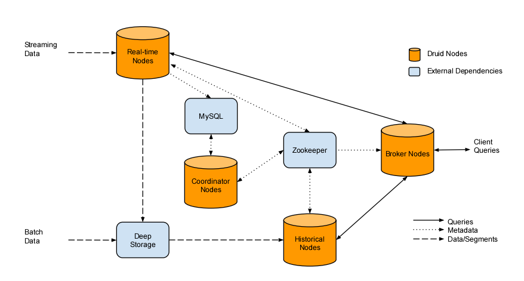

​											**图1: 一个Druid集群和集群中的数据流**

### 3.1 Real-time Nodes

实时节点（Real-time nodes）封装了用于摄取和查询事件流的功能。通过这些节点索引的事件可以立即可用于查询。这些节点只关心一些小时间范围内的事件，并定期将它们在这个小时间范围内收集到的不可变批次的事件转移到专门批处理不可变事件的Druid集群中的节点上。实时节点利用Zookeeper[19]和其他Druid节点进行协调。节点声明他们的在线状态和在zookeeper.real-time节点为所有进来的事件在内存索引缓冲区中保存数据。这些索引随着事件的摄入转移，并且索引也可直接用于查询。Druid用于查询这个基于JVM堆的缓冲区中存在的事件可以认为是一个行存储数据库。为了避免堆溢出问题，实时节点将它们的内存索引在达到一定的最大行限制之后持久化到磁盘中。这个持久化过程将存储在内存缓冲区中的数据转换为第4章中描述的面向列的存储格式。每个持久化索引都是不可变的，实时节点将持久性索引加载到堆内存中，以便它们仍然可以被查询。这个过程在lsm-tree[33]中详细描述，如图2所示。

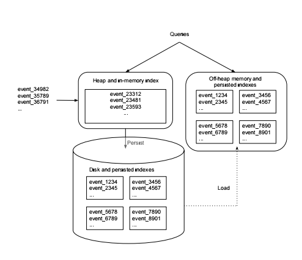

**图2: 实时节点将定期持久化到磁盘的事件缓冲到内存索引，在周期性准则下，持久化索引在切换之前进行合并。查询将在内存和持久化索引中同时命中。** 

在周期性准则下，每个实时节点将安排一个后台任务，搜索所有本地持久化索引。该任务将这些索引合并在一起，构建一个不可变的数据块。该数据块包含实时节点在某个时间段内摄入的所有事件。我们将这一块数据称为“段”（segment）。切换过程中，实时节点将段上传到永久备份存储（一个典型的分布式文件系统中，如S3 [12]和HDFS[36])，Druid将其看做是“深存储”（deep storage）。摄取、持久化、合并和切换步骤是流式的；在任何过程中都没有数据丢失。

图3说明了实时节点是如何操作的。节点开始在13:37时只会接受当前或之后一个小时的事件。当事件被摄取时，节点声明它正在为从13:00到14:00的间隔的数据segment服务。每10分钟（时间间隔是可配置的），节点将刷新并将其内存缓冲区中的数据保存到磁盘。在这个小时结束时，节点可能会看到14:00到15:00的事件。当发生这种情况时，节点准备为下一个小时提供数据服务，并创建新的内存索引，然后节点将声明它为从14:00到15:00的segment服务。节点不立即为13:00至14:00的持久化索引合并，而是在一个可配置的窗口内等待13:00 到 14:00的离散事件的到达。此窗口周期将事件传递时数据丢失的风险降到最低。在窗口周期结束时，节点将所有持久化索引从13:00到14:00合并成一个不可变的segment，并将该segment下线。一旦这个segment在Druid 的其他地方加载或查询，实时节点刷新所有在13:00至14:00收集的信息和并且声明不在为这些数据提供服务。
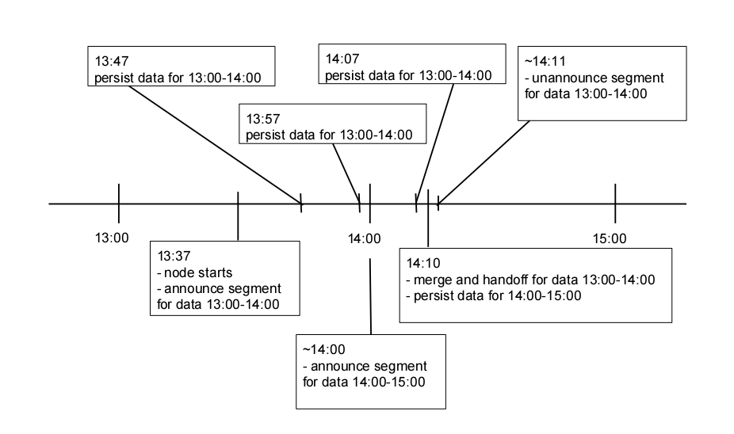

​			**图3：节点启动，摄取数据，持久化，定期下线数据。这个过程无限期的重复。不同的实时节点操作之间的时间间隔是可配置的。**

#### 3.1.1 Availability and Scalability

实时节点是数据消费者，需要相应的生产者来提供数据流。通常，出于数据持久化的目的，如Kafka[21]这样的消息总线位于生产者和实时节点之间，如图4所示。实时节点通过读取消息总线中的事件来导入数据。从事件创建到事件消耗的时间通常是几百毫秒。图4中消息总线的用途有两个。**首先**，消息总线充当传入事件的缓冲区。诸如Kafka这样的消息总线保持位置偏移（positional offsets），指出消费（实时节点）在事件流中读取了多少。消费者可以以编程方式更新这些偏移量。实时节点每次将它们的内存中数据保存到磁盘时都会更新这个偏移量。在故障恢复场景中，如果某个节点没有丢失磁盘，则它可以从磁盘重新加载所有持久化索引，并继续读取它所提交的最后一个偏移量的事件。从最近提交的偏移量中导入事件大大减少了节点的恢复时间。在实践中，节点可以在几秒钟内从此类故障场景中恢复过来。**其次**，消息总线可以在多个实时节点读取事件时充当单个端点（act as a single endpoint）。多个实时节点可以从总线中导入相同的事件集，从而创建事件的副本。在一个节点完全失败并丢失磁盘的场景中，流副本确保没有丢失数据。单个摄取端点（A single ingestion endpoint）还允许对数据流进行分区，使得多个实时节点各自导入流的一部分。这允许额外的实时节点无缝地添加。实际上，这个模型允许最大的生产Druid集群之一能够导入大约500MB/s（150000events/s或2 TB /hour）的原始数据。

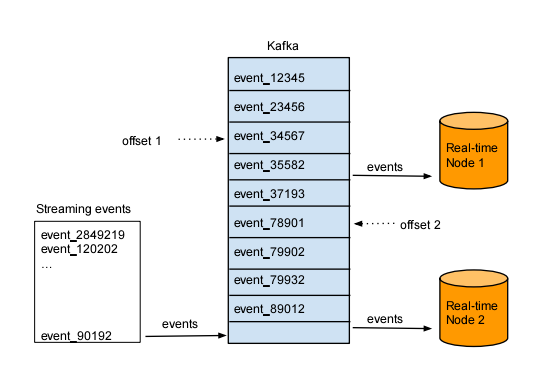

​									**图4：多实时节点可以读取同一消息，每个节点维持自己的offset。**

### 3.2 Historical Nodes

历史节点封装了加载和服务于由实时节点创建的不可变数据块（段）的功能。在许多真实的工作流程中，在Druid集群中加载的大部分数据是不可变的，因此，历史节点通常是Druid集群的主要工作组件。历史节点遵从于一个sharednothing构架，这个构架下节点之间没有竞争。节点不知道彼此，操作简单；它们只知道如何加载，drop和服务不可变segments。类似于实时节点，历史节点基于zookeeper声明它们的在线状态和服务于哪些数据。声明加载和卸载segment发送给zookeeper和在segment定位深存储中包含的信息和如何解压缩处理segment。在历史节点从深度存储中下载特定segment之前，它先检查一个本地缓存，该缓存保存关于节点上已经存在的segment的信息。如果缓存中不存在关于segment的信息，则历史节点将继续从深存储中下载该segment。这个过程如图5所示。一旦处理完成，段在zookeeper声明。在这一点上，segment可查询。本地缓存还允许历史节点快速更新和重新启动。在启动时，节点检查它的缓存，并立即为它找到的任何数据服务。

历史节点可以支持读一致性，因为它们只处理不可变数据。不可变数据块还启用了一个简单的并行化模型：历史节点可以同时扫描和聚合不可变块而不阻塞。

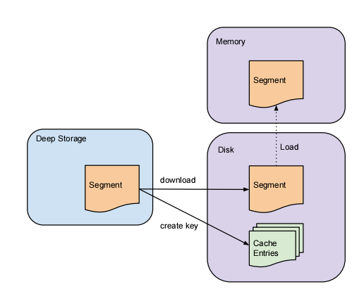

​							**图5：历史节点从深存储中下载不可变segments。Segments必须在可查询之前加载到内存**

#### 3.2.1 Tiers

历史节点可以在不同的tiers中分组，在所有节点的指定tier都是相同配置的。可以为每个tier设置不同的性能和容错参数。分层节点的目的是使高优先级或低优先级的segments按其重要性分配。例如，可以打开具有大量cores和大内存容量的“历史”节点的“热”层（“hot” tier）。可以将“hot”集群配置用来下载更频繁访问的数据。一个并行的“cold”集群也可以用配置低的后备硬件来创建。“cold”集群只包含不需要频繁访问的segments。

3.2.2可用性

历史节点依赖于Zookeeper管理负载和卸载segment指令。应该说，Zookeeper变得不可用，历史节点不再能够为新的数据或删除过时的数据服务，但是，因为查询是通过HTTP提供的，历史的节点仍然能够为当前的服务请求响应查询的数据。这意味着Zookeeper中断不会对历史节点当前数据的可用性造成影响。

### 3.3 Broker Nodes

代理节点充当历史和实时节点的查询路由器。代理节点通过发布于Zookeeper中元数据了解哪些segments可查询和这些segments的位置。代理节点分发查询，将查询命中到正确的历史和实施节点。代理节点还将历史和实时节点的部分结果合并，然后将最终的合并结果返回给调用方。

#### 3.3.1 Caching

代理节点包含一个LRU[31.20]缓存失效策略。缓存可以使用本地堆内存或外部分布式内存键/值存储，诸如memcached[16]。每次代理节点接收到查询请求时，它首先将查询映射到一组segment中。如果某些结果可能在缓存中已经存在，无需重新计算他们。对于缓存中不存在的结果，代理节点将将查询转发给正确的历史和实时节点。一旦历史节点返回其结果，代理将按每个segment缓存这些结果以供将来使用。这个过程如图6所示。实时数据从不缓存，因此对实时数据的请求总是转发给实时节点。实时数据是不断变化的，缓存结果是不可靠的。在所有历史节点失败的情况下，如果缓存中已经存在这些结果，仍然可以查询结果。

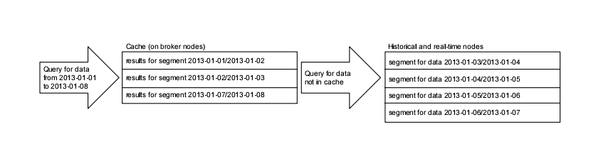

​					**图6：每个查询结果segment都进行缓存。查询将缓存结果与在历史和实时节点上的计算结果合并。**

#### 3.3.2 Availability

当所有的Zookeeper都中断时，数据仍然是可查询的。如果代理节点不能与Zookeeper交互，它们使用它们最后一次获取集群时知道的结构，并继续转发查询到实时节点和历史节点。代理节点假定集群的结构与Zookeeper中断前相同。在实践中，这种有效性模型允许Druid集群继续在这段重要的时期服务查询直至诊断到Zookeeper的中断原因。

### 3.4 Coordinator Nodes

Druid协调节点主要负责历史节点上的数据管理和分发。协调节点告诉历史节点加载新数据、删除过时数据、备份数据，并移动数据保持负载平衡。Druid使用一个多版本并发控制交换协议来管理不可变的segment，以便保持稳定。如果不可变segment包含是完全过时的新的segments，过时segment从集群中下线。协调节点经过一个leader选举过程以决定一个节点运行协调功能。剩余的协调节点充当冗余备份。协调节点周期性地运行以确定集群的当前状态。它通过在运行时将集群的期望状态与集群的实际状态进行比较来做出决策。同所有的Druid节点一样，协调节点维持一个Zookeeper 连接来获取当前集群信息。协调节点还维持一个与MySQL数据库的连接，该数据库包含额外的操作参数和配置。位于MySQL数据库中的关键信息之一是包含由历史节点提供的所有segments集合的一个表。此表可以由创建segments的任何服务（如实时节点）进行更新。MySQL数据库还包含一个规则表，用于管理在集群中创建、销毁和复制segments的方式。

#### 3.4.1 Rules

规则管理在集群中如何加载和删除历史段。规则说明了如何将段分配给不同的历史节点层，以及每个层中一个segment应该存在多少副本。规则还可以指示何时应该完全从集群中下线segments。规则通常设置一段时间。例如，用户可以使用规则将最新的一个月的值加载到一个“hot”集群中，最近一年的部分值放到一个“cold”集群中，并下线任何一个更旧的segments。协调节点从MySQL数据库中的规则表加载一组规则。规则可以针对特定的数据源，也可以配置默认的规则集。协调器节点将循环通过所有可用的segments，并与应用于它的规则相匹配。

#### 3.4.2 Load Balancing

在典型的生产环境中，查询常常会命中到几十个甚至几百个segments中。由于每个历史节点都只有有限的资源，所以必须在集群中分发segments，以确保集群负载均衡。确定最佳负载分布需要了解查询模式和速度。通常，查询覆盖为一个单独的数据源头跨越连续的时间间隔内最近segments。平均而言，访问较小segments 的查询速度更快。这些查询模式建议以更高的速率复制最近的历史段，将时间段接近的大segments扩展到不同的历史节点，并协同从不同数据源中定位段。为了优化分配和平衡集群中的segments，我们开发了一个基于成本的优化方法，这个方法考虑到了segment源、新旧程度、大小。该算法的具体细节超出了本文的范围，并将在以后的文献中加以讨论。

#### 3.4.3 Replication

协调节点可能通知不同历史节点加载一份相同的segment。历史节点中每个tier（层）中副本的数量是可配置的。需要高容错级别的地方可以配置为更多数量的副本。复制segment之间没有区别，并遵循相同的负载分配算法。通过segment副本机制，在Druid集群中单个历史节点故障总是透明的。我们使用这个属性进行软件升级。我们可以无缝地将一个历史节点离线，更新它，将其恢复，并重复集群中每个历史节点的处理过程。在过去的两年中，我们从未在我们的Druid集群中为软件升级而停机。

#### 3.4.4 Availability

Druid的协调节点对Zookeeper和MySQL有外部依赖。协调节点依靠Zookeeper确定哪些历史节点已经存在于集群。如果Zookeeper不可用，协调节点将不再能够发送指令分配，平衡，和下线段。然而，这些操作不影响所有的数据可用性。应对MySQL和Zookeeper失败的设计原理是一样的：如果负责协调外部依赖失败，集群保持现状。Druid使用MySQL存储操作管理信息，并对集群中应该包含哪些segment的元数据信息进行分类。如果MySQL不可用，则该信息对协调节点不可用。然而，这并不意味着数据本身不可用。如果协调节点不能与MySQL交互，他们将不再分配新的segments或使segments过时。代理节点，历史和实时的节点仍然可查询即使MySQL中断连接。

## 第四章 存储格式

在Druid中数据表（叫数据源）是包含时间戳的数据集合，并被划分为segments的集合，每个典型的segment包含5百万到1千万行。形式上，我们将segment定义为跨越一段时间的数据行集合，segment在druid里是最基本存储单元，复制和分发都是在segment级别上完成的。

Druid总是需要一个时间戳列作为一个简化的数据分布策略的方法，数据保留政策和一级查询。Druid将其数据源划分为定义良好的时间间隔，通常为一小时或一天，并可进一步对其他列的值进行分区，以实现所需的段大小。分区段的时间粒度是数据量和时间范围的函数。一个划分年的有时间戳的数据集，最好以天分区，一个划分天的有时间戳的数据集最好以小时分区。

Segments通过数据源标识符，数据时间间隔，新segment创建时的版本字符串号作为唯一标识。版本号表示segment数据的新旧；具有较旧版本的segment总是被具有较新版本的数据（在某些时间范围内）覆盖。此segment元数据被系统用来并发控制；读取操作总是在该时间范围内的最新版本标识符的segment中访问特定时间范围内的数据。

Druid的segments按列存储。Druid最佳应用方案是按事件流进行聚合（所有数据进入Druid必须带有一个时间戳），存储信息聚合通过列而不是行的优点是有依据的[1]。列存储允许更高效的CPU使用率唯一的需要是实际加载和扫描。在行存储下，与行关联的所有列都必须作为聚合的一部分进行扫描，额外的扫描时间可以使性能下降[1]。

Druid有多种列类型来表示各种数据格式。根据列类型，使用不同的压缩方法来减少在内存和磁盘中存储列的成本。在表1中给出的示例中，页面、用户、性别和城市列只包含字符串。直接存储字符串是不必要的开销，而字符串列可以用字典编码。字典编码来压缩数据的一种常用方法，已被应用于其他数据存储，如PowerDrill[17]。在表1的示例中，我们可以将每个页面映射到一个唯一的整数标识符。

`Justin Bieber -> 0`

`Ke$ha -> 1`

这种映射允许我们将页面列表示为一个整型数组，其中数组索引对应于原始数据集的行。对于页面列，我们可以将唯一的页面表示如下：

`[0, 0, 1, 1] `

生成的整数数组非常适合于压缩方法。通用的压缩算法上的编码在列存储是非常普遍的。Druid使用LZF[24]压缩算法。类似的压缩方法也可以应用到数字列中。例如，表1中添加字符和删除字符的列也可以表示为单个数组。

`Characters Added -> [1800, 2912, 1953, 3194]`
`Characters Removed -> [25, 42, 17, 170]`

在这种情况下，我们压缩原始值，而不是压缩字典编码。

### 4.1 Indices for Filtering Data

在许多现实世界的OLAP工作流中，查询通过对于一些度量指标的聚合结果集来满足。一个示例查询是：“有多少在San Francisco的男性用户编辑过维基百科？“这个查询是根据维度值的布尔表达式过滤表1中的维基百科数据集。在许多现实世界的数据集中，维度列包含字符串，包含数值的数值列。Druid为字符串列创建额外的查找索引，以便只扫描与特定查询筛选器相关的那些行。
让我们考虑表1中的页列。对于表1中的每个唯一页面，我们可以形成一个表示在哪个表行中看到某个特定页面的表示形式。我们可以把这个信息存储在二进制数组中，数组索引代表我们的行。如果某个行中看到某个页面，则该数组索引标记为1。例如:

`Justin Bieber -> rows [0, 1] -> [1][1][0][0]`
`Ke$ha -> rows [2, 3] -> [0][0][1][1]`

Justin Bieber 在行0和1中出现，该列值到行索引的映射形成一个倒排索引[39]。为了知道哪一行包含Justin Bieber或Ke$ha，我们可以通过OR合并数组：

`[0][1][0][1] OR [1][0][1][0] = [1][1][1][1]`

这种在大型位图（bitmap）集上执行布尔运算的方法通常用于搜索引擎。OLAP工作负载的位图索引（Bitmap indices）在[32]中有详细描述。位图压缩算法是一个定义良好的研究领域[2.44.42]，经常使用游程(run-length)编码。Druid选择使用简洁的算法[10]。图7演示了使用简洁压缩与使用整数数组的字节数对比。结果是由一个单线程，2G堆，512m新生代（young gen），并运行时强迫GC（forced GC）的cc2.8xlarge系统中产生。数据集是从Twitter garden hose[41]数据流收集的单日数据。数据集包含2272295行和12个不同基数的维度。作为一个额外的比较，我们还利用数据集行最大化压缩。

在无序的情况下，总压缩大小为53451144字节和总的整数数组大小为127248520字节。总的来说，压缩集比整数数组小42%。在排序的情况下，总的压缩大小为43832884字节，整型数组大小为127248520字节。值得注意的是，在排序之后，全局压缩仅有最低程度的增长。

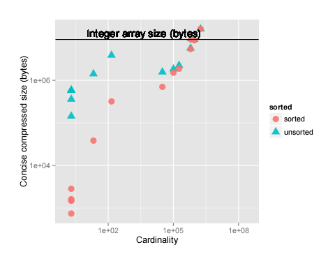

​												**图7：整形数组大小VS压缩集大小**

### 4.2 Storage Engine

Druid的持久化组件允许不同的存储引擎插件化，类似于Dynamo[12]。这些存储引擎可以将数据存储在完全内存结构中，例如JVM堆或内存映射结构中。切换存储引擎的能力允许Druid根据特定应用程序的规范进行配置。内存存储引擎可能在操作上比内存映射(memory-mapped)存储引擎更昂贵，但如果性能至关重要，则可能是更好的选择。默认情况下，使用内存映射存储引擎。

当使用内存映射存储引擎时，Druid依赖于操作系统在内存中分页（page segments）。鉴于segments只能扫描是否加载到内存中，内存映射存储引擎允许最近的segments保留在内存中而从没被查询到的segments将被调出，使用内存映射的存储引擎的主要缺点是当查询需要更多的segments被调到内存可能超过给定节点的能力。在这种情况下，查询性能将受到内存中分页segments成本的影响。

## 第五章 Query API

Druid拥有自己的查询语言，通过POST接收查询请求。代理、历史、实时节点使用相同的查询API。

POST请求的主体是一个JSON对象，其中包含指定各种查询参数的键值对。典型的查询将包含数据源名称、结果数据的粒度、时间范围、请求的类型和聚合的度量。结果也将是一个包含在时间段内聚合度量的JSON对象。

大多数查询类型也将支持一个过滤器集。过滤集是维度名称和值对的布尔表达式。可以指定任意数量和尺寸和值的组合。当提供一个过滤器集时，只有与过滤器集相关的数据子集才会被扫描。处理复杂嵌套过滤器集的能力，使Druid能够下钻到任何深度的数据中。

确切的查询语法取决于查询类型和请求的信息。一周以上的样本计数查询例子如下所示：

```json
{
  "queryType" : "timeseries",
  "dataSource" : "wikipedia",
  "intervals" : "2013-01-01/2013-01-08",
  "filter" : {
    "type" : "selector",
    "dimension" : "page",
    "value" : "Ke$ha"
  },
  "granularity" : "day",
  "aggregations" : [{"type":"count", "name":"rows"}]
}
```

上面显示的查询将返回一个在维基百科数据源的从2013-01-01到2013-01-08之间，过滤那些“page”维数value等于“Ke$ha”的结果。结果将在按天有如下形式的JSON数组：

```json
[{
  "timestamp": "2012-01-01T00:00:00.000Z",
  "result": {"rows":393298}
 },
 {
  "timestamp": "2012-01-02T00:00:00.000Z",
  "result": {"rows":382932}
 },
 ...
 {
   "timestamp": "2012-01-07T00:00:00.000Z",
   "result": {"rows": 1337}
 }]
```

Druid支持许多类型的聚合，包括浮点和整数类型的总数，最小值，最大值，和复杂聚合，如基数估计和近似分位数估计（cardinality estimation and approximate quantile estimation）。聚合的结果可以用数学表达式组合成其他聚合。完全描述查询API是超出了本文的范围，但是更多的信息可以[在线](http://druid.io/docs/latest/querying/querying.html)找到。

在编写本文时，还没有实现对Druid的join 查询，这是工程资源分配和业务驱动的函数，而不是由技术优势驱动的决策。事实上，Druid的存储格式将允许连接的实现（包括作为维度的列的保真度不会丢失），并且它们的实现一直是我们每隔几个月进行一次的会话内容。到目前为止，我们做出的选择是，实现成本不值得我们的组织投资。作出这一决定的原因一般是两方面的。

1. 在我们的专业经验中，扩展连接查询一直是分布式数据库工作的一个瓶颈。
2. 增加这个功能要比管理高度并发、加入高负载等的预期问题产生的价值小得多。

join查询本质上是基于共享key的两个或多个数据流的合并。我们所知道的连接查询的主要高级策略是基于散列的策略或排序合并策略。基于散列的策略要求除了一个数据集以外的所有数据集都可用作一个类似于哈希表的东西，然后在这个哈希表中对“primary”流中的每一行执行查找操作。排序合并策略假定每个流都由联接键进行排序，从而允许流的增量连接。然而，这些策略都需要按排序的顺序或以哈希表形式实现一些流的具体化。当加入各方都明显是大表（> 10亿的记录），实现预加入流需要复杂的分布式内存管理。内存管理的复杂性在我们的目标下会放大，我们的目标是高并发，多租户工作。就我们所知，这是一个积极的学术研究问题，我们愿意以可伸缩的方式帮助解决这一问题。

## 第六章 性能

Druid在很多公司应用于生产，并说明它的性能优势，我们选择分享一些截至2014年初在Metamarkets主要生产集群运行的真实数据。与其它数据库比较，还包括来自同步工作负载在TPC-H数据上的比较。

### 6.1 Query Performance in Production

Druid的查询性能可以显著依赖于查询发起的不同。例如，基于给定度量值对高基数维度的值进行排序比在一个时间范围内的简单计数要昂贵得多。为了展示生产Druid集群中的平均查询延迟，我们选择了8个我们查询最多的数据源，如表2所示。

| Data Source | Dimensions | Metrics |
| ----------- | ---------- | ------- |
| a           | 25         | 21      |
| b           | 30         | 26      |
| c           | 71         | 35      |
| d           | 60         | 19      |
| e           | 29         | 8       |
| f           | 30         | 16      |
| g           | 26         | 18      |
| h           | 78         | 14      |

​												**表2 生产数据源的特征**

大约30%的查询是通过度量和过滤条件产生的标准聚集，60%的查询命令分组是在一个或多个维度的聚合，和10%查询是搜索查询和元数据检索查询。在聚合查询中扫描的列的数量大致服从指数分布。涉及单个列的查询非常频繁，涉及所有列的查询非常罕见。

关于结果的一些说明：

- 结果来自我们生产集群中的“hot” tier。该层大约有50个数据源，几百个用户发起查询。
- 在"hot" tier有大约10.5 TB RAM可用，约10TB的segments 加载。总的来说，这一层大约有500亿个Druid行。这里没有展示每个数据源的结果。
- “hot"层使用Intel® Xeon® E5-2670处理器，包含1302处理进程，拥有673个核（超线程）。
- 使用内存映射存储引擎（机器配置成内存映射而不是将数据加载到java堆）

查询延迟如图8所示，每分钟查询数如图9所示。在所有不同的数据源中，平均查询延迟大约为550毫秒，其中90%的查询返回小于1秒，95%秒内返回2，99%返回少于10秒的查询。偶尔我们观察峰值延迟，如2月19日，在我们的一个最大的数据源由网络问题引起了对Memcached 实例产生了很高的查询负载。

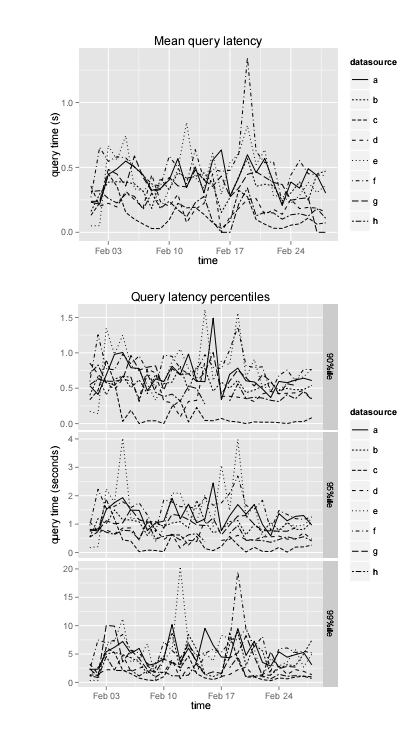

​													**图8：生产数据源的查询延时**

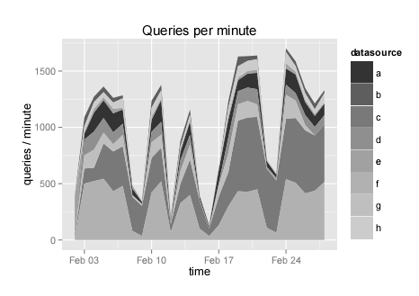

​													**图9：生产数据源每分钟的查询数**

### 6.2 Query Benchmarks on TPC-H Data

Druid使用TPC-H数据完成基准测试。大多数的TPC-H查询不能直接应用于Druid，所以我们选择了比较典型的Druid的工作量证明查询性能。作为比较，我们也提供使用MyISAM引擎的MySQL做相同的查询的结果（在我们的实验中，InnoDB较慢）。

我们选择MySQL作为基准，因为它非常流行。我们之所以不选择另一个开源列存储数据库，因为我们不相信我们可以正确地调整它以获得最佳性能。我们的Druid 设置历史节点使用Amazon EC2 m3.2xlarge 实例类型（Intel® Xeon® E5-2680 v2 @ 2.80GHz）和代理节点使用c3.2xlarge实例（Intel® Xeon® E5-2670 v2 @ 2.50GHz）。我们的MySQL安装是一个Amazon RDS实例运行在同一m3.2xlarge实例类型上。

在图10为1 GB的TPC-H数据集结果和图11为100 GB的数据集的结果。select count（*）在Druid的等价查询上的扫描速度为53,539,211 rows/second/core,select sum(float)类型的扫描速度是36,246,530 rows/second/core。

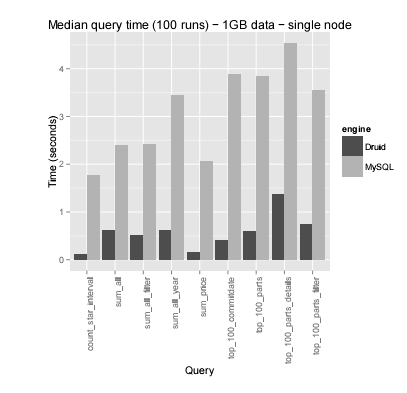

​										**图10：Druid & MySQL benchmarks – 1GB TPC-H data.**

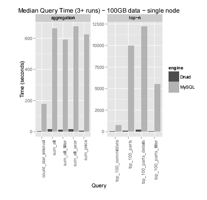

​										**图11：Druid & MySQL benchmarks – 100GB TPC-H data.**

最后，我们将我们的结果扩展以满足不断增长的数据量并在Drui中设置了TPC-H 100 GB的数据集。我们观察到，当我们将内核的数量从8增加到48时，并不是所有类型的查询都实现线性扩展，但是更简单的聚合查询可以做到，如图12所示。

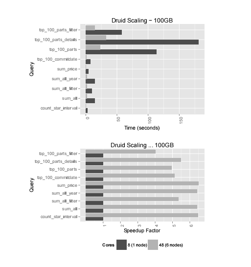

​										**图12：Druid scaling benchmarks – 100GB TPC-H data.**

并行计算系统速度的增加常常受限于系统顺序操作所需的时间。在这种情况下，在代理节点上的大量查询工作不能很好的并行化。

### 6.3 Data Ingestion Performance

展示Druid的数据导入的延迟，我们选择不同维度、指标、事件量的各种生产数据源。我公司司生产环境的导入由6个节点组成，360GB内存和96芯（12 xIntel®Xeon®E5-2670）。

注意，在这个设置中，有几个其他的数据源被同时导入，许多其他与Druid有关的导入任务同时在机器上运行。

Druid的数据导入延迟很大程度上取决于所采集数据集的复杂性。数据复杂性是由每个事件中的维度数量、每个事件中的度量数以及我们希望在这些度量上执行的聚合类型决定的。最基本的数据集（只有一个时间戳列），我们的设置可以控制导入数据的速度在800000 events/second/core，这是真的只是一个测量我们反序列化事件可以多快。现实世界的数据集从来就不是这么简单的。表3显示了数据源的选择及其字符数。

| Data Source | Dimensions | Metrics | Metrics Peak events/s |
| ----------- | ---------- | ------- | --------------------- |
| s           | 7          | 2       | 28334.60              |
| t           | 10         | 7       | 68808.70              |
| u           | 5          | 1       | 49933.93              |
| v           | 30         | 10      | 22240.45              |
| w           | 35         | 14      | 135763.17             |
| x           | 28         | 6       | 46525.85              |
| y           | 33         | 24      | 162462.41             |
| z           | 33         | 24      | 95747.74              |

 我们可以看到，根据表3中的描述，延迟显著变化，导入延迟并不总是维度和度量的数量有关。我们在简单数据集上看到一些较低的延迟，因为这取决于数据生产者提供数据的速率。结果如图13所示。

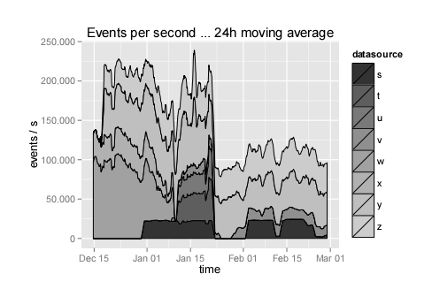

​											**图13: Combined cluster ingestion rates.**

我们定义吞吐量作为实时节点可以采集并可查询的事件数。如果将太多事件发送到实时节点，则这些事件将被阻塞，直到实时节点有能力接收它们为止。我们测量了在生产高峰期运行在Amazon cc2.8xlarge实例上一个数据源的30个维度19个指标导入延迟为22914.43events/second/core。

我们提供的延迟度量足以解决所述的交互问题。我们希望延迟的变异性要小一些。通过增加额外的硬件来减少延迟仍然是可能的，但我们没有选择这样做，因为基础设施成本仍然是我们考虑的问题。

## 第七章 Druid在生产中的应用

在过去的几年中，我们通过Druid 在生产环境下的大量实践，发现了一些有趣的现象。

**Query Patterns.**

Druid经常用于探索数据并生成数据报告。在探索应用中，单个用户发出的查询请求数量远远高于报告用例。探索性查询通常涉及在相同的时间范围内逐步添加过滤器以缩小结果。用户倾向于探索最近数据的短时间间隔。在生成报告用例中，用户查询更长的数据间隔，但这些查询通常很少并且是预先确定的。

**Multitenancy.**

昂贵的并行查询在多租户环境可能是有问题的。对大量数据源的查询可能会最终命中集群中的每个历史节点，并消耗所有集群资源。在这种情况下，小、耗资源小的查询可能会失败。我们引入了查询优先顺序来解决这些问题。适当的查询规划是生产工作负载的关键。值得庆幸的是，对于大量数据的查询往往是为了reporting use cases，并且可以被认为是低优先级的。用户不期望其与探索数据时具有相同的交互级别。

**Node failures.**

单一节点故障在分布式环境中是常见的，但许多节点同时失效不是。如果历史节点完全失败，并且不能恢复，segments需要被重新分配，这意味着我们需要多余的集群容量负荷数据。从我们的经验看，超过2个节点的完全失败的情况极为罕见，在集群中保留足够的容量用来从2个历史节点重新分配数据就足够了。

**Data Center Outages.**

整个集群故障是可能的，但非常罕见。如果Druid只部署在一个单一的数据中心，那么整个数据中心就有可能失败。在这种情况下，需要配置新的机器。只要深存储仍然可用，作为历史节点只需要从深存储下载segments，群集恢复时间恢复只受网络限制。我们在过去经历过这样的故障，在亚马逊AWS生态系统中百万兆字节的数据的恢复时间是几个小时。

### 7.1 Operational Monitoring

恰当的监控对于大规模分布式集群的运行至关重要。每个Druid节点被设计成周期性地发出一组操作度量值。这些度量值可以包括系统级数据，如CPU使用情况、可用内存和磁盘容量、JVM统计数据，如垃圾收集时间和堆使用情况，或特定于节点的度量值，如segment扫描时间、缓存命中率和数据采集延迟。Druid也会发出每个查询度量值。我们从一个生产Druid集群发出度量值，并将它们装载到专用的Druid集群中。该指标用于探索集群的性能和稳定性。这种专用的度量集群已经允许我们发现众多的生产问题，如逐步查询速度优先级，低于最佳调谐的硬件，以及其他各种系统瓶颈。我们还使用一个度量集群来分析生产中的查询以及数据用户最感兴趣的方面。

### 7.2 Pairing Druid with a Stream Processor

目前，Druid只能充分理解非规范化的数据流。为了在生产中提供完整的业务逻辑，可以与诸如Apache Storm[27]之类的流处理器配对。

Storm topology从数据流中消费事件，只保留那些“准时”的事件，并接收任何相关的业务逻辑。这可以确定简单传输范围，如ID名称查找，以复杂的操作，如多流连接。Storm拓扑将处理后的事件流实时转发给Druid。Storm进行流数据处理工作，Druid用于实时响应和历史数据的查询。

### 7.3 Multiple Data Center Distribution

大规模的生产中断不仅影响单个节点，而且影响整个数据中心。Druid 协调节点中的层配置允许跨多个层复制段。因此，可以在跨多个数据中心的历史节点中精确地复制段。同时，查询可以被分配到不同的层。将一个数据中心中的节点作为主集群（并接收所有查询）并在另一个数据中心中有一个冗余集群是可能的。那么可以设置如果一个数据中心位于离用户更近的地方。

## 第八章 其他系统对比

Cattell[6]的文章是现有的可扩展的SQL和NoSQL数据存储的一大总结。hu[18]为流式数据库贡献了另一个伟大的总结。Druid的feature-wise介于谷歌的Dremel [28]和PowerDrill [17]之间。Druid已经实现了Dremel的大部分功能（Dremel处理任意嵌套数据结构而Druid只允许一个单一的水平阵列嵌套）和所提到的许多PowerDrill有趣的压缩算法。

尽管Druid与其他分布式列式数据存储[15]的建立有许多相同的原则，但是这些数据存储框架中的许多被设计成更通用的键值存储[23]，并且不支持直接在存储层中计算。还有一些数据存储框架是也为解决同样的数据仓库问题而设计的，这些系统包括内存数据库，如SAP的HANA[14]和VoltDB[43]。这些数据存储框架缺乏Druid的低延迟采集特性。Druid也有本土的分析功能，类似于ParAccel[34]等，但是，Druid允许系统软件滚动更新无需停机。

Druid与C-STORE[38]和lazybase[8]类似，有两个子系统，历史节点存在读取优化子系统和实时节点存在写入优化子系统。实时节点设计用于采集大量的增量heavy数据，**不支持数据更新**。不同于上述的两个系统，Druid是OLAP事务系统而不是OLTP事务系统。

Druid的低延迟数据采集特性与Trident/Storm[27]和Spark Streaming[45]有一些相似之处，然而，这两个系统都集中在流处理上，而Druid则专注于采集和聚合。流处理器是Druid在数据进入Druid之前对数据进行预处理的一个很好的补充。

有一类系统专门研究集群计算框架之上的查询。Shark[13]就是基于Spark的这样一个系统，Cloudera的Impala [9]是在HDFS之上以优化查询性能的系统。Druid历史节点在本地下载数据，只与本地Druid索引一起工作。我们相信这种设置允许更快的查询延迟。

Druid在其体系结构中利用了独特的算法组合。尽管我们认为没有其他数据存储具有与Druid相同的功能，但是一些Druid的优化技术，如使用倒排索引来执行快速过滤器，也在其他数据存储系统[26]中使用。

## 第九章 总结

在本文中，我们提出了一个分布式的、面向列的、实时分析数据存储的Druid。Druid的目的是为高性能应用提供动力，并对低查询延迟进行优化。Druid支持流数据的采集，并且是容错的。我们讨论了Druid基准测试，并总结了关键的架构方面，如存储格式、查询语言和大致的执行过程。

## 致谢

Druid的诞生离不开在Metamarkets和社区许多伟大的工程师的帮助。我们要感谢大家，为完成Druid的基本代码给予的宝贵支持。

## 参考文献

[1] D. J. Abadi, S. R. Madden, and N. Hachem. Column-stores vs. row-stores: How different are they really? In Proceedings of the 2008 ACM SIGMOD international conference on Management of data, pages 967–980. ACM, 2008.

[2] G. Antoshenkov. Byte-aligned bitmap compression. In Data Compression Conference, 1995. DCC’95. Proceedings, page 476. IEEE, 1995.

[3] Apache. Apache solr. http://lucene.apache.org/solr/, February 2013.

[4] S. Banon. Elasticsearch. http://www.elasticseach.com/, July 2013.

[5] C. Bear, A. Lamb, and N. Tran. The vertica database: Sql rdbms for managing big data. In Proceedings of the 2012 workshop on Management of big data systems, pages 37–38.ACM, 2012.

[6] R. Cattell. Scalable sql and nosql data stores. ACM SIGMOD Record, 39(4):12–27, 2011.

[7] F. Chang, J. Dean, S. Ghemawat, W. C. Hsieh, D. A.Wallach, M. Burrows, T. Chandra, A. Fikes, and R. E.Gruber. Bigtable: A distributed storage system for structured data. ACM Transactions on Computer Systems (TOCS), 26(2):4, 2008.

[8] J. Cipar, G. Ganger, K. Keeton, C. B. Morrey III, C. A.Soules, and A. Veitch. Lazybase: trading freshness for performance in a scalable database. In Proceedings of the 7th ACM european conference on Computer Systems, pages 169–182. ACM, 2012.

[9] Cloudera impala. http://blog.cloudera.com/blog,March 2013.

[10] A. Colantonio and R. Di Pietro. Concise: Compressed ‘n’composable integer set. Information Processing Letters,110(16):644–650, 2010.

[11] J. Dean and S. Ghemawat. Mapreduce: simplified data processing on large clusters. Communications of the ACM,51(1):107–113, 2008.

[12] G. DeCandia, D. Hastorun, M. Jampani, G. Kakulapati,A. Lakshman, A. Pilchin, S. Sivasubramanian, P. Vosshall,and W. Vogels. Dynamo: amazon’s highly available key-value store. In ACM SIGOPS Operating Systems Review, volume 41, pages 205–220. ACM, 2007.

[13] C. Engle, A. Lupher, R. Xin, M. Zaharia, M. J. Franklin,S. Shenker, and I. Stoica. Shark: fast data analysis using coarse-grained distributed memory. In Proceedings of the 2012 international conference on Management of Data,pages 689–692. ACM, 2012.

[14] F. Färber, S. K. Cha, J. Primsch, C. Bornhövd, S. Sigg, and W. Lehner. Sap hana database: data management for modern business applications. ACM Sigmod Record, 40(4):45–51,2012.

[15] B. Fink. Distributed computation on dynamo-style distributed storage: riak pipe. In Proceedings of the eleventh ACM SIGPLAN workshop on Erlang workshop, pages 43–50. ACM, 2012.

[16] B. Fitzpatrick. Distributed caching with memcached. Linux journal, (124):72–74, 2004.

[17] A. Hall, O. Bachmann, R. Büssow, S. Gănceanu, and M. Nunkesser. Processing a trillion cells per mouse click.Proceedings of the VLDB Endowment, 5(11):1436–1446,2012.

[18] B. Hu. Stream database survey. 2011.

[19] P. Hunt, M. Konar, F. P. Junqueira, and B. Reed. Zookeeper:Wait-free coordination for internet-scale systems. In USENIX ATC, volume 10, 2010.

[20] C. S. Kim. Lrfu: A spectrum of policies that subsumes the least recently used and least frequently used policies. IEEE Transactions on Computers, 50(12), 2001.

[21] J. Kreps, N. Narkhede, and J. Rao. Kafka: A distributed messaging system for log processing. In Proceedings of 6th International Workshop on Networking Meets Databases (NetDB), Athens, Greece, 2011.

[22] T. Lachev. Applied Microsoft Analysis Services 2005: And Microsoft Business Intelligence Platform. Prologika Press,2005.

[23] A. Lakshman and P. Malik. Cassandra—a decentralized structured storage system. Operating systems review,44(2):35, 2010.

[24] Liblzf. http://freecode.com/projects/liblzf, March 2013.

[25] LinkedIn. Senseidb. http://www.senseidb.com/, July 2013.

[26] R. MacNicol and B. French. Sybase iq multiplex-designed for analytics. In Proceedings of the Thirtieth international conference on Very large data bases-Volume 30, pages 1227–1230. VLDB Endowment, 2004.

[27] N. Marz. Storm: Distributed and fault-tolerant realtime computation. http://storm-project.net/, February 2013.

[28] S. Melnik, A. Gubarev, J. J. Long, G. Romer, S. Shivakumar, M. Tolton, and T. Vassilakis. Dremel: interactive analysis of web-scale datasets. Proceedings of the VLDB Endowment,3(1-2):330–339, 2010.

[29] D. Miner. Unified analytics platform for big data. In Proceedings of the WICSA/ECSA 2012 Companion Volume,pages 176–176. ACM, 2012.

[30] K. Oehler, J. Gruenes, C. Ilacqua, and M. Perez. IBM Cognos TM1: The Official Guide. McGraw-Hill, 2012.

[31] E. J. O’neil, P. E. O’neil, and G. Weikum. The lru-k page replacement algorithm for database disk buffering. In ACM SIGMOD Record, volume 22, pages 297–306. ACM, 1993.

[32] P. O’Neil and D. Quass. Improved query performance with variant indexes. In ACM Sigmod Record, volume 26, pages 38–49. ACM, 1997.

[33] P. O’Neil, E. Cheng, D. Gawlick, and E. O’Neil. The log-structured merge-tree (lsm-tree). Acta Informatica, 33(4):351–385, 1996.

[34] Paraccel analytic database. http://www.paraccel.com/resources/Datasheets/ ParAccel-Core-Analytic-Database.pdf, March 2013.

[35] M. Schrader, D. Vlamis, M. Nader, C. Claterbos, D. Collins,M. Campbell, and F. Conrad. Oracle Essbase & Oracle OLAP. McGraw-Hill, Inc., 2009.

[36] K. Shvachko, H. Kuang, S. Radia, and R. Chansler. The hadoop distributed file system. In Mass Storage Systems and Technologies (MSST), 2010 IEEE 26th Symposium on, pages 1–10. IEEE, 2010.

[37] M. Singh and B. Leonhardi. Introduction to the ibm netezza warehouse appliance. In Proceedings of the 2011 Conference of the Center for Advanced Studies on Collaborative Research, pages 385–386. IBM Corp., 2011.

[38] M. Stonebraker, D. J. Abadi, A. Batkin, X. Chen, M. Cherniack, M. Ferreira, E. Lau, A. Lin, S. Madden,E. O’Neil, et al. C-store: a column-oriented dbms. In
Proceedings of the 31st international conference on Very large data bases, pages 553–564. VLDB Endowment, 2005.

[39] A. Tomasic and H. Garcia-Molina. Performance of inverted indices in shared-nothing distributed text document information retrieval systems. In Parallel and Distributed Information Systems, 1993., Proceedings of the Second International Conference on, pages 8–17. IEEE, 1993.

[40] E. Tschetter. Introducing druid: Real-time analytics at a billion rows per second. http://druid.io/blog/2011/
04/30/introducing-druid.html, April 2011.

[41] Twitter public streams. https://dev.twitter.com/docs/streaming-apis/streams/public, March 2013.

[42] S. J. van Schaik and O. de Moor. A memory efficient reachability data structure through bit vector compression. In Proceedings of the 2011 international conference on Management of data, pages 913–924. ACM, 2011.

[43] L. VoltDB. Voltdb technical overview.https://voltdb.com/, 2010.

[44] K. Wu, E. J. Otoo, and A. Shoshani. Optimizing bitmap indices with efficient compression. ACM Transactions on Database Systems (TODS), 31(1):1–38, 2006.

[45] M. Zaharia, T. Das, H. Li, S. Shenker, and I. Stoica.Discretized streams: an efficient and fault-tolerant model for stream processing on large clusters. In Proceedings of the 4th USENIX conference on Hot Topics in Cloud Computing,pages 10–10. USENIX Association, 2012